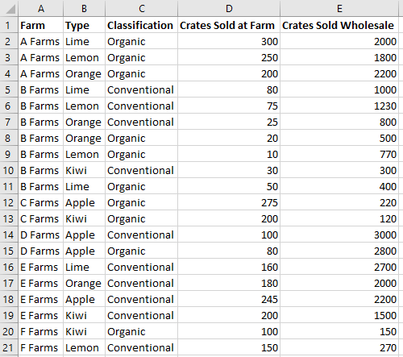
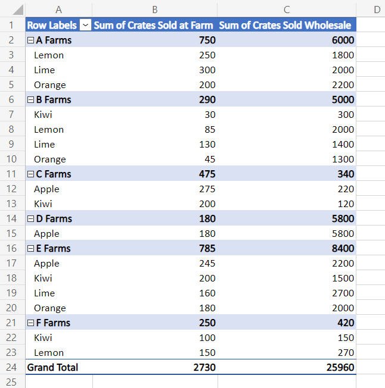
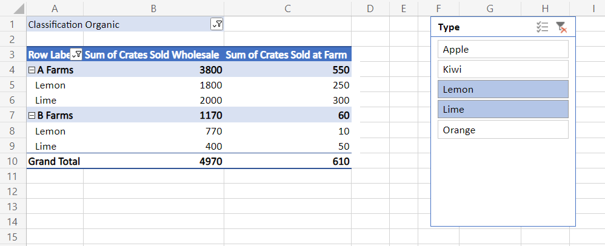

# Work with PivotTables in Office Scripts

PivotTables let you analyze large collections of data faster. With their power comes complexity. The Office Scripts APIs let you customize a PivotTable to suit your needs, but the scope of the API set makes getting started a challenge. This article demonstrates how to perform common PivotTable tasks and explains the important classes and methods that are frequently used.

> [!NOTE]
> To better understand context for the terms used by the APIs, please read Excel's PivotTable documentation first, starting with [Create a PivotTable to analyze worksheet data](https://support.microsoft.com/office/a9a84538-bfe9-40a9-a8e9-f99134456576).

## Object model

:::image type="content" source="../images/pivottable-object-model.png" alt-text="A simplified picture of the classes, methods, and properties used when working with PivotTables.":::

The [PivotTable](/javascript/api/office-scripts/excelscript/excelscript.pivottable) is the central object for PivotTables in the Office JavaScript API.

- The [Workbook](/javascript/api/office-scripts/excelscript/excelscript.workbook) object has a collection of all the [PivotTables](/javascript/api/office-scripts/excelscript/excelscript.pivottable). Each [Worksheet also contains a PivotTable collection that's local to that sheet.
- A [PivotTable](/javascript/api/office-scripts/excelscript/excelscript.pivottable) contains [PivotHierarchies](/javascript/api/office-scripts/excelscript/excelscript.pivothierarchy). A hierarchy can be thought of as a column in a table.
- Each [PivotHierarchy](/javascript/api/office-scripts/excelscript/excelscript.pivothierarchy) contains one and only one [PivotField](/javascript/api/office-scripts/excelscript/excelscript.pivotfield). PivotTable structures outside of Excel may contain multiple fields pet hierarchy, so this design exists to support future options. For Office Scripts, fields and hierarchies map to the same information.
- A [PivotField](/javascript/api/office-scripts/excelscript/excelscript.pivotfield) contains multiple [PivotItems](/javascript/api/office-scripts/excelscript/excelscript.pivotitem). Each PivotItem is a unique value in the field. Think of each item as a value in the table column. Items could also be aggregated values, such as sums, if the field is being used for data.
- The [PivotLayout defines how the [PivotFields](/javascript/api/office-scripts/excelscript/excelscript.pivotfield) and [PivotItems](/javascript/api/office-scripts/excelscript/excelscript.pivotitem) are displayed.
- [PivotFilters](/javascript/api/office-scripts/excelscript/excelscript.pivotfilters) filter data from the [PivotTable](/javascript/api/office-scripts/excelscript/excelscript.pivottable) using different criteria.

Let's look at how these relationships work in practice. The following data describes fruit sales from various farms. It will be the example throughout this article.

