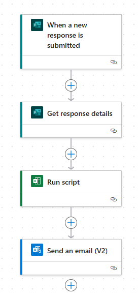

# Run Office Scripts with Power Automate

[Power Automate](https://flow.microsoft.com) lets you add Office Scripts to a larger, automated workflow. You can use Power Automate do things like add the contents of an email to a worksheet's table or create actions in your project management tools based on workbook comments.

## Getting started

If you are new to Power Automate, we recommend visiting [Get started with Power Automate](/power-automate/getting-started). There, you can learn more about all the automation possibilities available to you. The documents here focus on how Office Scripts work with Power Automate and how that can help improve your Excel experience.

To begin combining Power Automate and Office Scripts, follow the tutorial [Start using scripts with Power Automate](../tutorials/excel-power-automate-manual.md). This will teach you how to create a flow that calls a simple script. After you've completed that tutorial and the [Pass data to scripts in an automatically-run Power Automate flow](../tutorials/excel-power-automate-trigger.md) tutorial, return here for detailed information about connecting Office Scripts to Power Automate flows.

## Excel Online (Business) connector

[Connectors](/connectors/connectors) are the bridges between Power Automate and applications. The [Excel Online (Business) connector](/connectors/excelonlinebusiness) gives your flows access to Excel workbooks. The "Run script" action lets you call any Office Script accessible through the selected workbook. You can also give your scripts input parameters so data can be provided by the flow, or have your script return information for later steps in the flow.

> [!IMPORTANT]
> The "Run script" action gives people who use the Excel connector significant access to your workbook and its data. Additionally, there are security risks with scripts that make external API calls, as explained in [External calls from Power Automate](external-calls.md). If your admin is concerned with the exposure of highly sensitive data, they can either turn off the Excel Online connector or restrict access to Office Scripts through the [Office Scripts administrator controls](/microsoft-365/admin/manage/manage-office-scripts-settings).

## Data transfer in flows for scripts

Power Automate lets you pass pieces of data between steps of your flow. Scripts can be configured to accept whatever types of information you need and return anything from your workbook that you want in your flow. Input for your script is specified by adding parameters to the `main` function (in addition to `workbook: ExcelScript.Workbook`). Output from the script is declared by adding a return type to `main`.

> [!NOTE]
> When you create a "Run Script" block in your flow, the accepted parameters and returned types are populated. If you change the parameters or return types of your script, you'll need to redo the "Run script" block of your flow. This ensures the data is being parsed correctly.

The following sections cover the details of input and output for scripts used in Power Automate. If you'd like a hands-on approach to learning this topic, try out the [Pass data to scripts in an automatically-run Power Automate flow](../tutorials/excel-power-automate-trigger.md) tutorial or explore the [Automated task reminders](../resources/scenarios/task-reminders.md) sample scenario.

### `main` Parameters: Passing data to a script

All script input is specified as additional parameters for the `main` function. For example, if you wanted a script to accept a `string` that represents a name as input, you would change the `main` signature to `function main(workbook: ExcelScript.Workbook, name: string)`.

When you're configuring a flow in Power Automate, you can specify script input as static values, [expressions](/power-automate/use-expressions-in-conditions), or dynamic content. Details on an individual service's connector can be found in the [Power Automate Connector documentation](/connectors/).

When adding input parameters to a script's `main` function, consider the following allowances and restrictions.

1. The first parameter must be of type `ExcelScript.Workbook`. Its parameter name does not matter.

2. Every parameter must have a type (such as `string` or `number`).

3. The basic types `string`, `number`, `boolean`, `any`, `unknown`, `object`, and `undefined` are supported.

4. Arrays of the previously listed basic types are supported.

5. Nested arrays are supported as parameters (but not as return types).

6. Union types are allowed if they are a union of literals belonging to a single type (such as `"Left" | "Right"`). Unions of a supported type with undefined are also supported (such as `string | undefined`).

7. Object types are allowed if they contain properties of type `string`, `number`, `boolean`, supported arrays, or other supported objects. The following example shows nested objects that are supported as parameter types:

    ```TypeScript
    // Office Scripts can return an Employee object because Position only contains strings and numbers.
    interface Employee {
        name: string;
        job: Position;
    }

    interface Position {
        id: number;
        title: string;
    }
    ```

8. Objects must have their interface or class definition defined in the script. An object can also be defined anonymously inline, as in the following example:

    ```TypeScript
    function main(workbook: ExcelScript.Workbook): {name: string, email: string}
    ```

9. Optional parameters are allowed and can be denoted as such by using the optional modifier `?` (for example, `function main(workbook: ExcelScript.Workbook, Name?: string)`).

10. Default parameter values are allowed (for example `async function main(workbook: ExcelScript.Workbook, Name: string = 'Jane Doe')`.

### Returning data from a script

Scripts can return data from the workbook to be used as dynamic content in a Power Automate flow. As with input parameters, Power Automate places some restrictions on the return type.

1. The basic types `string`, `number`, `boolean`, `void`, and `undefined` are supported.

2. Union types used as return types follow the same restrictions as they do when used as script parameters.

3. Array types are allowed if they are of type `string`, `number`, or `boolean`. They are also allowed if the type is a supported union or supported literal type.

4. Object types used as return types follow the same restrictions as they do when used as script parameters.

5. Implicit typing is supported, though it must follow the same rules as a defined type.

## Example

The following screenshot shows a Power Automate flow that's triggered whenever a [GitHub](https://github.com/) issue is assigned to you. The flow runs a script that adds the issue to a table in an Excel workbook. If there are five or more issues in that table, the flow sends an email reminder.



The `main` function of the script specifies the issue ID and issue title as input parameters, and the script returns the number of rows in the issue table.

```TypeScript
function main(
  workbook: ExcelScript.Workbook,
  issueId: string,
  issueTitle: string): number {
  // Get the "GitHub" worksheet.
  let worksheet = workbook.getWorksheet("GitHub");

  // Get the first table in this worksheet, which contains the table of GitHub issues.
  let issueTable = worksheet.getTables()[0];

  // Add the issue ID and issue title as a row.
  issueTable.addRow(-1, [issueId, issueTitle]);

  // Return the number of rows in the table, which represents how many issues are assigned to this user.
  return issueTable.getRangeBetweenHeaderAndTotal().getRowCount();
}
```

## See also

- [Run Office Scripts in Excel on the web with Power Automate](../tutorials/excel-power-automate-manual.md)
- [Pass data to scripts in an automatically-run Power Automate flow](../tutorials/excel-power-automate-trigger.md)
- [Return data from a script to an automatically-run Power Automate flow](../tutorials/excel-power-automate-returns.md)
- [Troubleshooting information for Power Automate with Office Scripts](../testing/power-automate-troubleshooting.md)
- [Get started with Power Automate](/power-automate/getting-started)
- [Excel Online (Business) connector reference documentation](/connectors/excelonlinebusiness/)
