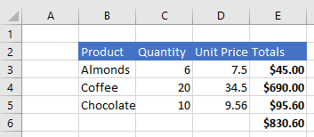
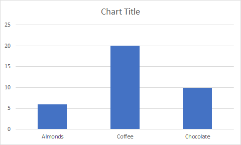
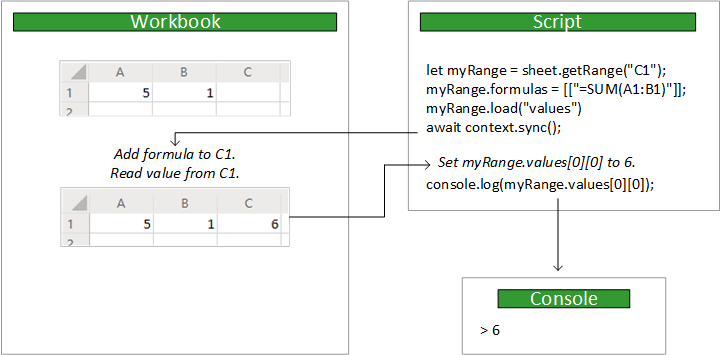

# Scripting fundamentals for Office Scripts in Excel on the web

[!INCLUDE [Preview note](../includes/preview-note.md)]

This article describes the areas of Office Scripts in Excel on the web that require you to have a better understanding of how the script code works with Excel. 

## Object model

To understand the Excel APIs, you must understand how the components of a workbook are related to one another.

- A **Workbook** contains one or more **Worksheets**.
- A **Worksheet** gives access to cells through **Range** objects.
- A **Range** represents a group of contiguous cells.
- **Ranges** are used to create and place **Tables**, **Charts**, **Shapes**, and other data visualization or organization objects.
- A **Worksheet** contains collections of those data objects that are present in the individual sheet.
- **Workbooks** contain collections of some of those data objects (such as **Tables**) for the entire **Workbook**.

### Ranges

A range is a group of contiguous cells in the workbook. Scripts typically use A1-style notation (e.g. **B3** for the single cell in row **B** and column **3** or **C2:F4** for the cells from rows **C** through **F** and columns **2** through **4**) to define ranges.

Ranges have three core properties: `values`, `formulas`, and `format`. These properties get or set the cell values, formulas to be evaluated, and the visual formatting of the cells.

#### Range sample

The following sample shows how to create sales records. This script uses `Range` objects to set the values, formulas, and formats.

```TypeScript
async function main(context: Excel.RequestContext) {
  // Get the active worksheet.
  let sheet = context.workbook.worksheets.getActiveWorksheet();

  // Create the headers and format them to stand out.
  let headers = [
    ["Product", "Quantity", "Unit Price", "Totals"]
  ];
  let headerRange = sheet.getRange("B2:E2");
  headerRange.values = headers;
  headerRange.format.fill.color = "#4472C4";
  headerRange.format.font.color = "white";

  // Create the product data rows.
  let productData = [
    ["Almonds", 6, 7.5],
    ["Coffee", 20, 34.5],
    ["Chocolate", 10, 9.56],
  ];
  let dataRange = sheet.getRange("B3:D5");
  dataRange.values = productData;

  // Create the formulas to total the amounts sold.
  let totalFormulas = [
    ["=C3 * D3"],
    ["=C4 * D4"],
    ["=C5 * D5"],
    ["=SUM(E3:E5)"]
  ];
  let totalRange = sheet.getRange("E3:E6");
  totalRange.formulas = totalFormulas;
  totalRange.format.font.bold = true;

  // Display the totals as US dollar amounts.
  totalRange.numberFormat = [["$0.00"]];
}
```

Running this script creates the following data in the current worksheet:



### Charts, tables, and other data objects

Scripts can create and manipulate the data structures and visualizations within Excel. Tables and charts are two of the more commonly used objects, but the APIs support PivotTables, shapes, images, and more.

#### Creating a table

Create tables by using data-filled ranges. Formatting and table controls (such as filters) are automatically applied to the range.

The following script creates a table using the ranges from the previous sample.

```TypeScript
async function main(context: Excel.RequestContext) {
   let sheet = context.workbook.worksheets.getActiveWorksheet();
   sheet.tables.add("B2:E5", true);
}
```

Running this script on the worksheet with the previous data creates the following table:


#### Creating a chart

Create charts to visualize the data in a range. Scripts allow for dozens of chart varieties, each of which can be customized to suit your needs.

The following script creates a simple column chart for three items and places it 100 pixels below the top of the worksheet.

```TypeScript
async function main(context: Excel.RequestContext) {
  let sheet = context.workbook.worksheets.getActiveWorksheet();
  let chart = sheet.charts.add(Excel.ChartType.columnStacked, sheet.getRange("B3:C5"));
  chart.top = 100;
}
```

Running this script on the worksheet with the previous table creates the following chart:



### Further reading on the object model

The [Office Scripts API reference documentation](/javascript/api/office-scripts/overview) is a comprehensive listing of the objects used in Office Scripts. There, you can use the table of contents to navigate to any class you'd like to learn more about. Here are some commonly viewed pages:

- [Chart](/javascript/api/office-scripts/excel-scripts/excel.chart)
- [Comment](/javascript/api/office-scripts/excel-scripts/excel.comment)
- [PivotTable](/javascript/api/office-scripts/excel-scripts/excel.pivottable)
- [Range](/javascript/api/office-scripts/excel-scripts/excel.range)
- [RangeFormat](/javascript/api/office-scripts/excel-scripts/excel.rangeformat)
- [Shape](/javascript/api/office-scripts/excel-scripts/excel.shape)
- [Table](/javascript/api/office-scripts/excel-scripts/excel.table)
- [Workbook](/javascript/api/office-scripts/excel-scripts/excel.workbook)
- [Worksheet](/javascript/api/office-scripts/excel-scripts/excel.worksheet)

## `main` function

Every Office Script must contain a `main` function with the following signature, including the `Excel.RequestContext` type definition:

```TypeScript
async function main(context: Excel.RequestContext) {
    // Your Excel Script
}
```

The code inside the `main` function runs when the script is run. `main` can call other functions in your script, but code that's not contained in a function will not run.

## Context

The `main` function accepts an `Excel.RequestContext` parameter, named `context`. Think of `context` as the bridge between your script and the workbook. Your script accesses the workbook with the `context` object and uses that `context` to send data back and forth.

The `context` object is necessary because the script and Excel are running in different processes and locations. The script will need to make changes to or query data from the workbook in the cloud. The `context` object manages those transactions.

## Sync and Load

Because your script and workbook run in different locations, any data transfer between the two takes time. To improve script performance, commands are queued up until the script explicitly calls the `sync` operation to synchronize the script and workbook. Your script can work independently until it needs to do either of the following:

- Read data from the workbook (following a `load` operation).
- Write data to the workbook (usually because the script has finished).

The following image shows an example control flow between the script and workbook:



### Sync

Whenever your script needs to read data from or write data to the workbook, call the `RequestContext.sync` method as shown here:

```TypeScript
await context.sync();
```

> [!NOTE]
> `context.sync()` is implicitly called when a script ends.

After the `sync` operation completes, the workbook updates to reflect any write operations that script has specified. A write operation is setting any property on a Excel object (e.g. `range.format.fill.color = "red"`) or calling a method that changes a property (e.g., `range.format.autoFitColumns()`). The `sync` operation also reads any values from the workbook that the script requested by using a `load` operation (as discussed in the next section).

Synchronizing your script with the workbook can take time, depending on your network. You should minimize the number of `sync` calls to help your script run fast.  

### Load

A script must load data from the workbook before reading it. However, frequently loading data from the entire workbook would greatly reduce the script's speed. Instead, the `load` method lets your script state specifically which data should be retrieved from the workbook.

The `load` method is available on every Excel object. Your script must load an object's properties before it can read them. Not doing so will result in an error.

The following examples use a `Range` object to show the three ways the `load` method can be used to load data.

|Intent |Example Command | Effect |
|:--|:--|:--|
|Load one property |`myRange.load("values");` | Loads a single property, in this case the two-dimensional array of values in this range. |
|Load multiple properties |`myRange.load("values, rowCount, columnCount");`| Loads all the properties from a comma-delimited list, in this example the values, row count, and column count. |
|Load everything | `myRange.load();`|Loads all the properties on the range. This is not a recommended solution, since it will slow down your script by getting unnecessary data. You should only use this while testing your script or if you need every property from the object. |

Your script must call `context.sync()` before reading any loaded values.

```TypeScript
let range = selectedSheet.getRange("A1:B3");
range.load ("rowCount"); // Load the property.
await context.sync(); // Synchronize with the workbook to get the property.
console.log(range.rowCount); // Read and log the property value (3).
```

You can also load properties across an entire collection. Every collection object has an `items` property that is an array containing the objects in that collection. Using `items` as the start of a hierarchical call (`items\myProperty`) to `load` loads the specified properties on each of those items. The following example loads the `resolved` property on every `Comment` object in the `CommentCollection` object of a worksheet.

```TypeScript
let comments = selectedSheet.comments;
comments.load("items/resolved"); // Load the `resolved` property from every comment in this collection.
await context.sync(); // Synchronize with the workbook to get the properties.
```

## See also

- [Office Scripts API reference](/javascript/api/office-scripts/overview)
