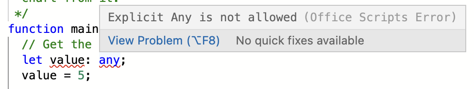

# Scripting fundamentals for Office Scripts in Excel on the web (preview)

This article will introduce you to the technical aspects of Office Scripts. You'll learn how the Excel objects work together and how the Code Editor synchronizes with a workbook.

[!INCLUDE [Preview note](../includes/preview-note.md)]

## `main` function

Each Office Script must contain a `main` function with the `ExcelScript.Workbook` type as its first parameter. When the function is executed, Excel application invokes this `main` function by providing the workbook as its first parameter. Hence, it is important to not modify the basic signature of the `main` function once you have either recorded the script or created a new script from the code editor.

```typescript
function main(workbook: ExcelScript.Workbook) {
  // Your code goes here
}
```

The code inside the `main` function runs when the script is run. `main` can call other functions in your script, but code that's not contained in a function will not run.

> [!CAUTION]
> If your `main` function looks like `async function main(context: Excel.RequestContext)`, your script is using the older async API model. For more information (including how to convert your script to the current API model), refer to [Support older Office Scripts that use the Async APIs](excel-async-model.md).

## Object model

To write a script, you need to understand how the Office Script APIs fit together. The components of a workbook have specific relations to one another. In many ways, these relations match those of the Excel UI.

- A **Workbook** contains one or more **Worksheets**.
- A **Worksheet** gives access to cells through **Range** objects.
- A **Range** represents a group of contiguous cells.
- **Ranges** are used to create and place **Tables**, **Charts**, **Shapes**, and other data visualization or organization objects.
- A **Worksheet** contains collections of those data objects that are present in the individual sheet.
- **Workbooks** contain collections of some of those data objects (such as **Tables**) for the entire **Workbook**.

### Workbook

Every script is provided a `workbook` object of type `Workbook` by the `main` function. This represents the top level object through which your script interacts with the Excel workbook.

The following script gets the active worksheet from the workbook and logs its name.

```typescript
function main(workbook: ExcelScript.Workbook) {
    // Get the active worksheet.
    let sheet = workbook.getActiveWorksheet();

    // Display the current worksheet's name.
    console.log(sheet.getName());
}
```

### Ranges

A range is a group of contiguous cells in the workbook. Scripts typically use A1-style notation (e.g., **B3** for the single cell in column **B** and row **3** or **C2:F4** for the cells from columns **C** through **F** and rows **2** through **4**) to define ranges.

Ranges have three core properties: values, formulas, and format. These properties get or set the cell values, formulas to be evaluated, and the visual formatting of the cells. They are accessed through `getValues`, `getFormulas`, and `getFormat`. Values and formulas can be changed with `setValues` and `setFormulas`, while the format is a `RangeFormat` object comprised of several smaller objects that are individually set.

Ranges use two-dimensional arrays to manage information. Read the [Working with ranges section of Using built-in JavaScript objects in Office Scripts](javascript-objects.md#working-with-ranges) for more information on handling those arrays in the Office Scripts framework.

#### Range sample

The following sample shows how to create sales records. This script uses `Range` objects to set the values, formulas, and parts of the format.

```TypeScript
function main(workbook: ExcelScript.Workbook) {
    // Get the active worksheet.
    let sheet = workbook.getActiveWorksheet();

    // Create the headers and format them to stand out.
    let headers = [["Product", "Quantity", "Unit Price", "Totals"]];
    let headerRange = sheet.getRange("B2:E2");
    headerRange.setValues(headers);
    headerRange.getFormat().getFill().setColor("#4472C4");
    headerRange.getFormat().getFont().setColor("white");

    // Create the product data rows.
    let productData = [
        ["Almonds", 6, 7.5],
        ["Coffee", 20, 34.5],
        ["Chocolate", 10, 9.56],
    ];
    let dataRange = sheet.getRange("B3:D5");
    dataRange.setValues(productData);

    // Create the formulas to total the amounts sold.
    let totalFormulas = [
        ["=C3 * D3"],
        ["=C4 * D4"],
        ["=C5 * D5"],
        ["=SUM(E3:E5)"],
    ];
    let totalRange = sheet.getRange("E3:E6");
    totalRange.setFormulas(totalFormulas);
    totalRange.getFormat().getFont().setBold(true);

    // Display the totals as US dollar amounts.
    totalRange.setNumberFormat("$0.00");
}
```

Running this script creates the following data in the current worksheet:


### Charts, tables, and other data objects

Scripts can create and manipulate the data structures and visualizations within Excel. Tables and charts are two of the more commonly used objects, but the APIs support PivotTables, shapes, images, and more. These are stored in collections, which will be discussed later in this article.

#### Creating a table

Create tables by using data-filled ranges. Formatting and table controls (such as filters) are automatically applied to the range.

The following script creates a table using the ranges from the previous sample.

```TypeScript
function main(workbook: ExcelScript.Workbook) {
    // Get the active worksheet.
    let sheet = workbook.getActiveWorksheet();

    // Add a table that has headers using the data from B2:E5.
    sheet.addTable("B2:E5", true);
}
```

Running this script on the worksheet with the previous data creates the following table:


#### Creating a chart

Create charts to visualize the data in a range. Scripts allow for dozens of chart varieties, each of which can be customized to suit your needs.

The following script creates a simple column chart for three items and places it 100 pixels below the top of the worksheet.

```TypeScript
function main(workbook: ExcelScript.Workbook) {
    // Get the active worksheet.
    let sheet = workbook.getActiveWorksheet();

    // Create a column chart using the data from B3:C5.
    let chart = sheet.addChart(
        ExcelScript.ChartType.columnStacked,
        sheet.getRange("B3:C5")
    );

    // Set the margin of the chart to be 100 pixels from the top of the screen.
    chart.setTop(100);
}
```

Running this script on the worksheet with the previous table creates the following chart:


### Collections and other object relations

Any child object can be accessed through its parent object. For example, you can read `Worksheets` from the `Workbook` object. There will be a related `get` method on the parent class that (e.g., `Workbook.getWorksheets()` or `Workbook.getWorksheet(name)`). `get` methods that are singular return a single object and require an ID or name for the specific object (such as the name of a worksheet). `get` methods that are plural return the entire object collection as an array. If the collection is empty, you'll get an empty array (`[]`).

Once the collection is retrieved, you can use regular array operations such as getting its `length` or use `for`, `for..of`, `while` loops for iteration or use TypeScript array methods such as `map`, `forEach` on them. You can also access individual objects within the collection using the array index value. For example, `workbook.getTables()[0]` returns the first table in the collection. Read the [Working with collections section of Using built-in JavaScript objects in Office Scripts](javascript-objects.md#working-with-collections) to learn more about using built-in array functionality with the Office Scripts framework.

The following script gets all tables in the workbook. It then ensures the headers are displays, the filter buttons are visible, and the table style is set to "TableStyleLight1".

```typescript
function main(workbook: ExcelScript.Workbook) {
  /* Get table collection */
  const tables = workbook.getTables();
  /* Set table formatting properties */
  tables.forEach(table => {
    table.setShowHeaders(true);
    table.setShowFilterButton(true);
    table.setPredefinedTableStyle("TableStyleLight1");
  })
}
```

#### Adding Excel objects with a script

You can programmatically add document objects, such as tables or charts, by calling the corresponding `add` method available on the parent object.

> [!NOTE]
> Do not manually add objects to collection arrays. Use the `add` methods on the parent objects For example, add a `Table` to a `Worksheet` with the `Worksheet.addTable` method.

The following script creates a table in Excel on the first worksheet in the workbook. Note that the created table is returned by the `addTable` method.

```typescript
function main(workbook: ExcelScript.Workbook) {
    // Get the first worksheet.
    let sheet = workbook.getWorksheets()[0];

    // Add a table that uses the data in C3:G10.
    let table = sheet.addTable(
      "C3:G10",
       true /* True because the table has headers. */
    );
}
```

## Removing Excel objects with a script

To delete an object, call the object's `delete` method.

> [!NOTE]
> As with adding objects, do not manually remove objects from collection arrays. Use the `delete` methods on the collection-type objects. For example, remove a `Table` from a `Worksheet` using `Table.delete`.

The following script removes the first worksheet in the workbook.

```typescript
function main(workbook: ExcelScript.Workbook) {
    // Get first worksheet.
    let sheet = workbook.getWorksheets()[0];

    // Remove that worksheet from the workbook.
    sheet.delete();
}
```

### Definining types 

Type declarations help users understand the type of variable they are dealing with. It helps with auto completion of methods and assists in development time quality checks. 
You can fine type declarations in the script in various places including function declaration, variable declaration, IntelliSence definitions, etc. 

Examples: 

* `function main(workbook: ExcelScript.Workbook)`
* `let myRange: ExcelScript.Range;` 
* `function getMaxAmount(range: ExcelScript.Range): number`

You can identify the types easily in the code editor as it appears distinctly usually in a different color. The color `:` usually preceds the type declaration.  

Writing types can be optional in TypeScript, because type inference allows you to get a lot of power without writing additional code. For the most part TypeScript language is good at inferring the types of variables. However, in certain cases, Office Script will require the type declarations be explicitly defined if the language is unable to clearly identify the type. Also, explicit or implicit `any` is not allowed in Office Script. More on that below 

#### 'any' type in the script

As the [TypeScript website states](https://www.typescriptlang.org/docs/handbook/basic-types.html#any), in some situations, not all type information is available or its declaration would take an inappropriate amount of effort. These may occur for values from code that has been written without TypeScript or a 3rd party library. In these cases, we might want to opt-out of type checking. To do so, we label these values with the `any` type:

```typescript
declare function getValue(key: string): any;
// OK, return value of 'getValue' is not checked
const str: string = getValue("myString");
```

**Explicit `any` is not allowed**

```typescript
let someVariable: any; 
// ^^ This is not allowed ^^
```

The `any` type presents challenges to the way Office Script processes the Excel APIs. It causes issues when the variables are sent to Excel APIs for processing. Knowing the type of variables used in the script is essential to the processing of script and hence explicit definition of any variable with `any` type is prohibited. You will receive a compile time error (error prior to the running of the script) if there is any variable with `any` type defined in the script. You will see an error on the editor as well. 

] 

] 

In the above code `[5, 16] Explicit Any is not allowed` indicates that line # 5 column # 16 defines `any` type. This helps to locate the error line. 

To get around this issue, always define the type of the variable. 

If you are uncertain about the type of a variable, one cool trick in TypeScript allows you to define [union types](https://www.typescriptlang.org/docs/handbook/unions-and-intersections.html). This can be used for variables to hold range value, which can be only of many types. 

```typescript
   let value: (string | number | boolean);
   // ^^ define this as a union type rather than any type ^^
   value = someValue_from_another_source;
   //...
   someRange.setValue(value);
```

#### Type inference 

In TypeScript, there are several places where [type inference](https://www.typescriptlang.org/docs/handbook/type-inference.html is used to provide type information when there is no explicit type annotation. For example, in this code

```typescript
let x = 3;
//  ^ = let x: number
```

The type of the x variable is inferred to be number. This kind of inference takes place when initializing variables and members, setting parameter default values, and determining function return types. 


#### no-implicit-any rule
A script requires the types of the variables used to be explicitly or implicity defined. If TypeScript compiler is unable to determine the type of a variable (either because type is not defined explicitly or type inference is not not possible), then you will receive a compilation time error (error prior to the running of the script).  You will see an error on the editor as well.


Following scripts will receive compilation time error as variables are defined without any types and TypeScript cannot determine the type at the time of declaration. 

```typescript
function main(workbook: ExcelScript.Workbook) {
    let value; 
    // ^^ the variable 'value' gets 'any' type as no type is defined. ^^
    value = 10; 
    // ^^Even when a numer type is assigned, the type of 'value' remains any. ^^
    workbook.getActiveCell().setValue(value);
    // ^^ Above line will fail because Office Scripts can't send an argument of type 'any' to Excel for processing. ^^
    return;
}
```

```typescript
function main(workbook: ExcelScript.Workbook) {
    let cell; 
    // ^^ the variable 'cell' gets 'any' type as no type is defined. ^^
    cell = workbook.getActiveCell().getValue();
    console.log(cell.getValue());
    // ^^ Office Scripts cannot assign Range type object to 'any' type variable. ^^    
    return;
}
```

To avoid this, use following instead. In each case, the type is declared at the time of declaration of variable. 

```typescript
function main(workbook: ExcelScript.Workbook) {
    const value: number = 10; 
    workbook.getActiveCell().setValue(value);
    return;
}
```

```typescript
function main(workbook: ExcelScript.Workbook) {
    const cell: ExcelScript.Range = workbook.getActiveCell().getValue();
    console.log(cell.getValue()); 
    return;
}
```


### Further reading on the object model

The [Office Scripts API reference documentation](/javascript/api/office-scripts/overview) is a comprehensive listing of the objects used in Office Scripts. There, you can use the table of contents to navigate to any class you'd like to learn more about. The following are several commonly viewed pages.

- [Chart](/javascript/api/office-scripts/excelscript/excelscript.chart)
- [Comment](/javascript/api/office-scripts/excelscript/excelscript.comment)
- [PivotTable](/javascript/api/office-scripts/excelscript/excelscript.pivottable)
- [Range](/javascript/api/office-scripts/excelscript/excelscript.range)
- [RangeFormat](/javascript/api/office-scripts/excelscript/excelscript.rangeformat)
- [Shape](/javascript/api/office-scripts/excelscript/excelscript.shape)
- [Table](/javascript/api/office-scripts/excelscript/excelscript.table)
- [Workbook](/javascript/api/office-scripts/excelscript/excelscript.workbook)
- [Worksheet](/javascript/api/office-scripts/excelscript/excelscript.worksheet)

## See also

- [Record, edit, and create Office Scripts in Excel on the web](../tutorials/excel-tutorial.md)
- [Read workbook data with Office Scripts in Excel on the web](../tutorials/excel-read-tutorial.md)
- [Office Scripts API reference](/javascript/api/office-scripts/overview)
- [Using built-in JavaScript objects in Office Scripts](javascript-objects.md)
