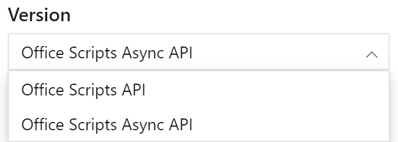

Use [this link to view the async version of the API reference documentation](/javascript/api/office-scripts/excelscript?view=office-scripts-async&preserve-view=true). You can switch between the standard APIs and the async versions using the version selection control above the table-of-contents in the reference documentation.

