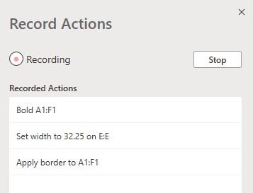
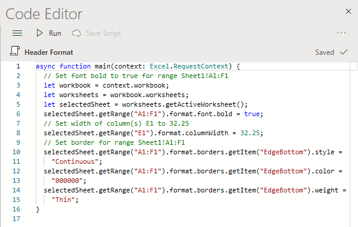

# Office Scripts in Excel on the web (preview)

Office Scripts in Excel on the web let you automate your day-to-day tasks. You can record your Excel actions with the Action Recorder, which creates a script. You can also create and edit scripts with the Code Editor. This series of documents teaches you how to use these tools. You'll be introduced to the Action Recorder and see how to record your frequent Excel actions. You'll also learn how to make or update your own scripts with the Code Editor.

 

> [!VIDEO https://www.microsoft.com/videoplayer/embed/RE4qdFF]

[!INCLUDE [Preview note](../includes/preview-note.md)]

## When to use Office Scripts

Scripts allow you to record and replay your Excel actions on different workbooks and worksheets. If you find yourself doing the same things over and over again, an Office Script can help you by reducing your whole workflow to a single button press.

As an example, say you start your work day by opening a .csv file from an accounting site in Excel. You then spend several minutes deleting unnecessary columns, formatting a table, adding formulas, and creating a PivotTable in a new worksheet. Those actions you repeat daily can be recorded once with the Action Recorder. For then on, running the script will take care of your entire .csv conversion. You'll not only remove the risk of forgetting steps, but be able to share your process with others without having to teach them anything. Office Scripts automate your common tasks so you and your workplace can be more efficient and productive.

## Action Recorder

The Action Recorder records actions you take in Excel and translates them into a script. With the Action recorder running, you can capture the Excel actions as you edit cells, change formatting, and create tables. The resulting script can be run on other worksheets and workbooks to recreate your original actions.

## Code Editor

All scripts recorded with the Action Recorder can be edited through the Code Editor. This lets you tweak and customize the script to better suit your exact needs. You can also add logic and functionality that is not directly accessible through the Excel UI, such as conditional statements (if/else) and loops.

One easy way to start learning the capabilities of Office Scripts is to record scripts in Excel on the web and view the resulting code. Another option is to follow our [tutorials](../tutorials/excel-tutorial.md) to learn in a more guided and structured way.

## Next steps

Complete the [Office Scripts in Excel on the web tutorial](../tutorials/excel-tutorial.md) to learn how to create your first Office Scripts.

## See also

- [Scripting fundamentals for Office Script in Excel on the web](../develop/scripting-fundamentals.md)
- [Office Scripts API reference](/javascript/api/office-scripts/overview)
- [Troubleshooting Office Scripts](../testing/troubleshooting.md)
- [Office Scripts settings in M365](https://support.office.com/article/office-scripts-settings-in-m365-19d3c51a-6ca2-40ab-978d-60fa49554dcf)
- [Introduction to Office Scripts in Excel (on support.office.com)](https://support.office.com/article/introduction-to-office-scripts-in-excel-9fbe283d-adb8-4f13-a75b-a81c6baf163a)
