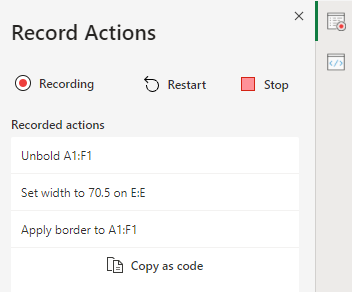

# Office Scripts in Excel on the web (preview)

Office Scripts in Excel on the web let you automate your day-to-day tasks. You can record your Excel actions with the Action Recorder, which creates a script. You can also create and edit scripts with the Code Editor. Your scripts can then be shared across your organization so your coworkers can also automate their workflows.

This series of documents teaches you how to use these tools. You'll be introduced to the Action Recorder and see how to record your frequent Excel actions. You'll also learn how to make or update your own scripts with the Code Editor.

 

> [!VIDEO https://www.microsoft.com/videoplayer/embed/RE4qdFF]

## Requirements

[!INCLUDE [Preview note](../includes/preview-note.md)]

To use Office Scripts, you'll need the following.

1. [Excel on the web](https://www.office.com/launch/excel) (other platforms, such as desktop, are not supported).
1. Office Scripts [enabled by your administrator](https://support.office.com/article/office-scripts-settings-in-m365-19d3c51a-6ca2-40ab-978d-60fa49554dcf).
1. Any commercial or educational Microsoft 365 license with access to the Microsoft 365 Apps, such as:

    - Office 365 Business
    - Office 365 Business Premium
    - Office 365 ProPlus
    - Office 365 ProPlus for Devices
    - Office 365 Enterprise E3
    - Office 365 Enterprise E5
    - Office 365 A3
    - Office 365 A5

## When to use Office Scripts

Scripts allow you to record and replay your Excel actions on different workbooks and worksheets. If you find yourself doing the same things over and over again, you can turn all that work into an easy-to-run Office Script. Run your script with a button-press in Excel or combine it with Power Automate to streamline your entire workflow.

As an example, say you start your work day by opening a .csv file from an accounting site in Excel. You then spend several minutes deleting unnecessary columns, formatting a table, adding formulas, and creating a PivotTable in a new worksheet. Those actions you repeat daily can be recorded once with the Action Recorder. From then on, running the script will take care of your entire .csv conversion. You'll not only remove the risk of forgetting steps, but be able to share your process with others without having to teach them anything. Office Scripts automate your common tasks so you and your workplace can be more efficient and productive.

## Action Recorder

The Action Recorder records actions you take in Excel and saves them as a script. With the Action recorder running, you can capture the Excel actions as you edit cells, change formatting, and create tables. The resulting script can be run on other worksheets and workbooks to recreate your original actions.

## Code Editor

All scripts recorded with the Action Recorder can be edited through the Code Editor. This lets you tweak and customize the script to better suit your exact needs. You can also add logic and functionality that is not directly accessible through the Excel UI, such as conditional statements (if/else) and loops.

One easy way to start learning the capabilities of Office Scripts is to record scripts in Excel on the web and view the resulting code. Another option is to follow our [tutorials](../tutorials/excel-tutorial.md) to learn in a more guided and structured way.

## Sharing scripts

Office Scripts can be shared with other users of an Excel workbook. When you share a script with others in a workbook, the script is attached to the workbook. Your scripts are stored in your OneDrive, and when you share one, you create a link to it in the workbook you have open.

More details about sharing and unsharing scripts can be in the article [Sharing Office Scripts in Excel for the Web](https://support.microsoft.com/office/sharing-office-scripts-in-excel-for-the-web-226eddbc-3a44-4540-acfe-fccda3d1122b?storagetype=live&ui=en-US&rs=en-US&ad=US).

## Connecting Office Scripts to Power Automate

[Power Automate](https://flow.microsoft.com/) is a service that helps you create automated workflows between multiple apps and services. Office Scripts can be used in these workflows, giving you control of your scripts outside of the workbook. You can run your scripts on a schedule, trigger them in response to emails, and much more. Visit the [Run Office Scripts in Excel on the web with Power Automate](../tutorials/excel-power-automate-manual.md) tutorial to learn the basics of connecting these automation services.

## Next steps

Complete the [Office Scripts in Excel on the web tutorial](../tutorials/excel-tutorial.md) to learn how to create your first Office Scripts.

## See also

- [Scripting fundamentals for Office Scripts in Excel on the web](../develop/scripting-fundamentals.md)
- [Office Scripts API reference](/javascript/api/office-scripts/overview)
- [Troubleshooting Office Scripts](../testing/troubleshooting.md)
- [Office Scripts settings in M365](https://support.office.com/article/office-scripts-settings-in-m365-19d3c51a-6ca2-40ab-978d-60fa49554dcf)
- [Introduction to Office Scripts in Excel (on support.office.com)](https://support.office.com/article/introduction-to-office-scripts-in-excel-9fbe283d-adb8-4f13-a75b-a81c6baf163a)
- [Sharing Office Scripts in Excel for the Web](https://support.microsoft.com/office/sharing-office-scripts-in-excel-for-the-web-226eddbc-3a44-4540-acfe-fccda3d1122b?storagetype=live&ui=en-US&rs=en-US&ad=US)
