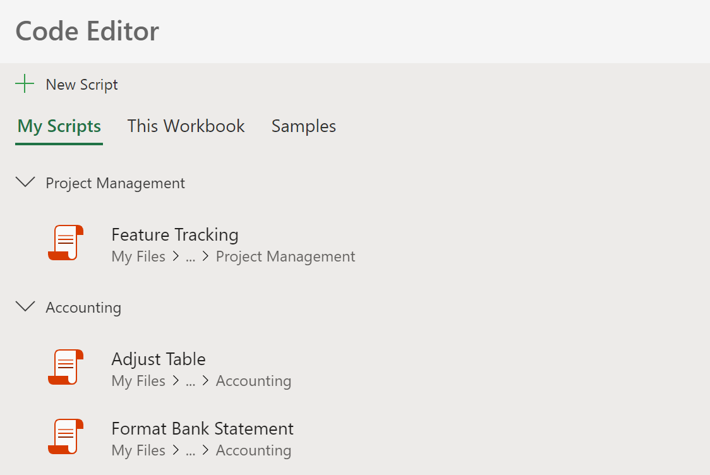

# Office Scripts file storage and ownership

Office Scripts are stored as **.osts** files in your OneDrive. The permissions of a script inside a workbook are limited to the permissions of that script's owner. The script **.osts** files carry whatever shared access and permissions that user's OneDrive allows.

## File storage

You Office Scripts are stored in your OneDrive. The **.osts** files are found in the **/Documents/Office Scripts/** folder. Any edits made these **.osts** files, such as renaming or deleting files, will be reflected in the Code Editor and Script Gallery.

Scripts that are shared with one of your workbooks remain in the cloud and are not locally copied. The **Make a Copy** button of the Code Editor saves a separate, local copy of the script.Changes to the copy do not affect the original script.

### Script Folders

Adding folders to your OneDrive helps keep your scripts organized. Any folders under **/Documents/Office Scripts/** are displayed under the **My Scripts** section of the Code Editor. Please note that these folders cannot be created and deleted through the Code Editor. Likewise, scripts cannot be placed in to or out of folders through the Code Editor.

## File ownership and retention

Office Scripts are stored on a user's OneDrive, they follow the same retention and deletion policies. To learn how to handle scripts that were created and shared by a user being removed from your organization, see [OneDrive retention and deletion](/onedrive/retention-and-deletion).
