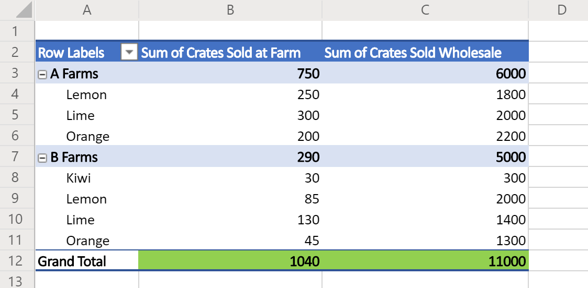

# Sample scripts for Office Scripts in Excel on the web (preview)

The following samples are simple scripts for you to try on your own workbooks. To use them in Excel on the web:

1. Open the **Automate** tab.
2. Press **Code Editor**.
3. Press **New Script** in the Code Editor's task pane.
4. Replace the entire script with the sample of your choice.
5. Press **Run** in the Code Editor's task pane.

[!INCLUDE [Preview note](../includes/preview-note.md)]

## Scripting basics

These samples demonstrate fundamental building blocks for Office Scripts. Add these to your scripts to extend your solution and solve common problems.

### Read and log one cell

This sample reads the value of **A1** and prints it to the console.

``` TypeScript
async function main(context: Excel.RequestContext) {
  // Get the current worksheet.
  let selectedSheet = context.workbook.worksheets.getActiveWorksheet();

  // Get the value of cell A1.
  let range = selectedSheet.getRange("A1");
  range.load("values");
  await context.sync();

  // Print the value of A1.
  console.log(range.values);
}
```

### Work with dates

The samples in this section show how to use the JavaScript [Date](https://developer.mozilla.org/docs/web/javascript/reference/global_objects/date) object.

The following sample gets the current date and time and then writes those values to two cells in the active worksheet.

```TypeScript
async function main(context: Excel.RequestContext) {
  // Get the cells at A1 and B1.
  let dateRange = context.workbook.worksheets.getActiveWorksheet().getRange("A1");
  let timeRange = context.workbook.worksheets.getActiveWorksheet().getRange("B1");

  // Get the current date and time with the JavaScript Date object.
  let date = new Date(Date.now());

  // Add the date string to A1.
  dateRange.values = [[date.toLocaleDateString()]];
  
  // Add the time string to B1.
  timeRange.values = [[date.toLocaleTimeString()]];
}
```

The next sample reads a date that's stored in Excel and translates it to a JavaScript Date object. It uses the [date's numeric serial number](https://support.office.com/article/now-function-3337fd29-145a-4347-b2e6-20c904739c46) as input for the JavaScript Date.

```TypeScript
async function main(context: Excel.RequestContext) {
  // Read a date at cell A1 from Excel.
  let dateRange = context.workbook.worksheets.getActiveWorksheet().getRange("A1");
  dateRange.load("values");
  await context.sync();

  // Convert the Excel date to a JavaScript Date object.
  let excelDateValue = dateRange.values[0][0];
  let javaScriptDate = new Date(Math.round((excelDateValue - 25569) * 86400 * 1000));
  console.log(javaScriptDate);
}
```

## Display data

These samples demonstrate how to work with worksheet data and provide users with a better view or organization.

### Apply conditional formatting

This sample applies conditional formatting to the currently used range in the worksheet. The conditional formatting is a green fill for the top 10% of values.

```TypeScript
async function main(context: Excel.RequestContext) {
  // Get the current worksheet.
  let selectedSheet = context.workbook.worksheets.getActiveWorksheet();

  // Get the used range in the worksheet.
  let range = selectedSheet.getUsedRange();

  // Set the fill color to green for the top 10% of values in the range.
  let conditionalFormat = range.conditionalFormats.add(Excel.ConditionalFormatType.topBottom);
  conditionalFormat.topBottom.format.fill.color = "green";
  conditionalFormat.topBottom.rule = {
    rank: 10, // The percentage threshold.
    type: Excel.ConditionalTopBottomCriterionType.topPercent // The type of the top/bottom condition.
  };
}
```

### Create a sorted table

This sample creates a table from the current worksheet's used range, then sorts it based on the first column.

```TypeScript
async function main(context: Excel.RequestContext) {
  // Get the current worksheet.
  let selectedSheet = context.workbook.worksheets.getActiveWorksheet();

  // Create a table with the used cells.
  let usedRange = selectedSheet.getUsedRange();
  let newTable = selectedSheet.tables.add(usedRange, true);

  // Sort the table using the first column.
  newTable.sort.apply([{ key: 0, ascending: true }]);
}
```

### Log the "Grand Total" values from a PivotTable

This sample finds the first PivotTable in the workbook and logs the values in the "Grand Total" cells (as highlighted in green in the image below).



```TypeScript
async function main(context: Excel.RequestContext) {
  // Get the first PivotTable in the workbook.
  let pivotTableCollection = context.workbook.pivotTables;
  pivotTableCollection.load("items");
  await context.sync();

  let pivotTable = pivotTableCollection.items[0];
  
  // Get the names of each data column in the PivotTable.
  let pivotColumnLabelRange = pivotTable.layout.getColumnLabelRange();
  pivotColumnLabelRange.load("values");

  // Get the range displaying the pivoted data.
  let pivotDataRange = pivotTable.layout.getDataBodyRange();

  // Get the range with the "grand totals" for the PivotTable columns.
  let grandTotalRange = pivotDataRange.getLastRow();
  grandTotalRange.load("values");
  await context.sync();
  
  // Print each of the "Grand Totals" to the console.
  grandTotalRange.values[0].forEach((column, columnIndex) => {
    console.log(`Grand total of ${pivotColumnLabelRange.values[0][columnIndex]}: ${grandTotalRange.values[0][columnIndex]}`);
    // Example log: "Grand total of Sum of Crates Sold Wholesale: 11000"
  });
}
```

## Collaboration

These samples demonstrate how to work with collaboration-related features of Excel, such as comments.

### Delete resolved comments

This sample deletes all resolved comments from the current worksheet.

```TypeScript
async function main(context: Excel.RequestContext) {
  // Get the current worksheet.
  let selectedSheet = context.workbook.worksheets.getActiveWorksheet();

  // Get the comments on this worksheet.
  let comments = selectedSheet.comments;
  comments.load("items/resolved");
  await context.sync();

  // Delete the resolved comments.
  comments.items.forEach((comment) => {
      if (comment.resolved) {
          comment.delete();
      }
  });
}
```

## Scenario samples

For samples showcasing larger, real-world solutions, visit [Sample scenarios for Office Scripts](scenarios/sample-scenario-overview.md).

## Suggest new samples

We welcome suggestions for new samples. If there is a common scenario that would help other script developers, please tell us in the feedback section below.
