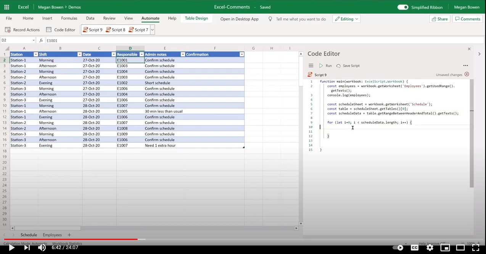

# Add comments in Excel

This sample shows how to add comments to a cell with at-mention of a contact.

## Example scenario

* Team lead maintains shift schedule information. Team lead assigns employee ID to shift record.
* Team lead wishes to send email reminder by adding a comment with @mention of the employee by cross referencing the employee email address along with a custom message from the sheet.
* Employee can then address and respond to the comment.

## Solution

1. The Office Script extracts employee information from the employee sheet.
1. The script then cross references the shift record and adds a comment to the appropriate cell by including the relevant employee email in the team lead's comment.
1. It also removes any existing comment on the cell before adding a new comment.

## Sample Excel file

Download the file <a href="excel-comments.xlsx">excel-comments.xlsx</a> used in this sample and try it out yourself!

## Office Script

```ts
function main(workbook: ExcelScript.Workbook) {
    const employees = workbook.getWorksheet('Employees').getUsedRange().getTexts();
    console.log(employees); 

    const scheduleSheet = workbook.getWorksheet('Schedule');
    const table = scheduleSheet.getTables()[0];
    const range = table.getRangeBetweenHeaderAndTotal();
    const scheduleData = range.getTexts();

    for (let i=0; i < scheduleData.length; i++) {
      let eId = scheduleData[i][3];

      let employeeInfo = employees.find(e => e[0] === eId);
      if (employeeInfo) {
        console.log("Found a match " + employeeInfo);
        let adminNotes = scheduleData[i][4];
        try { 
          let comment = workbook.getCommentByCell(range.getCell(i, 5));
          comment.delete();
        } catch {
            console.log("Ignore if there is no existing comment in the cell");
        }
        workbook.addComment(range.getCell(i,5), {
          mentions: [{
            email: employeeInfo[1],
            id: 0,
            name: employeeInfo[2]
          }],
          richContent: `<at id=\"0\">${employeeInfo[2]}</at> ${adminNotes}`
        }, ExcelScript.ContentType.mention);        
        
      } else {
        console.log("No match for: " + eId);
      }
    }
    return;
}
```

## Video

[](https://youtu.be/CpR78nkaOFw "Step-by-step video")
