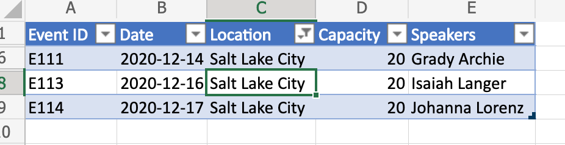
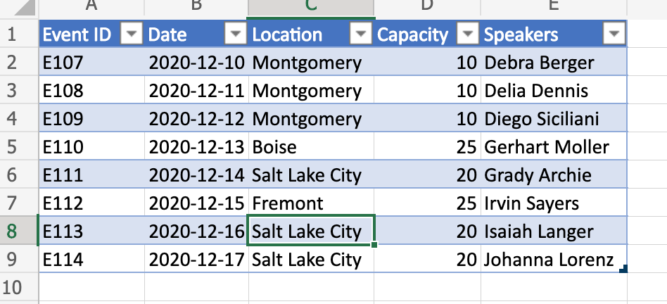

# Clear table column filter based on active cell location

This script clears the table column filter based on active cell location. The script detects if the cell is part of a table and then determines the table column and clears any filter that may be applied on it.

If you wish to learn more about how to save the filter prior to clearing it (and re-apply later), check out a [more advanced sample](move-rows-across-tables.md).

## Video

See [Range basics](range-basics.md#video-links)

## Screenshots

_Before clearing column filter (notice the active cell)_



_After clearing column filter_



## Sample Excel file

This example can be applied to any Excel file with a table. For the convenience sake, you can use the following file.

* <a href="table-with-filter.xlsx">table-with-filter.xlsx</a>

## Script

```ts
function main(workbook: ExcelScript.Workbook) {
    // Get active cell.
    const cell = workbook.getActiveCell();

    // Get all tables associated with that cell.
    const tables = cell.getTables();
    
    // If there is no table on the selection, return/exit.
    if (tables.length !== 1) {
      console.log("The selection is not in a table.");
      return;
    }

    // Get table (since it is already determined that there is only
    // a single table part of the selection).
    const currentTable = tables[0];

    console.log(currentTable.getName());
    console.log(currentTable.getRange().getAddress());

    const entireCol = cell.getEntireColumn();
    const intersect = entireCol.getIntersection(currentTable.getRange());
    console.log(intersect.getAddress());

    const headerCellValue = intersect.getCell(0,0).getValue() as string;
    console.log(headerCellValue);

    // Get column.
    const col = currentTable.getColumnByName(headerCellValue);

    // Clear filter.
    col.getFilter().clear();
}
```
