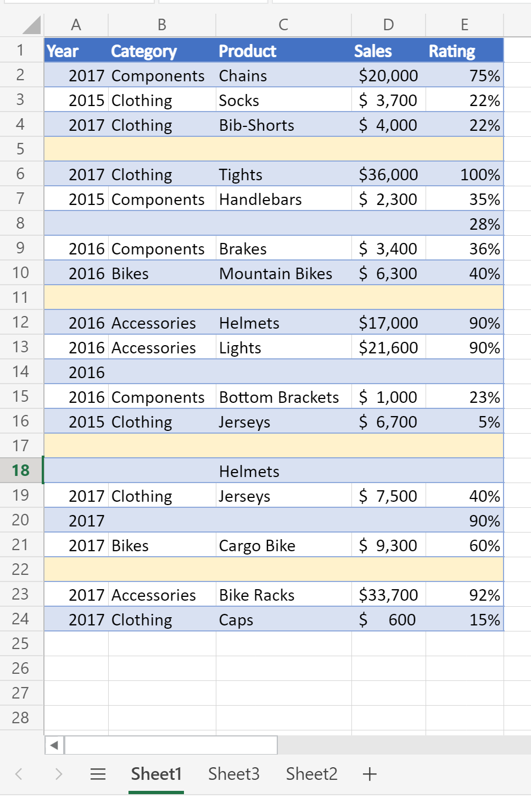
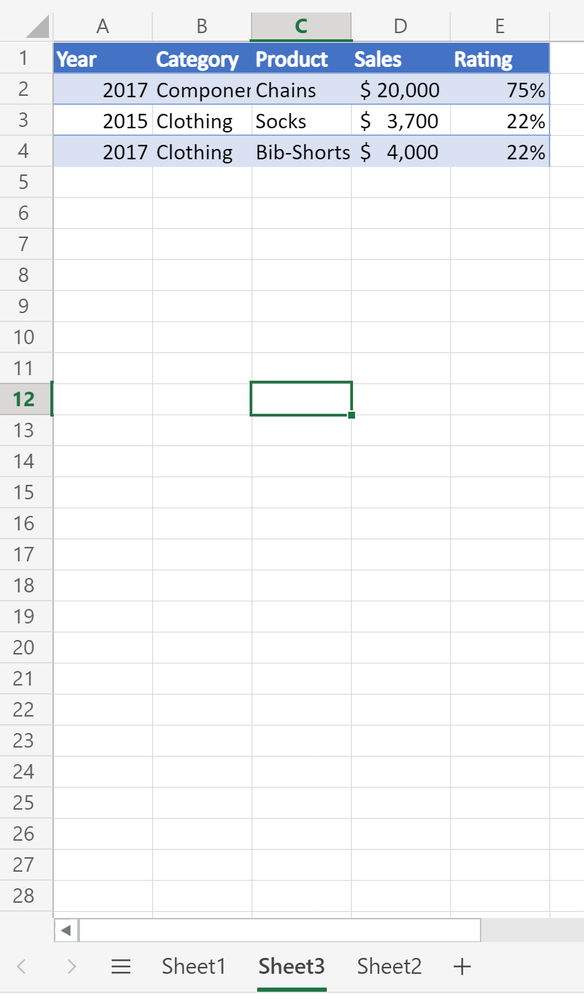
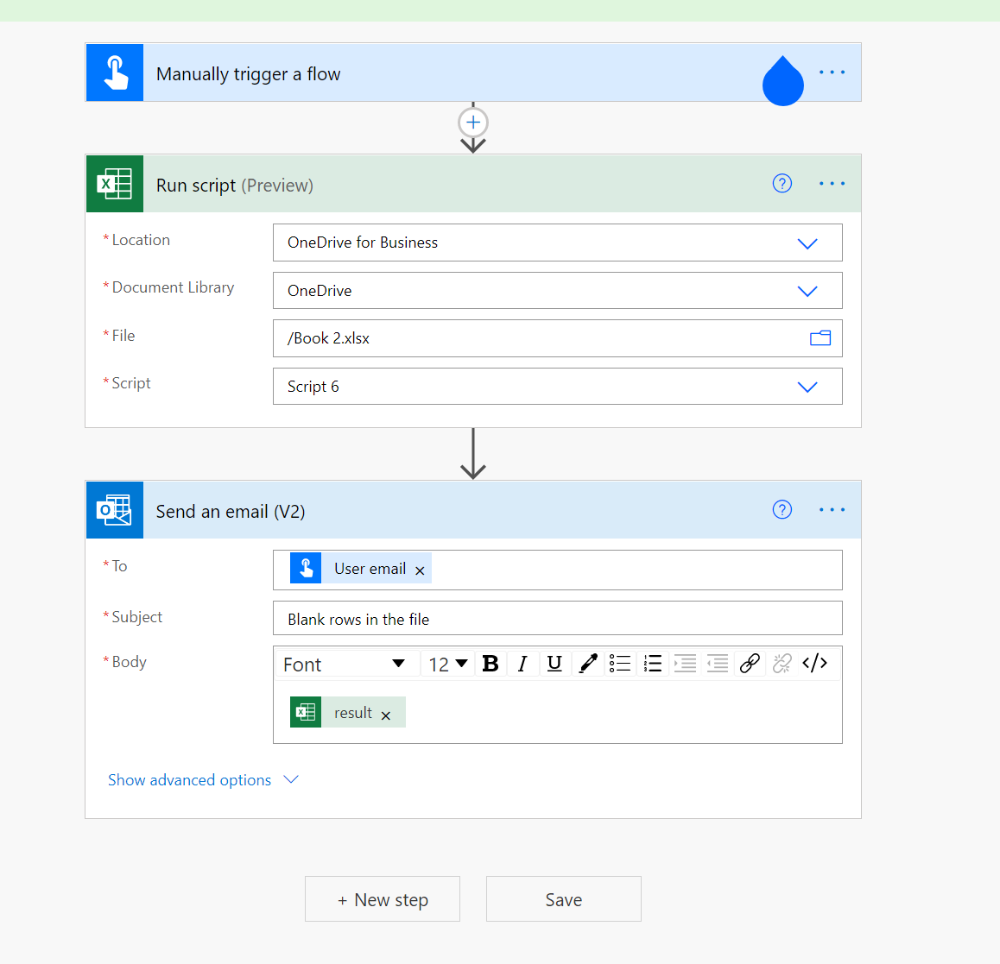

# Count blank rows on sheets

This project includes two scripts:

* [Count blank rows on a given sheet](#office-scripts-sample-code-count-blank-rows-on-a-given-sheet): Traverses the used range on a given worksheet and returns a blank row count.
* [Count blank rows on all sheets](#office-scripts-sample-code-count-blank-rows-on-all-sheets): Traverses the used range on _all of the worksheets_ and returns a blank row count.

> [!NOTE]
> For our script, a blank row is any row where there's no data. The row can have formatting.

_This sheet returns count of 4 blank rows_



_This sheet returns count of 0 blank rows (all rows have some data)_



## Office Scripts sample code: Count blank rows on a given sheet

```TypeScript
function main(workbook: ExcelScript.Workbook): number
{
  const sheet = workbook.getWorksheet('Sheet1'); 
  // Getting the active worksheet is not suitable for a script used by Power Automate.
  // const sheet = workbook.getActiveWorksheet();
  
  const range = sheet.getUsedRange(true); // Get value only.
  if (!range) {
    console.log(`No data on this sheet. `);
    return;
  }
  console.log(`Used range for the worksheet: ${range.getAddress()}`);
  const values = range.getValues();
  let emptyRows = 0;
  for (let row of values) {
    let len = 0; 
    for (let cell of row) {
      len = len + cell.toString().length;
    }
    if (len === 0) { 
      emptyRows++;
    }
  }
  console.log(`Total empty row: ` + emptyRows);
  return emptyRows;
}
```

## Office Scripts sample code: Count blank rows on all sheets

```TypeScript
function main(workbook: ExcelScript.Workbook): number
{
  const sheets = workbook.getWorksheets();
  let emptyRows = 0;
  for (let sheet of sheets) { 
    const range = sheet.getUsedRange(true); // Get value only.
    if (!range) {
      console.log(`No data on this sheet. `);
      continue;
    }
    console.log(`Used range for the worksheet ${sheet.getName()}: ${range.getAddress()}`);
    const values = range.getValues();

    for (let row of values) {
      let len = 0;
      for (let cell of row) {
        len = len + cell.toString().length;
      }
      if (len === 0) {
        emptyRows++;
      }
    }
  }
  console.log(`Total empty row: ` + emptyRows);
  return emptyRows;
}
```

## Use with Power Automate


