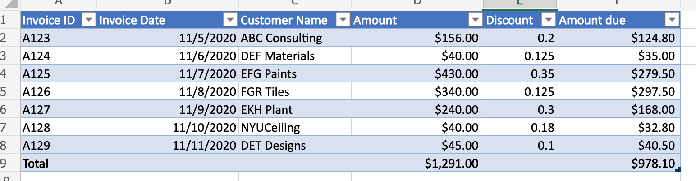
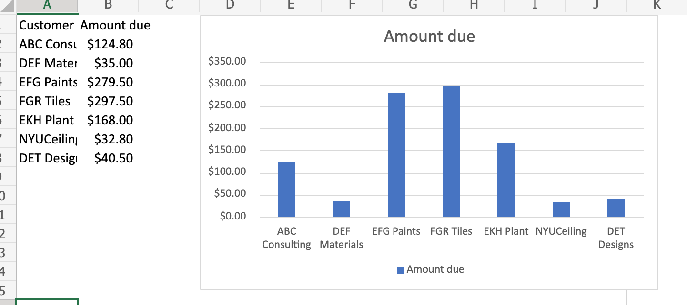
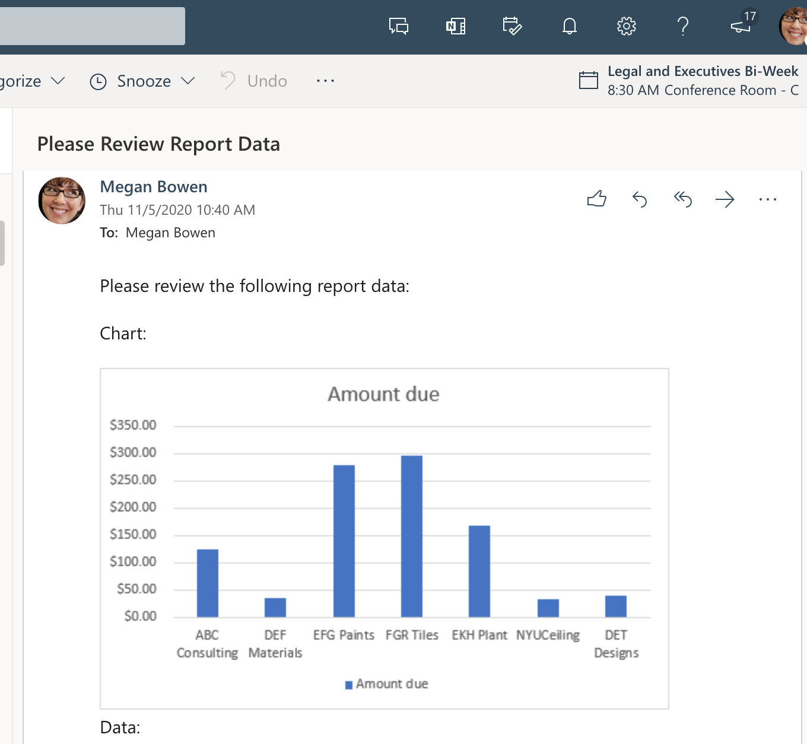
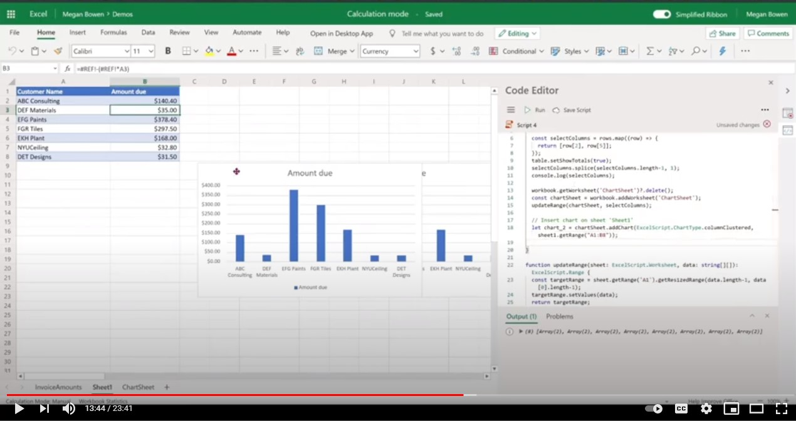

# Use Office Scripts and Power Automate to email images of a chart and table

This sample uses Office Scripts and Power Automate to create a chart. It then emails images of the chart and its base table.

## Example scenario

* Calculate to get latest results.
* Create chart.
* Get chart and table images.
* Email the images with Power Automate.

_Input data_



_Output chart_



_Email that was received through Power Automate flow_



## Solution

This solution has two parts:

1. [An Office Script to calculate and extract Excel chart and table](#office-scripts-sample-code-calculate-and-extract-excel-chart-and-table)
1. A Power Automate flow to invoke the script and email the results. For an example on how to do this, see [Create an automated workflow with Power Automate](../../tutorials/excel-power-automate-returns.md#create-an-automated-workflow-with-power-automate).

## Sample code: Calculate and extract Excel chart and table

The following script calculates and extracts an Excel chart and table.

Download the sample file <a href="email-chart-table.xlsx">email-chart-table.xlsx</a> and use it with this script to try it out yourself!

```TypeScript
function main(workbook: ExcelScript.Workbook): ReportImages {

  workbook.getApplication().calculate(ExcelScript.CalculationType.full);
  
  let sheet1 = workbook.getWorksheet("Sheet1");
  const table = workbook.getWorksheet('InvoiceAmounts').getTables()[0];
  const rows = table.getRange().getTexts();

  const selectColumns = rows.map((row) => {
    return [row[2], row[5]];
  });
  table.setShowTotals(true);
  selectColumns.splice(selectColumns.length-1, 1);
  console.log(selectColumns);

  workbook.getWorksheet('ChartSheet')?.delete();
  const chartSheet = workbook.addWorksheet('ChartSheet');
  const targetRange = updateRange(chartSheet, selectColumns);

  // Insert chart on sheet 'Sheet1'.
  let chart_2 = chartSheet.addChart(ExcelScript.ChartType.columnClustered, targetRange);
  chart_2.setPosition('D1');
  const chartImage = chart_2.getImage();
  const tableImage = table.getRange().getImage();
  return {
    chartImage,
    tableImage
  }
}

function updateRange(sheet: ExcelScript.Worksheet, data: string[][]): ExcelScript.Range {
  const targetRange = sheet.getRange('A1').getResizedRange(data.length-1, data[0].length-1);
  targetRange.setValues(data);
  return targetRange;
}

interface ReportImages {
  chartImage: string
  tableImage: string
}
```

## Training video: Extract and email images of chart and table

[](https://youtu.be/152GJyqc-Kw "Step-by-step video on how to extract and email images of chart and table")
