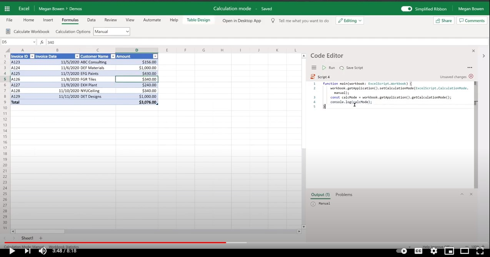

# Manage calculation mode in Excel

This sample shows how to use the calculation mode and calculate methods in Excel on the web using Office Scripts. You can try the script on any Excel file.

## Scenario

In Excel on the web, a file's calculation mode can be controlled programmatically using APIs. The following actions are possible using Office Scripts.

1. Get the calculation mode (automatic or manual, etc.).
1. Set the calculation mode.
1. Calculate Excel formulas for files that are set to the manual mode (also referred as re-calculate).

## Office Script

```ts
function main(workbook: ExcelScript.Workbook) {
    // Set calculation mode.
    workbook.getApplication().setCalculationMode(ExcelScript.CalculationMode.manual);
    // Get calculation mode.
    const calcMode = workbook.getApplication().getCalculationMode();    
    console.log(calcMode);
    // Calculate (for manual mode files).
    workbook.getApplication().calculate(ExcelScript.CalculationType.full);
}
```

## Video

[](https://youtu.be/iw6O8QH01CI "Step-by-step video")
