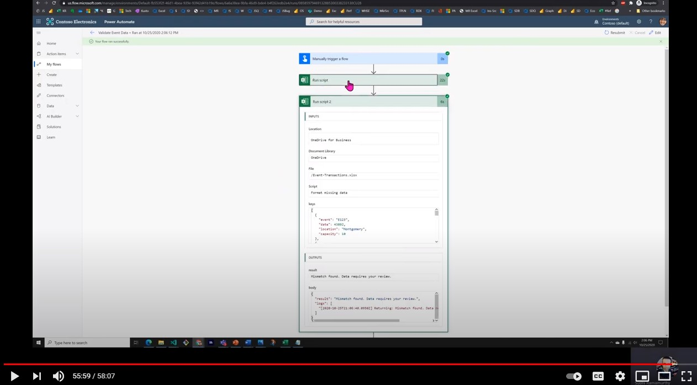

# Cross reference and format an Excel file

This solution shows how two Excel files can be cross-referenced and formatted using Office Scripts and Power Automate.

The project achieves the following:

1. Extracts event data from <a href="events.xlsx">events.xlsx</a> using one Run script action.
1. Passes that data to the second Excel file containing event transaction data and uses that data to do basic validation of data and formatting of missing or incorrect data using Office Scripts.
1. Emails the result to a reviewer.

For further details, see [Cross Reference and formatting two Excel files using Office Scripts](https://powerusers.microsoft.com/t5/Power-Automate-Cookbook/Cross-Reference-and-formatting-two-Excel-files-using-Office/td-p/728535).

## Sample Excel files

1. <a href="events.xlsx">events.xlsx</a>
1. <a href="event-transactions.xlsx">event-transactions.xlsx</a>

## Office Scripts

1. [Get event data](#get-event-data)
1. [Validate event transactions](#validate-event-transactions)

### Get event data

```TypeScript
function main(workbook: ExcelScript.Workbook): EventData[] {
    let table = workbook.getWorksheet('Keys').getTables()[0];
    let range = table.getRangeBetweenHeaderAndTotal();
    let rows = range.getValues();
    let records: EventData[] = [];
    for (let row of rows) {
        let [event, date, location, capacity] = row;
        records.push({
            event: event as string,
            date: date as number, 
            location: location as string,
            capacity: capacity as number
        })
    }
    console.log(JSON.stringify(records))
    return records;
}

interface EventData {
    event: string
    date: number
    location: string
    capacity: number
}
```

### Validate event transactions

```TypeScript
function main(workbook: ExcelScript.Workbook, keys: string): string {
    let table = workbook.getWorksheet('Transactions').getTables()[0];
    let range = table.getRangeBetweenHeaderAndTotal();
    range.clear(ExcelScript.ClearApplyTo.formats);
  
    let overallMatch = true;
  
    table.getColumnByName('Date').getRangeBetweenHeaderAndTotal().setNumberFormatLocal("yyyy-mm-dd;@");
    table.getColumnByName('Capacity').getRangeBetweenHeaderAndTotal().getFormat()
      .setHorizontalAlignment(ExcelScript.HorizontalAlignment.center);
    let rows = range.getValues();
    let keysObject = JSON.parse(keys) as EventData[];
    for (let i=0; i < rows.length; i++){
      let row = rows[i];
      let [event, date, location, capacity] = row;
      let match = false;
      for (let keyObject of keysObject){
        if (keyObject.event === event) {
          match = true;
          if (keyObject.date !== date) {
            overallMatch = false;
            range.getCell(i, 1).getFormat()
              .getFill()
              .setColor("FFFF00");
          }
          if (keyObject.location !== location) {
            overallMatch = false;
            range.getCell(i, 2).getFormat()
              .getFill()
              .setColor("FFFF00");
          }
          if (keyObject.capacity !== capacity) {
            overallMatch = false;
            range.getCell(i, 3).getFormat()
              .getFill()
              .setColor("FFFF00");
          }   
          break;             
        }
      }
      if (!match) {
        overallMatch = false;
        range.getCell(i, 0).getFormat()
          .getFill()
          .setColor("FFFF00");      
      }
  
    }
    let returnString = "All the data is in the right order.";
    if (overallMatch === false) {
      returnString = "Mismatch found. Data requires your review.";
    }
    console.log("Returning: " + returnString);
    return returnString;
}

interface EventData {
event: string
date: number
location: string
capacity: number
}
```

## Video

[](https://youtu.be/dVwqBf483qo "Step-by-step video")
