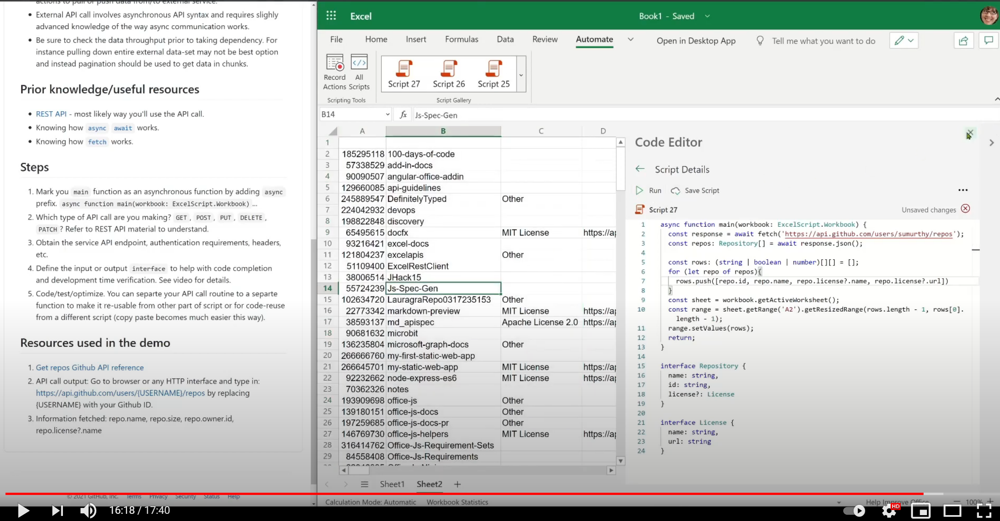

# External API calls from Office Scripts

Office Scripts allows [limited external API call support](../../develop/external-calls.md).

> [!IMPORTANT]
>
> * There is no way to sign in or use OAuth2 type of authentication flows. All keys and credentials have to be hardcoded (or read from another source).
> * There is no infrastructure to store API credentials and keys. This will have to be managed by the user.
> * External calls may result in sensitive data being exposed to undesirable endpoints, or external data to be brought into internal workbooks. Your admin can establish firewall protection against such calls. Be sure to check with local policies prior to relying on external calls.
> * If a script uses an API call, it will not function in a Power Automate scenario. You'll have to use Power Automate's HTTP action or equivalent actions to pull data from or push it to an external service.
> * An external API call involves asynchronous API syntax and requires slightly advanced knowledge of the way async communication works.
> * Be sure to check the amount of data throughput prior to taking a dependency. For instance, pulling down the entire external dataset may not be the best option and instead pagination should be used to get data in chunks.

## Useful knowledge and resources

* [REST API](https://en.wikipedia.org/wiki/Representational_state_transfer): Most likely way you'll use the API call.
* [`async` `await`](https://developer.mozilla.org/docs/Learn/JavaScript/Asynchronous/Async_await): Understand how this works.
* [`fetch`](https://developer.mozilla.org/docs/Web/API/Fetch_API/Using_Fetch): Understand how this works.

## Steps

1. Mark your `main` function as an asynchronous function by adding `async` prefix. For example, `async function main(workbook: ExcelScript.Workbook)`.
1. Which type of API call are you making? `GET`, `POST`, `PUT`, `DELETE`, `PATCH`? Refer to REST API material for details.
1. Obtain the service API endpoint, authentication requirements, headers, etc.
1. Define the input or output `interface` to help with code completion and development time verification. See [video](#video) for details.
1. Code, test, optimize. You can create a function for your API call routine to make it reusable from other parts of your script or for reuse in a different script (copy-paste becomes much easier this way).

## Scenario

This script gets basic information about the user's GitHub repositories.


## Resources used in the sample

1. [Get repos Github API reference.](https://docs.github.com/rest/reference/repos#list-repositories-for-a-user)
1. API call output: Go to a web browser or any HTTP interface and type in `https://api.github.com/users/{USERNAME}/repos`, replacing the {USERNAME} placeholder with your Github ID.
1. Information fetched: repo.name, repo.size, repo.owner.id, repo.license?.name

## Script

```TypeScript
async function main(workbook: ExcelScript.Workbook) {

  // Replace the {USERNAME} placeholder with your GitHub username.
  const response = await fetch('https://api.github.com/users/{USERNAME}/repos');
  const repos: Repository[] = await response.json();
  
  const rows: (string | boolean | number)[][] = [];
  for (let repo of repos){ 
    rows.push([repo.id, repo.name, repo.license?.name, repo.license?.url])
  }
  const sheet = workbook.getActiveWorksheet();
  const range = sheet.getRange('A2').getResizedRange(rows.length - 1, rows[0].length - 1);
  range.setValues(rows);
  return;
}

interface Repository {
  name: string,
  id: string,
  license?: License 
}

interface License {
  name: string,
  url: string
}
```

## Video

[](https://youtu.be/fulP29J418E "API call video")
