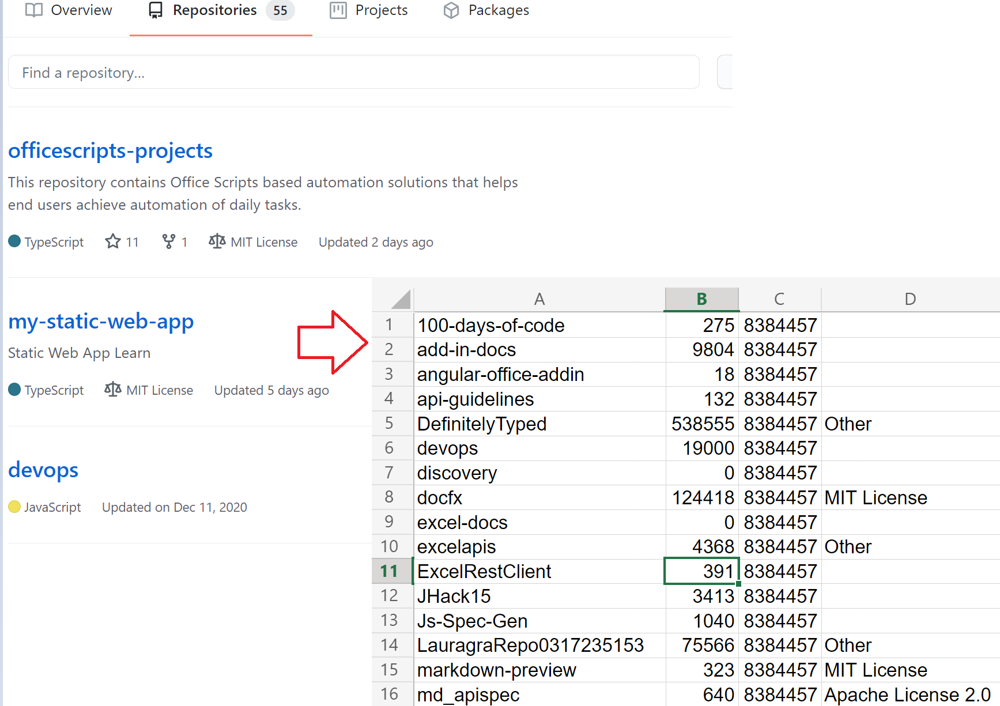

# Use external fetch calls in Office Scripts

This script gets basic information about a user's GitHub repositories. It shows how to use `fetch` in a simple scenario. For more information about using `fetch` or other external calls, read [External API call support in Office Scripts](../../develop/external-calls.md)

You can learn more about the GItHub APIs being used in the [GitHub API reference](https://docs.github.com/rest/reference/repos#list-repositories-for-a-user). You can also see the raw API call output by visiting `https://api.github.com/users/{USERNAME}/repos` in a web browser (be sure to replace the {USERNAME} placeholder with your GitHub ID).



## Sample code: Get basic information about user's GitHub repositories

```TypeScript
async function main(workbook: ExcelScript.Workbook) {
  // Call the GitHub REST API.
  // Replace the {USERNAME} placeholder with your GitHub username.
  const response = await fetch('https://api.github.com/users/{USERNAME}/repos');
  const repos: Repository[] = await response.json();
  
  // Create an array to hold the returned values.
  const rows: (string | boolean | number)[][] = [];

  // Convert each repository block into a row.
  for (let repo of repos){ 
    rows.push([repo.id, repo.name, repo.license?.name, repo.license?.url])
  }

  // Add the data to the current worksheet, starting at "A2".
  const sheet = workbook.getActiveWorksheet();
  const range = sheet.getRange('A2').getResizedRange(rows.length - 1, rows[0].length - 1);
  range.setValues(rows);
}

// An interface matching the returned JSON for a GitHub repository.
interface Repository {
  name: string,
  id: string,
  license?: License 
}

// An interface matching the returned JSON for a GitHub repo license.
interface License {
  name: string,
  url: string
}
```

## Training video: How to make external API calls

[Watch Sudhi Ramamurthy walk through this sample on YouTube](https://youtu.be/fulP29J418E).
