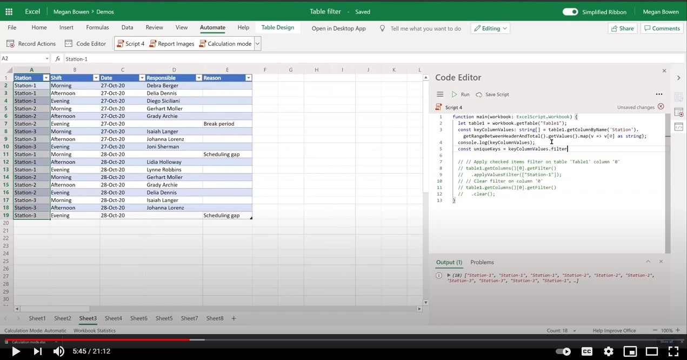

# Filter Excel table and get visible range as a JSON object

This sample filters an Excel table and returns the visible range as a JSON object. This JSON could be provided to a Power Automate flow as part of a larger solution.

## Example scenario

* Apply a filter to a table column.
* Extract the visible range after filtering.
* Assemble and return an object with a [specific JSON structure](#sample-json).

## Office Scripts sample code: Filter a table and get visible range

The following script filters a table and gets the visible range.

Download the sample file <a href="table-filter.xlsx">table-filter.xlsx</a> and use it with this script to try it out yourself!

```TypeScript
function main(workbook: ExcelScript.Workbook): ReturnTemplate {
  const table1 = workbook.getTable("Table1");
  const keyColumnValues: string [] = table1.getColumnByName('Station').getRangeBetweenHeaderAndTotal().getValues().map(v => v[0] as string);
  const uniqueKeys = keyColumnValues.filter((v, i, a) => a.indexOf(v) === i);

  console.log(uniqueKeys);
  const returnObj: ReturnTemplate = {}

  uniqueKeys.forEach((key: string) => {
    table1.getColumnByName('Station').getFilter()
      .applyValuesFilter([key]);
    const rangeView = table1.getRange().getVisibleView();
    returnObj[key] = returnObjectFromValues(rangeView.getValues() as string[][]);
  })
  table1.getColumnByName('Station').getFilter().clear();
  console.log(JSON.stringify(returnObj));
  return returnObj
}

function returnObjectFromValues(values: string[][]): BasicObj[] {
  let objArray = [];
  let objKeys: string[] = [];
  for (let i=0; i < values.length; i++) {
    if (i===0) {
      objKeys = values[i]
      continue;
    }
    let obj = {}
    for (let j=0; j < values[i].length; j++) {
      obj[objKeys[j]] = values[i][j]
    }
    objArray.push(obj);
  }
  return objArray;
}

interface BasicObj {
  [key: string] : string
}

interface ReturnTemplate {
  [key: string]: BasicObj[]
}
```

### Sample JSON

Each key represents a unique value of a table. Each array instance represents the row that is visible when the corresponding filter is applied.

```json
{
  "Station-1": [{
    "Station": "Station-1",
    "Shift": "Morning",
    "Date": "27-Oct-20",
    "Responsible": "Debra Berger",
    "Reason": ""
  }, {
    "Station": "Station-1",
    "Shift": "Afternoon",
    "Date": "27-Oct-20",
    "Responsible": "Delia Dennis",
    "Reason": ""
  }, {
    "Station": "Station-1",
    "Shift": "Afternoon",
    "Date": "28-Oct-20",
    "Responsible": "Lidia Holloway",
    "Reason": ""
  }],
  "Station-2": [{
    "Station": "Station-2",
    "Shift": "Morning",
    "Date": "27-Oct-20",
    "Responsible": "Gerhart Moller",
    "Reason": ""
  }, {
    "Station": "Station-2",
    "Shift": "Afternoon",
    "Date": "28-Oct-20",
    "Responsible": "Grady Archie",
    "Reason": ""
  }],
  "Station-3": [{
    "Station": "Station-3",
    "Shift": "Morning",
    "Date": "27-Oct-20",
    "Responsible": "Isaiah Langer",
    "Reason": ""
  }]
}
```

## Video

[](https://youtu.be/Mv7BrvPq84A "Step-by-step video on how to filter an Excel table and get the visible range")
