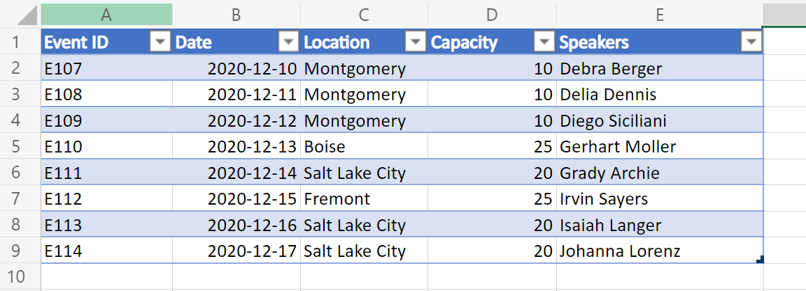
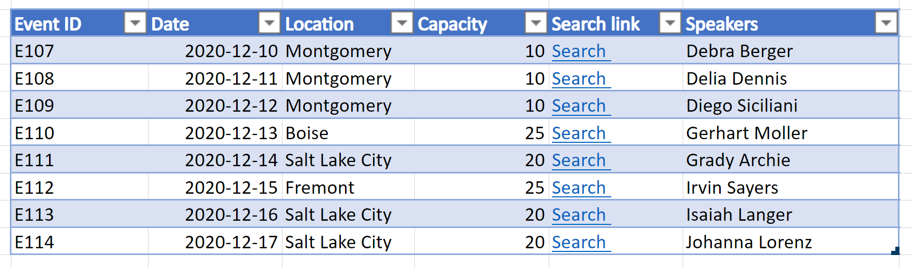
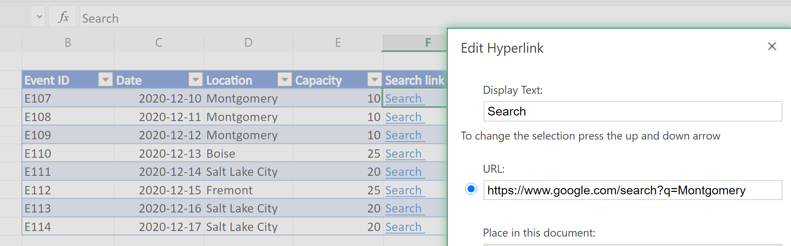

# Output Excel table data (including hyperlink data) as JSON for usage in Power Automate

Often it is beneficial to extract Excel table data as an array of objects (each item representing a row) in the form of JSON using Office Scripts. This helps with extracting the data from Excel in the same format that is visible to the user. Data can then be fed into other systems using Power Automate flows.

A variation of this sample involves doing the same as described previously, but this time also selecting the hyperlink associated with one of the table columns. This allows data not readily available at the cell level to be surfaced in the JSON.

## Sample Excel file

Download the file <a href="table-data-with-hyperlinks.xlsx">table-data-with-hyperlinks.xlsx</a> used in this sample and try it out yourself!

## Office Scripts

1. [Return table data as JSON](#return-table-data-as-json)
1. [Return table data as JSON with hyperlink text](#return-table-data-as-json-with-hyperlink-text)

### Return table data as JSON

#### Screenshot



#### Script

> [!NOTE]
> To suit your needs or data, change the `interface TableData` structure to match your table columns. Note that for column names that contain spaces, be sure to place your key within quotes as with `"Event ID"` in the sample.

```TypeScript
function main(workbook: ExcelScript.Workbook): TableData[] {
  const table = workbook.getWorksheet('PlainTable').getTables()[0];
  // If you know the table name, you can also do the following:
  // const table = workbook.getTable('Table13436');
  const texts = table.getRange().getTexts();
  let returnObjects: TableData[] = [];
  if (table.getRowCount() > 0)  {
    returnObjects = returnObjectFromValues(texts);
  } 
  console.log(JSON.stringify(returnObjects));  
  return returnObjects
}

function returnObjectFromValues(values: string[][]): TableData[] {
  let objArray = [];
  let objKeys: string[] = [];
  for (let i = 0; i < values.length; i++) {
    if (i === 0) {
      objKeys = values[i]
      continue;
    }
    let obj = {}
    for (let j = 0; j < values[i].length; j++) {
      obj[objKeys[j]] = values[i][j]
    }
    objArray.push(obj);
  }
  return objArray as TableData[];
}

interface BasicObj {
  [key: string]: string
}

interface TableData {
  "Event ID": string
  Date: string
  Location: string
  Capacity: string
  Speakers: string
}
```

#### Sample output

```json
[{
    "Event ID": "E107",
    "Date": "2020-12-10",
    "Location": "Montgomery",
    "Capacity": "10",
    "Speakers": "Debra Berger"
}, {
    "Event ID": "E108",
    "Date": "2020-12-11",
    "Location": "Montgomery",
    "Capacity": "10",
    "Speakers": "Delia Dennis"
}, {
    "Event ID": "E109",
    "Date": "2020-12-12",
    "Location": "Montgomery",
    "Capacity": "10",
    "Speakers": "Diego Siciliani"
}, {
    "Event ID": "E110",
    "Date": "2020-12-13",
    "Location": "Boise",
    "Capacity": "25",
    "Speakers": "Gerhart Moller"
}, {
    "Event ID": "E111",
    "Date": "2020-12-14",
    "Location": "Salt Lake City",
    "Capacity": "20",
    "Speakers": "Grady Archie"
}, {
    "Event ID": "E112",
    "Date": "2020-12-15",
    "Location": "Fremont",
    "Capacity": "25",
    "Speakers": "Irvin Sayers"
}, {
    "Event ID": "E113",
    "Date": "2020-12-16",
    "Location": "Salt Lake City",
    "Capacity": "20",
    "Speakers": "Isaiah Langer"
}, {
    "Event ID": "E114",
    "Date": "2020-12-17",
    "Location": "Salt Lake City",
    "Capacity": "20",
    "Speakers": "Johanna Lorenz"
}]
```

### Return table data as JSON with hyperlink text

#### Screenshots




#### Script

> [!NOTE]
> The script always extracts hyperlinks from the 4th column (0 index) of the table. You can change that order or include multiple columns as hyperlink data by modifying the code under the comment `// For the 4th column (0 index), extract the hyperlink and use that instead of text.`

```TypeScript
function main(workbook: ExcelScript.Workbook): TableData[] {
  const table = workbook.getWorksheet('WithHyperLink').getTables()[0];
  const range = table.getRange();
  // If you know the table name, you can also do the following:
  // const table = workbook.getTable('Table13436');
  const texts = table.getRange().getTexts();
  let returnObjects: TableData[] = [];
  if (table.getRowCount() > 0)  {
    returnObjects = returnObjectFromValues(texts, range);
  } 
  console.log(JSON.stringify(returnObjects));  
  return returnObjects
}

function returnObjectFromValues(values: string[][], range: ExcelScript.Range): TableData[] {
  let objArray = [];
  let objKeys: string[] = [];
  for (let i = 0; i < values.length; i++) {
    if (i === 0) {
      objKeys = values[i]
      continue;
    }
    let obj = {}
    for (let j = 0; j < values[i].length; j++) {
      // For the 4th column (0 index), extract the hyperlink and use that instead of text. 
      if (j === 4) {
        obj[objKeys[j]] = range.getCell(i, j).getHyperlink().address;
      } else {
        obj[objKeys[j]] = values[i][j];
      }
    }
    objArray.push(obj);
  }
  return objArray as TableData[];
}

interface BasicObj {
  [key: string]: string
}

interface TableData {
  "Event ID": string
  Date: string
  Location: string
  Capacity: string
  "Search link": string
  Speakers: string
}
```

## Sample output

```json
[{
    "Event ID": "E107",
    "Date": "2020-12-10",
    "Location": "Montgomery",
    "Capacity": "10",
    "Search link": "https://www.google.com/search?q=Montgomery",
    "Speakers": "Debra Berger"
}, {
    "Event ID": "E108",
    "Date": "2020-12-11",
    "Location": "Montgomery",
    "Capacity": "10",
    "Search link": "https://www.google.com/search?q=Montgomery",
    "Speakers": "Delia Dennis"
}, {
    "Event ID": "E109",
    "Date": "2020-12-12",
    "Location": "Montgomery",
    "Capacity": "10",
    "Search link": "https://www.google.com/search?q=Montgomery",
    "Speakers": "Diego Siciliani"
}, {
    "Event ID": "E110",
    "Date": "2020-12-13",
    "Location": "Boise",
    "Capacity": "25",
    "Search link": "https://www.google.com/search?q=Boise",
    "Speakers": "Gerhart Moller"
}, {
    "Event ID": "E111",
    "Date": "2020-12-14",
    "Location": "Salt Lake City",
    "Capacity": "20",
    "Search link": "https://www.google.com/search?q=salt+lake+city",
    "Speakers": "Grady Archie"
}, {
    "Event ID": "E112",
    "Date": "2020-12-15",
    "Location": "Fremont",
    "Capacity": "25",
    "Search link": "https://www.google.com/search?q=Fremont",
    "Speakers": "Irvin Sayers"
}, {
    "Event ID": "E113",
    "Date": "2020-12-16",
    "Location": "Salt Lake City",
    "Capacity": "20",
    "Search link": "https://www.google.com/search?q=salt+lake+city",
    "Speakers": "Isaiah Langer"
}, {
    "Event ID": "E114",
    "Date": "2020-12-17",
    "Location": "Salt Lake City",
    "Capacity": "20",
    "Search link": "https://www.google.com/search?q=salt+lake+city",
    "Speakers": "Johanna Lorenz"
}]
```

## Use in Power Automate

For how to use such a script in Power Automate, see [similar sample](email-chart-image.md).
