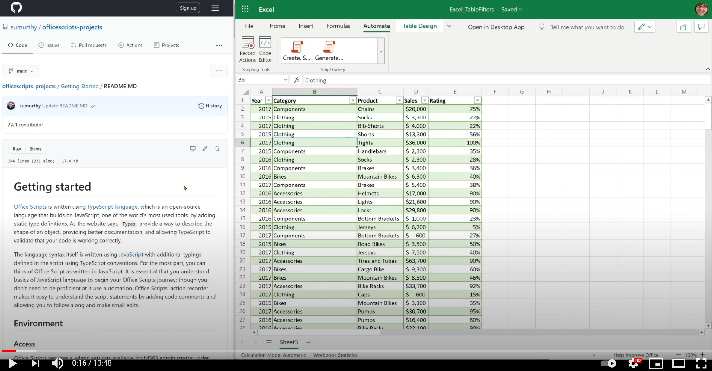
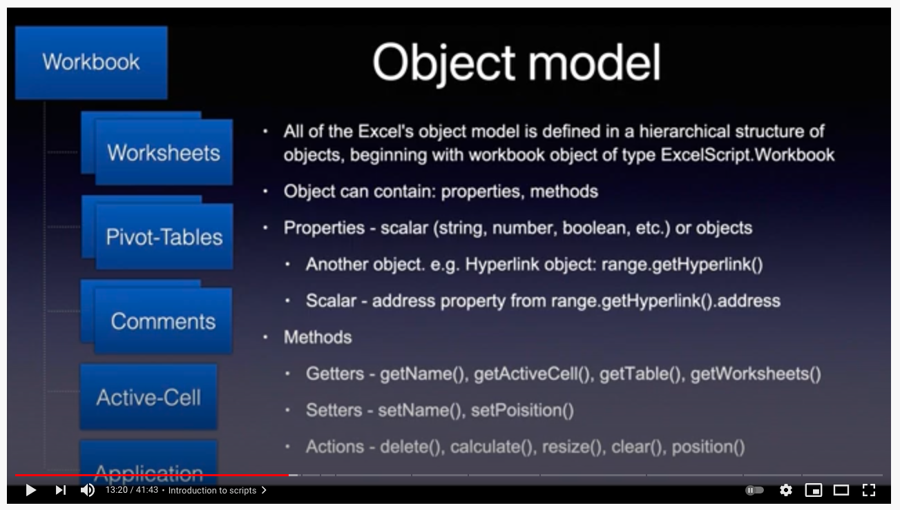
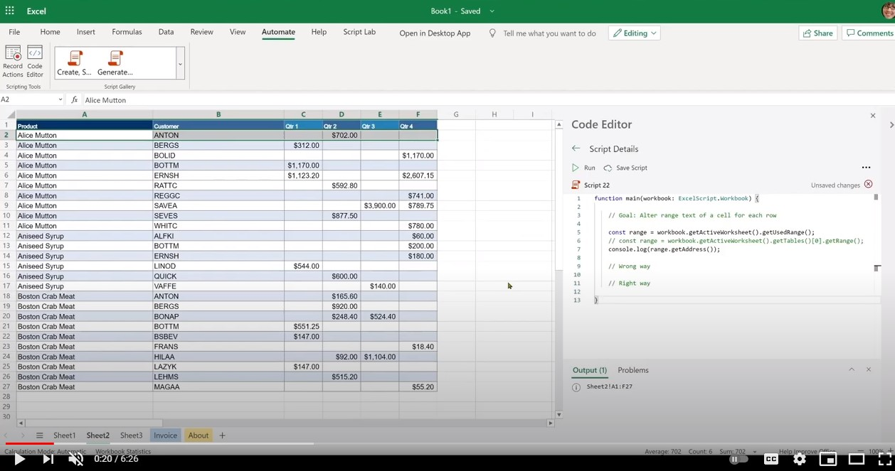

# Getting started

This section provides details about the basics of Office Scripts including access, environment, script fundamentals, and few basic script patterns.

## Environment setup

Learn about the basics of access, environment, and script editor.

[](https://youtu.be/vvCtxsjPxo8 "Basics of Office Scripts application")

### Access

Office Scripts requires admin settings available for Microsoft 365 administrator under **Settings** > **Org settings** > **Office Scripts**. By default, it's turned on for all users. There are two sub-settings, which the admin can turn on and off.

* Ability to share scripts within the organization
* Ability to use scripts in Power Automate

You can tell if you have access to Office Scripts by opening a file in Excel on the web (browser) and seeing if the **Automate** tab appears in the Excel ribbon or not.
If you still can't see the **Automate** tab, check [this troubleshooting section](../../testing/troubleshooting.md#automate-tab-not-appearing-or-office-scripts-unavailable).

### Availability

Office Scripts is available only in the Excel on the web for Enterprise E3+ licenses (Consumer and E1 accounts are not supported). Office Scripts is not yet supported in Excel on Windows and Mac.

### Scripts and editor

The code editor is built right into Excel on the web (online version). If you have used editors like Visual Studio Code or Sublime, this editing experience will be quite similar.
Most of the shortcut keys that Visual Studio Code editor uses work in the Office Scripts editing experience as well. Check out the following shortcut keys handouts.

* [macOS](https://code.visualstudio.com/shortcuts/keyboard-shortcuts-macos.pdf)
* [Windows](https://code.visualstudio.com/shortcuts/keyboard-shortcuts-windows.pdf)

#### Key things to note

* Office Scripts is only available for files stored in OneDrive for Business, SharePoint sites, and Team sites.
* The editor doesn't show the script's extension. In reality, these are TypeScript files but they are stored with a custom extension called `.osts`.
* The scripts are stored in your own OneDrive for Business folder `My Files/Documents/OfficeScripts`. You won't need to manage this folder. For your part, you can ignore this aspect as the editor manages the viewing/editing experience.
* Scripts are not stored as part of Excel files. They are stored separately.
* You can share the script with an Excel file which in effect means you are linking the script with the file, not attaching it. Whoever has access to the Excel file will also be able to **view**, **run**, or **make a copy** of the script. This is a key difference compared to VBA macros.
* Unless you share your scripts, no one else can access it as it resides in your own library.
* Scripts can't be linked from a local disk or custom cloud locations. Office Scripts only recognizes and runs a script that is on predefined location (your OneDrive folder mentioned above) or shared scripts.
* During editing, files are temporarily saved in the browser but you'll have to save the script before closing the Excel window to save it to the OneDrive location. Don't forget to save the file after edits.

## Gentle introduction to scripting

Office Scripts are standalone scripts written in the TypeScript language that contain instructions to perform some automation against the selected Excel workbook. All automation instructions are self-contained within a script and scripts can't invoke or call other scripts. All scripts are stored in standalone files and stored on the user's OneDrive folder. You can record a new script, edit a recorded script, or write a whole new script from scratch, all within a built-in editor interface. The best part of Office Scripts is that they don't need any further setup from users. No external libraries, web pages, or UI elements, setup, etc. All the environment setup is handled by Office Scripts and it allows easy and fast access to automation through a simple API interface.

Some of the basic concepts helpful to understand how to edit and navigate around scripts include:

* Basic TypeScript language syntax
* Understanding of `main` function and arguments
* Objects and hierarchy, methods, properties
* Collection (array): navigation and operations
* Type definitions
* Environment: record/edit, run, examine results, share

This video and section explain some of these concepts in detail.

[](https://youtu.be/8Zsrc1uaiiU "Basics of Scripts")

### Language: TypeScript

[Office Scripts](../../index.md) is written using the [TypeScript language](https://www.typescriptlang.org/), which is an open-source language that builds on JavaScript (one of the world's most used) by adding static type definitions. As the website says, `Types` provide a way to describe the shape of an object, providing better documentation, and allowing TypeScript to validate that your code is working correctly.

The language syntax itself is written using [JavaScript](https://developer.mozilla.org/docs/Web/JavaScript) with additional typings defined in the script using TypeScript conventions. For the most part, you can think of Office Scripts as written in JavaScript. It is essential that you understand the basics of JavaScript language to begin your Office Scripts journey; though you don't need to be proficient at it to begin your automation journey. With the Office Scripts' action recorder, you can understand the script statements because code comments are included and you can follow along and make small edits.

Office Scripts APIs, which allow the script to interact with Excel, are designed for end-users who may not have much coding background. APIs can be invoked synchronously and you don't need to know advanced topics such as promises or callbacks. Office Scripts API design provides:

* Simple object model with methods, getters/setters.
* Easy-to-access object collections as regular arrays.
* Simple error handling options.
* Optimized performance for select scenarios helping users to focus on the scenario at hand.

### `main` function: The script's starting point

Office Scripts' execution begins at the `main` function. A script is a single file containing one or many functions along with declarations of types, interfaces, variables, etc. To follow along with the script, begin with the `main` function as Excel always first invokes the `main` function when you execute any script. The `main` function will always have at least one argument (or parameter) named `workbook`, which is just a variable name identifying the current workbook against which the script is running. You can define additional arguments for usage with Power Automate (offline) execution.

* `function main(workbook: ExcelScript.Workbook)`

A script can be organized into smaller functions to aid with code reusability, clarity, etc. Other functions can be inside or outside of the main function but always in the same file. A script is self-contained and can only use functions defined in the same file. Scripts cannot invoke or call another Office Script.

So, in summary:

* The `main` function is the entry point for any script. When the function is executed, the Excel application invokes this main function by providing the workbook as its first parameter.
* It's important to keep the first argument `workbook` and its type declaration as it appears. You can add new arguments to the `main` function (see the next section) but do keep the first argument as is.

:::image type="content" source="../../images/getting-started-main-introduction.png" alt-text="The main function is the script's entry point":::

#### Send or receive data from other apps

You can connect Excel to other parts of your organization by running scripts in [Power Automate](https://flow.microsoft.com). Learn more about [running Office Scripts in Power Automate flows](../../develop/power-automate-integration.md).

The way to receive or send data from and to Excel is through the `main` function. Think of it as the information gateway that allows incoming and outgoing data to be described and used in the script. You can receive data from outside the script using the `string` data type and return any TypeScript-recognized data such as `string`, `number`, `boolean`, or any objects in the form of interfaces you define in the script.

:::image type="content" source="../../images/getting-started-data-in-out.png" alt-text="The inputs and outputs of a script":::

#### Use functions to organize and reuse code

You can use functions to organize and reuse code within your script.

:::image type="content" source="../../images/getting-started-use-functions.png" alt-text="Using functions in a script":::

### Objects, hierarchy, methods, properties, collections

All of Excel's object model is defined in a hierarchical structure of objects, beginning with the workbook object of type `ExcelScript.Workbook`. An object can contain methods, properties, and other objects within it. Objects are linked to each other using the methods. An object's method can return another object or collection of objects. Using the code editor's IntelliSense (code completion) feature is a great way to explore the object hierarchy. You can also use the [official reference documentation site](/javascript/api/office-scripts/overview) to follow along with the relationships among objects.

An [object](https://developer.mozilla.org/docs/Web/JavaScript/Reference/Global_Objects/Object) is a collection of properties, and a property is an association between a name (or key) and a value. A property's value can be a function, in which case the property is known as a method. In the case of the Office Scripts object model, an object represents a thing in the Excel file that users interact with such as a chart, hyperlink, pivot-table, etc. It can also represent the behavior of an object such as the protection attributes of a worksheet.

The topic of TypeScript objects and properties vs methods is quite deep. In order to get started with the script and be productive, you can remember a few basic things:

* Both objects and properties are accessed using `.` (dot) notation, with the object on the left side of the `.` and the property or method on the right side. Examples: `hyperlink.address`, `range.getAddress()`.
* Properties are scalar in nature (strings, booleans, numbers). For example, name of a workbook, position of a worksheet, the value of whether the table has a footer or not.
* Methods are 'invoked' or 'executed' using the open-close parentheses. Example: `table.delete()`. Sometimes an argument is passed to a function by including them between open-close parentheses: `range.setValue('Hello')`. You can pass many arguments to a function (as defined by its contract/signature) and separate them using `,`.  For example: `worksheet.addTable('A1:D6', true)`. You can pass arguments of any type as required by the method such as strings, number, boolean, or even other objects, for example, `worksheet.addTable(targetRange, true)`, where `targetRange` is an object created elsewhere in the script.
* Methods can return a thing such as a scalar property (name, address, etc.) or another object (range, chart), or not return anything at all (such as the case with `delete` methods). You receive what the method returns by declaring a variable or assigning to an existing variable. You can see that on the left hand side of statement such as `const table = worksheet.addTable('A1:D6', true)`.
* For the most part, the Office Scripts object model consists of objects with methods that link various parts of the Excel object model. Very rarely you'll come across properties that are of scalar or object values.
* In Office Scripts, an Excel object model method has to contain open-close parentheses. Using methods without them is not allowed (such as assigning a method to a variable).

Let's look at a few methods on the `workbook` object.

```TypeScript
function main(workbook: ExcelScript.Workbook) {
    // Return a boolean (true or false) setting of whether the workbook is set to auto-save or not. 
    const autoSave = workbook.getAutoSave(); 
    // Get workbook name.
    const name = workbook.getName();
    // Get active cell range object.
    const cell = workbook.getActiveCell();
    // Get table named SALES.
    const cell = workbook.getTable('SALES');
    // Get all slicer objects.
    const slicers = workbook.getSlicers();
}
```

In this example:

* The methods of the `workbook` object such as `getAutoSave()` and `getName()` return a scalar property (string, number, boolean).
* Methods such as `getActiveCell()` return another object.
* The `getTable()` method accepts an argument (table name in this case) and returns a specific table in the workbook.
* The `getSlicers()` method returns an array (referred to in many places as a collection) of all slicer objects within the workbook.

You'll notice that all of these methods have a `get` prefix, which is just a convention used in the Office Scripts object model to convey that the method is returning something. They are also commonly referred to as 'getters'.

There are two other types of methods that we'll now see in the next example:

```TypeScript
function main(workbook: ExcelScript.Workbook) {
    // Get a worksheet named 'Sheet1.
    const sheet = workbook.getWorksheet('Sheet1'); 
    // Set name to SALES.
    sheet.setName('SALES');
    // Position the worksheet at the beginning.
    sheet.setPosition(0);
}
```

In this example:

* The `setName()` method sets a new name to the worksheet. `setPosition()` sets the position to the first cell.
* Such methods modify the Excel file by setting a property or behavior of the workbook. These methods are called 'setters'.
* Typically 'setters' have a companion 'getter', for example, `worksheet.getPosition` and `worksheet.setPosition`, both of which are methods.

#### `undefined` and `null` primitive types

The following are two primitive data types that you must be aware of:

1. The value [`null`](https://developer.mozilla.org/docs/Web/JavaScript/Reference/Global_Objects/null) represents the intentional absence of any object value. It is one of JavaScript's primitive values and is used to indicate that a variable has no value.
1. A variable that has not been assigned a value is of type [`undefined`](https://developer.mozilla.org/docs/Web/JavaScript/Reference/Global_Objects/undefined). A method or statement can also return `undefined` if the variable that's being evaluated doesn't have an assigned value.

These two types crop up as part of error handling and can cause quite a bit of headache if not handled properly. Fortunately, TypeScript/JavaScript offers a way to check if a variable is of type `undefined` or `null`. We will talk about some of those checks in later sections, including error handling.

#### Method chaining

You can use dot notation to connect objects being returned from a method to shorten your code. Sometimes this technique makes the code easy to read and manage. However, there are few things to be aware of. Let's look at the following examples.

The following code gets the active cell and the next cell, then sets the value. This is a good candidate to use chaining as this code will succeed all the time.

```TypeScript
function main(workbook: ExcelScript.Workbook) {
    workbook.getActiveCell().getOffsetRange(0,1).setValue('Next cell');
}
```

However, the following code (which gets a table named **SALES** and turns on its banded column style) has an issue.

```TypeScript
function main(workbook: ExcelScript.Workbook) {
  workbook.getTable('SALES').setShowBandedColumns(true);
}
```

What if the **SALES** table doesn't exist? The script will fail with an error (shown next) because `getTable('SALES')` returns `undefined` (which is a JavaScript type indicating that there is no table such as **SALES**). Calling the `setShowBandedColumns` method on `undefined` makes no sense, that is, `undefined.setShowBandedColumns(true)`, and hence the script ends in an error.

```text
Line 2: Cannot read property 'setShowBandedColumns' of undefined
```

You could use the [optional chaining operator](https://developer.mozilla.org/docs/Web/JavaScript/Reference/Operators/Optional_chaining) that provides a way to simplify accessing values through connected objects when it's possible that a reference or method may be `undefined` or `null` (which is JavaScript's way of indicating an unassigned or nonexistent object or result) to handle this condition.

```TypeScript
function main(workbook: ExcelScript.Workbook) {
    // This line will not fail as the setShowBandedColumns method is executed only if the SALES table is present.
    workbook.getTable('SALES')?.setShowBandedColumns(true); 
}
```

If you wish to handle nonexistent object conditions or `undefined` type being returned by a method, then it is better to assign the return value from the method and handle that separately.

```TypeScript
function main(workbook: ExcelScript.Workbook) {
    const salesTable = workbook.getTable('SALES');
    if (salesTable) {
        salesTable.setShowBandedColumns(true);
    } else { 
        // Handle this condition.
    }
}
```

#### Get object reference

The `workbook` object is given to you in the `main` function. You can begin to use the `workbook` object and access its methods directly.

```TypeScript
function main(workbook: ExcelScript.Workbook) {
    // Get workbook name.
    const name = workbook.getName();
    // Display name to console.
    console.log(name);
}
```

For using all other objects within the workbook, begin with `workbook` object and go down the hierarchy until you get to the object you are looking for. You can get the object reference by fetching the object using its `get` method or by retrieving the collection of objects as shown below:

```TypeScript
function main(workbook: ExcelScript.Workbook) {
    // Get the active worksheet.
    const sheet = workbook.getActiveWorksheet();
    // Fetch using an ID or key.
    const sheet = workbook.getWorksheet('SomeSheetName');
    // Invoke methods on the object.
    sheet.setPosition(0); 
    
    // Get collection of methods.
    const tables = sheet.getTables();
    console.log('Total tables in this sheet: ' + tables.length);
}
```

#### Check if an object exists, then delete, and add

For creating an object, say with a predefined name, it is always better to remove a similar object that may exist and then add it. You can do that using the following pattern.

```TypeScript
function main(workbook: ExcelScript.Workbook) {
  // Name of the worksheet to be added. 
  let name = "Index";
  // Check if the worksheet already exists. If not, add the worksheet.
  let sheet = workbook.getWorksheet('Index');
  if (sheet) {
    console.log(`Worksheet by the name ${name} already exists. Deleting it.`);
    // Call the delete method on the object to remove it. 
    sheet.delete();
  } 
    // Add a blank worksheet. 
  console.log(`Adding the worksheet named  ${name}.`)
  const indexSheet = workbook.addWorksheet("Index");
}

```

Alternatively, for deleting an object that may or may not exist, use the following pattern.

```TypeScript
    // The ? preceding delete() will ensure that the API is only invoked if the object exists. 
    workbook.getWorksheet('Index')?.delete(); 
```

#### Note about adding an object

To create, insert, or add an object such as a slicer, pivot table, worksheet, etc., use the corresponding **add_Object_** method. Such a method is available on its parent object. For example, the `addChart()` method is available on `worksheet` object. The **add_Object_** method returns the object it creates. Receive the returned value and use it later in your script.

```TypeScript
function main(workbook: ExcelScript.Workbook) {
  // Add object and get a reference to it. 
  const indexSheet = workbook.addWorksheet("Index");
  // Use it elsewhere in the script 
  console.log(indexSheet.getPosition());
}

```

Alternatively, for deleting an object that may or may not exist, use this pattern:

```TypeScript
    workbook.getWorksheet('Index')?.delete(); // The ? preceding delete() will ensure that the API is only invoked if the object exists. 
```

#### Collections

Collections are objects such as tables, charts, columns, etc. that can be retrieved as an array and iterated over for processing. You can retrieve a collection using the corresponding `get` method and process the data in a loop using one of many TypeScript array traversal techniques such as:

* [`for` or `while`](https://developer.mozilla.org/docs/Web/JavaScript/Guide/Loops_and_iteration)
* [`for..of`](https://developer.mozilla.org/docs/Web/JavaScript/Reference/Statements/for...of)
* [`forEach`](https://developer.mozilla.org/docs/Web/JavaScript/Reference/Global_Objects/Array/forEach)

* [Language basics of arrays](https://developer.mozilla.org//docs/Learn/JavaScript/First_steps/Arrays)

This script demonstrates how to use collections supported in Office Scripts APIs. It colors each worksheet tab in the file with a random color.

```TypeScript
function main(workbook: ExcelScript.Workbook) {

  // Get all sheets as a collection.
  const sheets = workbook.getWorksheets();
  const names = sheets.map ((sheet) => sheet.getName());
  console.log(names);
  console.log(`Total worksheets inside of this workbook: ${sheets.length}`);
  // Get information from specific sheets within the collection.
  console.log(`First sheet name is: ${names[0]}`);
  if (sheets.length > 1) {
    console.log(`Last sheet's Id is: ${sheets[sheets.length -1].getId()}`);
  }
  // Color each worksheet with random color.
  for (const sheet of sheets) {
    sheet.setTabColor(`#${Math.random().toString(16).substr(-6)}`);
  }
}
```

## Type declarations

Type declarations help users understand the type of variable they are dealing with. It helps with auto-completion of methods and assists in development time quality checks.

You can find type declarations in the script in various places including function declaration, variable declaration, IntelliSense definitions, etc.

Examples:

* `function main(workbook: ExcelScript.Workbook)`
* `let myRange: ExcelScript.Range;`
* `function getMaxAmount(range: ExcelScript.Range): number`

You can identify the types easily in the code editor as it usually appears distinctly in a different color. A colon `:` usually precedes the type declaration.  

Writing types can be optional in TypeScript because type inference allows you to get a lot of power without writing additional code. For the most part, the TypeScript language is good at inferring the types of variables. However, in certain cases, Office Scripts require the type declarations to be explicitly defined if the language is unable to clearly identify the type. Also, explicit or implicit `any` is not allowed in Office Script. More on that later.

### `ExcelScript` types

In Office Scripts, you will use the following kinds of types.

* Native language types such as `number`, `string`, `object`, `boolean`, `null`, etc.
* Excel API types. They begin with `ExcelScript`. For example, `ExcelScript.Range`, `ExcelScript.Table`, etc.
* Any custom interfaces you may have defined in the script using `interface` statements.

See examples of each of these groups next.

**_Native language types_**

In the following example, notice places where `string`, `number`, and `boolean` have been used. These are native **TypeScript** language types.

```TypeScript
function main(workbook: ExcelScript.Workbook)
{
  const table = workbook.getActiveWorksheet().getTables()[0];
  const sales = table.getColumnByName('Sales').getRange().getValues();
  console.log(sales);
  // Add 100 to each value.
  const revisedSales = salesAs1DArray.map(data => data as number + 100);
  // Add a column.
  table.addColumn(-1, revisedSales);  
}
/**
 * Extract a column from 2D array and return result.
 */
function extractColumn(data: (string | number | boolean)[][], index: number): (string | number | boolean)[] {

  const column = data.map((row) => {
    return row[index];
  })
  return column;
}
/**
 * Convert a flat array into a 2D array that can be used as range column.
 */
function convertColumnTo2D(data: (string | number | boolean)[]): (string | number | boolean)[][] {

  const columnAs2D = data.map((row) => {
    return [row];
  })
  return columnAs2D;
}
```

**_ExcelScript types_**

In the following example, a helper function takes two arguments. The first one is the `sheet` variable which is of type `ExcelScript.Worksheet` type.

```TypeScript
function main(workbook: ExcelScript.Workbook) {
    const sheet = workbook.getWorksheet('Sheet5');
    const data = ['2016', 'Bikes', 'Seats', '1500', .05];
    addRow(sheet, data);
    return;
}

function addRow(sheet: ExcelScript.Worksheet, data: (string | number | boolean)[]): void {

    const usedRange = sheet.getUsedRange();
    let startCell: ExcelScript.Range;
    // If the sheet is empty, then use A1 as starting cell for update.
    if (usedRange) { 
      startCell = usedRange.getLastRow().getCell(0, 0).getOffsetRange(1, 0);
    } else {
      startCell = sheet.getRange('A1');
    }
    console.log(startCell.getAddress());
    const targetRange = startCell.getResizedRange(0, data.length - 1);      
    targetRange.setValues([data]);
    return;
}
```

**_Custom types_**

The custom interface `ReportImages` is used to return images to another flow action. The `main` function declaration includes `: ReportImages` instruction to tell TypeScript that an object of that type is being returned.

```TypeScript
function main(workbook: ExcelScript.Workbook): ReportImages {
  let chart = workbook.getWorksheet("Sheet1").getCharts()[0];
  const table = workbook.getWorksheet('InvoiceAmounts').getTables()[0];
  
  const chartImage = chart.getImage();
  const tableImage = table.getRange().getImage();
  return {
    chartImage,
    tableImage
  }
}

interface ReportImages {
  chartImage: string
  tableImage: string
}
```

### Type assertion (overriding the type)

As the TypeScript [documentation](https://www.typescriptlang.org/docs/handbook/basic-types.html#type-assertions) states, "Sometimes you'll end up in a situation where you'll know more about a value than TypeScript does. Usually, this will happen when you know the type of some entity could be more specific than its current type. Type assertions are a way to tell the compiler “trust me, I know what I'm doing.” A type assertion is like a type cast in other languages, but it performs no special checking or restructuring of data. It has no runtime impact and is used purely by the compiler."

You can assert the type using the `as` keyword or using angle brackets as shown in following code.

```TypeScript
function main(workbook: ExcelScript.Workbook) {
  let data = workbook.getActiveCell().getValue();
  // Since the add10 function only accepts number, assert data's type as number, otherwise the script cannot be run.
  const answer1 = add10(data as number);
  const answer2 = add10(<number> data);
}

function add10(data: number) { 
  return data + 10;
}
```

#### 'any' type in the script

The [TypeScript website states](https://www.typescriptlang.org/docs/handbook/basic-types.html#any):

  In some situations, not all type information is available or its declaration would take an inappropriate amount of effort. These may occur for values from code that has been written without TypeScript or a 3rd party library. In these cases, we might want to opt-out of type checking. To do so, we label these values with the `any` type:

  ```TypeScript
  declare function getValue(key: string): any;
  // OK, return value of 'getValue' is not checked
  const str: string = getValue("myString");
  ```

**Explicit `any` is NOT allowed**

```TypeScript
// This is not allowed
let someVariable: any; 
```

The `any` type presents challenges to the way Office Scripts processes the Excel APIs. It causes issues when the variables are sent to Excel APIs for processing. Knowing the type of variables used in the script is essential to the processing of script and hence explicit definition of any variable with `any` type is prohibited. You will receive a compile-time error (error prior to running the script) if there is any variable with `any` type declared in the script. You will see an error in the editor as well.

:::image type="content" source="../../images/getting-started-eanyi.png" alt-text="Explicit 'any' error":::

:::image type="content" source="../../images/getting-started-expany.png" alt-text="Explicit 'any' error shown in Output":::

In the code displayed in the previous image, `[5, 16] Explicit Any is not allowed` indicates that line 5 column 16 declares the `any` type. This helps you locate the line of code that contains the error.

To get around this issue, always declare the type of the variable.

If you are uncertain about the type of a variable, one cool trick in TypeScript allows you to define [union types](https://www.typescriptlang.org/docs/handbook/unions-and-intersections.html). This can be used for variables to hold a range values, which can be of many types.

```TypeScript
// Define value as a union type rather than 'any' type.
let value: (string | number | boolean);
value = someValue_from_another_source;
//...
someRange.setValue(value);
```

### Type inference

In TypeScript, there are several places where [type inference](https://www.typescriptlang.org/docs/handbook/type-inference.html) is used to provide type information when there is no explicit type annotation. For example, the type of the x variable is inferred to be a number in the following code.

```TypeScript
let x = 3;
//  ^ = let x: number
```

This kind of inference takes place when initializing variables and members, setting parameter default values, and determining function return types.

### no-implicit-any rule

A script requires the types of the variables used to be explicitly or implicitly declared. If the TypeScript compiler is unable to determine the type of a variable (either because type is not declared explicitly or type inference is not possible), then you will receive a compilation time error (error prior to running the script). You will see an error in the editor as well.

:::image type="content" source="../../images/getting-started-iany.png" alt-text="The Implicit 'any' error shown in editor.":::

The following scripts have compilation time errors because variables are declared without types and TypeScript cannot determine the type at the time of declaration.

```TypeScript
function main(workbook: ExcelScript.Workbook) {
    // The variable 'value' gets 'any' type
    // because no type is declared.
    let value; 
    // Even when a number type is assigned,
    // the type of 'value' remains any.
    value = 10; 
    // The following statement fails because
    // Office Scripts can't send an argument
    // of type 'any' to Excel for processing.
    workbook.getActiveCell().setValue(value);
    return;
}
```

```TypeScript
function main(workbook: ExcelScript.Workbook) {
    // The variable 'cell' gets 'any' type
    // because no type is defined.
    let cell; 
    cell = workbook.getActiveCell().getValue();
    // Office Scripts can't assign Range type object
    // to a variable of 'any' type.
    console.log(cell.getValue());
    return;
}
```

To avoid this error, use the following patterns instead. In each case, the variable and its type are declared at the same time.

```TypeScript
function main(workbook: ExcelScript.Workbook) {
    const value: number = 10; 
    workbook.getActiveCell().setValue(value);
    return;
}
```

```TypeScript
function main(workbook: ExcelScript.Workbook) {
    const cell: ExcelScript.Range = workbook.getActiveCell().getValue();
    console.log(cell.getValue()); 
    return;
}
```

## Error handling

Office Scripts error can be classified into one of the following categories.

1. Compile-time warning shown in the editor
1. Compile-time error that appears when you run but occurs before execution begins
1. Runtime error

Editor warnings can be identified using the wavy red underlines in the editor:

:::image type="content" source="../../images/getting-started-eanyi.png" alt-text="Compile-time warning shown in the editor":::

At times, you may also see orange warning underlines and grey informational messages. They should be examined closely though they are not going to cause errors.

It isn't possible to distinguish between compile-time and runtime errors as both error messages look identical. They both occur when you actually execute the script. The following images show examples of a compile-time error and a runtime error.

:::image type="content" source="../../images/getting-started-expany.png" alt-text="Example of a compile-time error":::

:::image type="content" source="../../images/getting-started-error-basic.png" alt-text="Example of a runtime error":::

In both cases, you will see the line number where the error occurred. You can then examine the code, fix the issue, and run again.

Following are a few best practices to avoid runtime errors.

### Check for object existence before deletion

Alternatively, for deleting an object that may or may not exist, use this pattern:

```TypeScript
// The ? ensures that the delete() API is only invoked if the object exists.
workbook.getWorksheet('Index')?.delete();

// Alternative:
const indexSheet = workbook.getWorksheet('Index');
if (indexSheet) {
    indexSheet.delete();
}
```

### Do pre-checks at the beginning of the script

As a best practice, always ensure that all your inputs are present in the Excel file prior to running your script. You may have made certain assumptions about objects being present in the workbook. If those objects don't exist, your script may encounter an error when you read the object or its data. Rather than beginning the processing and erroring in the middle after part of the updates or processing has already finished, it is better to do all pre-checks at the start of the script.

For example, the following script requires two tables named Table1 and Table2 to be present. Hence the script checks for their presence and ends with the `return` statement and an appropriate message if they are not present.

```TypeScript
function main(workbook: ExcelScript.Workbook) {

  // Tables that should be in the workbook for the script to work:
  const TargetTableName = 'Table1';
  const SourceTableName = 'Table2';

  // Get the table objects.
  let targetTable = workbook.getTable(TargetTableName);
  let sourceTable = workbook.getTable(SourceTableName);

  if (!targetTable || !sourceTable) {
    console.log(`Required tables missing - Check that both source (${TargetTableName}) and target (${SourceTableName}) tables are present before running the script.`);
    return;
  }

  // Continue....
}
```

If the verification to ensure the presence of input data is happening in a separate function, it's important to end the script by issuing the `return` statement from the `main` function.

In the following example, the `main` function calls the `inputPresent` function to do the pre-checks. `inputPresent` returns a boolean (`true` or `false`) indicating whether all required inputs are present or not. It's then the responsibility of the `main` function to issue the `return` statement (that is, from within the `main` function) to end the script immediately.

```TypeScript
function main(workbook: ExcelScript.Workbook) {

  // Get the table objects.
  if (!inputPresent(workbook)) {
    return;
  }

  // Continue....
}

function inputPresent( workbook: ExcelScript.Workbook): boolean {

  // Tables that should be in the workbook for the script to work:
  const TargetTableName = 'Table1';
  const SourceTableName = 'Table2';

  // Get the table objects.
  let targetTable = workbook.getTable(TargetTableName);
  let sourceTable = workbook.getTable(SourceTableName);

  if (!targetTable || !sourceTable) {
    console.log(`Required tables missing - Check that both source (${TargetTableName}) and target (${SourceTableName}) tables are present before running the script.`);
    return false;
  }
  return true;
}
```

### When to abort (`throw`) the script  

For the most part, you don't need to abort (`throw`) from your script. This is because the script's usually informs the user that the script failed to run due to an issue. In most case, it's sufficient to end the script with an error message and a `return` statement from the `main` function.

However, if your script is running as part of Power Automate, you may want to abort the flow if certain conditions are not met. It's therefore important to not `return` upon an error but rather issue a `throw` statement to abort the script so that any subsequent code statements don't run.

```TypeScript
function main(workbook: ExcelScript.Workbook) {

  // Tables that should be in the workbook for the script to work:
  const TargetTableName = 'Table1';
  const SourceTableName = 'Table2';

  // Get the table objects.
  let targetTable = workbook.getTable(TargetTableName);
  let sourceTable = workbook.getTable(SourceTableName);

  if (!targetTable || !sourceTable) {
    // Abort script.
    throw `Required tables missing - Check that both source (${TargetTableName}) and target (${SourceTableName}) tables are present before running the script.`;
  }
  
```

As mentioned in the following section, another scenario is when you have several functions involved (`main` calls `functionX` which calls `functionY`, etc.) which makes it hard to propagate the error. Aborting/throwing from the nested function with a message may be easier than returning an error all the way up to `main` and returning from `main` with an error message.

### When to use try..catch (throw exception)

The [`try..catch`](https://developer.mozilla.org/docs/Web/JavaScript/Reference/Statements/try...catch) technique is a way to detect if an API call failed and handle that error in your script. It may be important to check the return value of an API to verify that it was completed successfully.

Consider the following example snippet.

```TypeScript
function main(workbook: ExcelScript.Workbook) {

  // Somewhere in the script, perform a large data update.
  range.setValues(someLargeValues);

}
```

The `setValues()` call may fail and result in the script failure. You may wish to handle this condition in your code and perhaps customize the error message or break up the update into smaller units, etc. In that case, it's important to know that the API returned an error and interpret or handle that error.

```TypeScript
try {
    range.setValues(someLargeValues);
} catch (error) {
    console.log(`The script failed to update the values at location ____. Please inspect and run again.`);
    console.log(error);
    return; // End script (assuming this is in main function).
}

// OR...

try {
    range.setValues(someLargeValues);
} catch (error) {
    console.log(`The script failed to update the values at location ____. Trying a different approach`);
    handleUpdatesInSmallerChunks(someLargeValues);
}

// Continue...
}
```

Another scenario is when main function calls another function, which in turn calls another function (and so on..), and the API call that you care about happens down in the bottom function. Propagating the error all the way up to `main` may not be feasible or convenient. In that case, throwing an error in the bottom function will be most convenient.

```TypeScript

function main(workbook: ExcelScript.Workbook) {
    ...
    updateRangeInChunks(sheet.getRange("B1"), data);
    ...
}

function updateRangeInChunks(
    ...
    updateNextChunk(startCell, values, rowsPerChunk, totalRowsUpdated);
    ...
}

function updateTargetRange(
      targetCell: ExcelScript.Range,
      values: (string | boolean | number)[][]
    ) {
    const targetRange = targetCell.getResizedRange(values.length - 1, values[0].length - 1);
    console.log(`Updating the range: ${targetRange.getAddress()}`);
    try {
      targetRange.setValues(values);
    } catch (e) {
      throw `Error while updating the whole range: ${JSON.stringify(e)}`;
    }
    return;
}
```

*Warning*: Using `try..catch` inside of a loop will slow down your script. Avoid using this inside of or around loops.

## Basic performance considerations

### Avoid slow operations in the loop

Certain operations when done inside/around the loop statements such as `for`, `for..of`, `map`, `forEach`, etc. can lead to slow performance. Avoid the following API categories.

* `get*` APIs

Read all the data you need outside of the loop rather than reading it inside of the loop. At times, it is hard to avoid reading inside of loops; in such a case, make sure your loop counts are not too large or manage them in batches to avoid having to loop through a large data structure.

**Note**: If the range/data you are dealing with is quite large (say >100K cells), you may need to use advanced techniques like breaking up your read/writes into multiple chunks. The following video is really for a small-mid sized data setup. For a large dataset, refer to [advanced data write scenario](write-large-dataset.md).

[](https://youtu.be/lsR_GvVW3Pg "Video showing read-and-write optimization tip")

* `console.log` statement (see the following example)

```TypeScript
// Color each cell with random color.
for (let row = 0; row < rows; row++) {
    for (let col = 0; col < cols; col++) {
        range
            .getCell(row, col)
            .getFormat()
            .getFill()
            .setColor(`#${Math.random().toString(16).substr(-6)}`);
        /* Avoid such console.log inside loop */
        // console.log("Updating" + range.getCell(row, col).getAddress());
    }
}
```

* `try {} catch ()` statement

Avoid exception handling `for` loops. Both inside and outside loops.

## Note to VBA developers

The TypeScript language differs from VBA both syntactically as well as in naming conventions.

Check out the following equivalent snippets.

```vba
Worksheets("Sheet1").Range("A1:G37").Clear
```

```TypeScript
workbook.getWorksheet('Sheet1').getRange('A1:G37').clear(ExcelScript.ClearApplyTo.all);
```

A few things to call out about TypeScript:

* You may notice that all methods need to have open-close parentheses to execute. Arguments are passed identically but some arguments may be required for execution (that is, required vs optional).
* The naming convention follows camelCase instead of PascalCase convention.
* Methods usually have `get` or `set` prefixes indicating whether it is reading or writing object members.
* The code blocks are defined and identified by open-close curly braces: `{` `}`. Blocks are required for `if` conditions, `while` statements, `for` loops, function definitions, etc.
* Functions can call other functions and you can even define functions within a function.

Overall, TypeScript is a different language and there are few similarities between them. However, the Office Scripts API themselves use similar terminology and data-model (object model) hierarchy as VBA APIs and that should help you navigate around.
