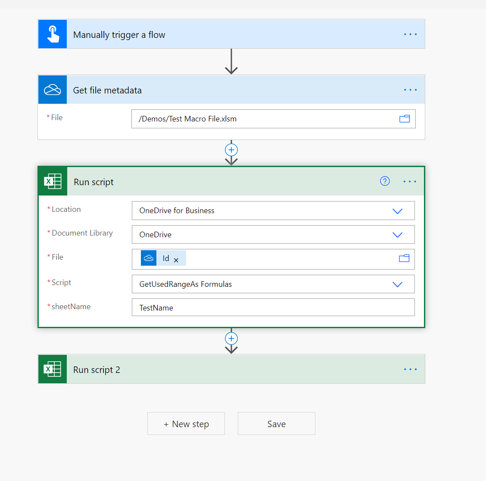

# Tip for how to use macro files or xlsm files in Power Automate flows

[Power Automate flows](https://us.flow.microsoft.com/) provide [Excel connectors](https://us.flow.microsoft.com/connectors/shared_excelonlinebusiness/excel-online-business/) to help connect Excel files with the rest of your organizational data and apps such as Teams, Outlook, SharePoint, etc.

However, a limitation is that macro files can't be selected in the file dropdown (see an example in the following screenshot).

One way to get around this issue is by including the "Get File Metadata" action (OneDrive or SharePoint) and use the ID property in the "Run Script" action as shown in the following screenshot.

> [!NOTE]
> Some XLSM (especially the ones with ActiveX/Form controls) may not work in the Excel online connector. Be sure to test before deploying your solution.

## Video

