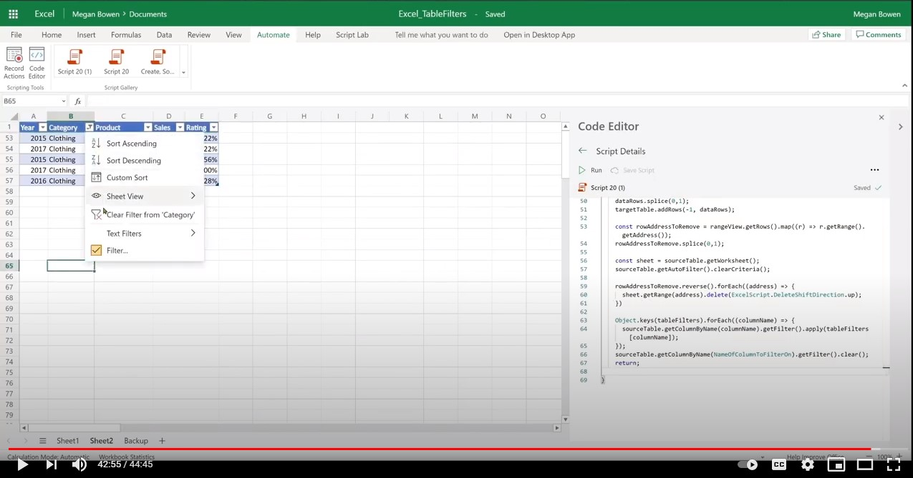

# Move rows across tables by saving filters, then processing and reapplying the filters

This script does the following:

* Selects rows from the source table where the value in a column is equal to _some value_.
* Moves all selected rows into another (target) table on another worksheet.
* Reapplies the relevant filters on the source table.

:::image type="content" source="../../images/table-filter-before-after.png" alt-text="Screenshots of workbook before and after":::

There are two scripts in this solution. The main difference is how the rows are selected.

* In the [first variant](#sample-code-move-rows-using-table-filter), the rows are selected by applying the table filter and reading the visible range.
* In the [second](#sample-code-move-rows-using-range-values), the rows are selected by reading the values and extracting the row values.

## Sample Excel file

Download the file <a href="input-table-filters.xlsx">input-table-filters.xlsx</a> used in this solution to try it out yourself!

## Sample code: Move rows using table filter

```TypeScript
function main(workbook: ExcelScript.Workbook) {

  // Update the table names, column name, and look up value as needed.
  const TargetTableName = 'Table1';
  const SourceTableName = 'Table2';
  const NameOfColumnToFilterOn = 'Category';
  const ValueToFilterOn = 'Clothing';

  // Get the table objects.
  let targetTable = workbook.getTable(TargetTableName);
  let sourceTable = workbook.getTable(SourceTableName);
  // If you don't know the table names, you can instead use the following code to fetch the first table on a given worksheet name.
  // let targetTable = workbook.getWorksheet('Sheet1').getTables()[0];
  // let sourceTable = workbook.getWorksheet('Sheet2').getTables()[0];

  
  if (!targetTable || !sourceTable) {
    console.log(`Required tables missing - Check that both source (${TargetTableName}) and target (${SourceTableName}) tables are present before running the script.`);
    return;
  }

  // Save all of the filter criteria.
  // Initialize with an empty object to hold the filter criteria.
  const tableFilters = {};
  // For each table column, collect the filter criteria.
  sourceTable.getColumns().forEach((column) => {
    let colFilterCriteria = column.getFilter().getCriteria();
    if (colFilterCriteria) {
      // If we don't remove these two keys, the API fails for some reason. So, remove these.
      delete colFilterCriteria['@odata.type'];
      delete colFilterCriteria['subField'];

      tableFilters[column.getName()] = colFilterCriteria;
    }
  });

  // Clear all filters on the table so that new filter can be applied.
  sourceTable.getAutoFilter().clearCriteria();

  // Get the name of the column that needs to be filtered (to select rows).
  const columnToFilter = sourceTable.getColumnByName(NameOfColumnToFilterOn);

  // Apply checked items filter on table 'targetTable' column '1'.
  columnToFilter.getFilter().applyValuesFilter([ValueToFilterOn]);

  // Get the visible range reference.
  const rangeView = sourceTable.getRange().getVisibleView();

  // Get number of rows that matched the filter criteria.
  const rowsCount = rangeView.getRowCount();
  console.log("Rows selected including header: " + rowsCount);

  // If no data rows to process, exit script.
  if (rowsCount < 2) {
    console.log('No data rows selected from the source table that matched the filter criteria.');
    reApplyFilters(sourceTable, NameOfColumnToFilterOn, tableFilters);
    return;
  }

  // Get the data values to insert to target table.
  let dataRows: (number | string | boolean)[][] = [];
  rangeView.getRows().forEach( (r, i) => {
    dataRows.push(r.getValues()[0]);
    return;
  });
  // Remove header row as it shows up as part of visible range rows.
  dataRows.splice(0,1);
  console.log(`Adding ${dataRows.length} rows to target table.`);
  // Insert rows at the end of target table. Change the first argument to suit your target location (e.g., 0 for beginning, -1 for end).
  targetTable.addRows(-1, dataRows);

  // Collect all the range addresses to be removed.
  const rowAddressToRemove = rangeView.getRows().map((r) => r.getRange().getAddress());
  // Remove the header row address.
  rowAddressToRemove.splice(0,1);
  
  // Remove the filters from the table prior to deleting rows.
  columnToFilter.getFilter().clear();

  // Get worksheet reference where the table rows to be deleted resides.
  const sheet = sourceTable.getWorksheet();

  // Important: Reverse the address and remove from the bottom so that the right rows are removed.
  // If not reversed, the resulting row upwards shift will mean that incorrect rows will be removed. 
  console.log(`Removing ${rowAddressToRemove.length} from the source table. `)
  rowAddressToRemove.reverse().forEach((address) => {
    // console.log(`Deleting row: ${address}`);
    sheet.getRange(address).delete(ExcelScript.DeleteShiftDirection.up);
  });

  // Format source table to wrap text (important to do this before reapplying filters).
  sourceTable.getRange().getFormat().setWrapText(true);  
  
  // Reapply filters.
  // Log the criteria for testing purpose (not required).
  console.log(tableFilters);
  reApplyFilters(sourceTable, NameOfColumnToFilterOn, tableFilters);
  console.log("Finished.")
  return;
}

function reApplyFilters(sourceTable: ExcelScript.Table, columnNameFilteredOn: string, tableFilters: {}): void {

  // Reapply all column filters.
  Object.keys(tableFilters).forEach((columnName) => {
    sourceTable.getColumnByName(columnName).getFilter().apply(tableFilters[columnName]);
  });
  // Clear the filter on the column that we used to select rows
  // as those rows may have already been removed (retain all other filters).
  sourceTable.getColumnByName(columnNameFilteredOn).getFilter().clear();
  return;
}
```

## Sample code: Move rows using range values

```TypeScript
function main(workbook: ExcelScript.Workbook) {

  // Update the table names, column index to look up as needed.
  const TargetTableName = 'Table1';
  const SourceTableName = 'Table2';
  const IndexOfColumnToFilterOn = 1; // 0-index
  const NameOfColumnToFilterOn = 'Category';
  const ValueToFilterOn = 'Clothing';

  // Get the table objects.
  let targetTable = workbook.getTable(TargetTableName);
  let sourceTable = workbook.getTable(SourceTableName);
  
  // If you don't know the table names, you can fetch first table on a given worksheet name.
  // let targetTable = workbook.getWorksheet('Sheet1').getTables()[0];
  // let sourceTable = workbook.getWorksheet('Sheet2').getTables()[0];

  if (!targetTable || !sourceTable) {
    console.log(`Tables missing - Check to make sure both source (${TargetTableName}) and target table (${SourceTableName}) are present before running the script. `);
    return;
  }

  // Save all of the filter criteria.
  // Initialize with an empty object to hold the filter criteria.
  const tableFilters = {};
  // For each table column, collect the filter criteria.
  sourceTable.getColumns().forEach((column) => {
    let colFilterCriteria = column.getFilter().getCriteria();
    if (colFilterCriteria) {
      // If we don't remove these two keys, the API fails for some reason. So, remove these.
      delete colFilterCriteria['@odata.type'];
      delete colFilterCriteria['subField'];
      tableFilters[column.getName()] = colFilterCriteria;
    }
  });

  // Range object of table data.
  const sourceRange = sourceTable.getRangeBetweenHeaderAndTotal();
  // Get data values of the table rows.
  const dataRows: (number | string | boolean)[][] = sourceTable.getRangeBetweenHeaderAndTotal().getValues();

  // Create variables to hold the rows to be moved and their addresses.
  let rowsToMoveValues: (number | string | boolean)[][] = [];
  let rowAddressToRemove: string[] = [];

  // Get the data values to insert to target table.
  for (let i = 0; i < dataRows.length; i++) { 
    if (dataRows[i][IndexOfColumnToFilterOn] === ValueToFilterOn) {
      rowsToMoveValues.push(dataRows[i]);
      // Get the intersection between table address and the entire row where we found the match. This provides the address of the range to remove.
      let address = sourceRange.getIntersection(sourceRange.getCell(i,0).getEntireRow()).getAddress();
      rowAddressToRemove.push(address);
    }
  }

  // If no data rows to process, exit script.
  if (rowsToMoveValues.length < 1) {
    console.log('No rows selected from the source table that matched the filter criteria.');
    return;
  }
  console.log(`Adding ${rowsToMoveValues.length} rows to target table.`);
  // Insert rows at the end of target table. Change the first argument to suit your target location (e.g., 0 for beginning, -1 for end).
  targetTable.addRows(-1, rowsToMoveValues)
  // Get worksheet reference where the table rows to be deleted resides. 
  const sheet = sourceTable.getWorksheet();

  // Remove all filters before removing rows.
  sourceTable.getAutoFilter().clearCriteria();

  // Important: Reverse the address and remove from the bottom so that the right rows are removed.
  // If not reversed, the resulting row upwards shift will mean that incorrect rows will be removed. 
  console.log(`Removing ${rowAddressToRemove.length} from the source table. `)
  rowAddressToRemove.reverse().forEach((address) => {
    sheet.getRange(address).delete(ExcelScript.DeleteShiftDirection.up);
  });
  // Reapply filters. 
  // Log the criteria for testing purpose (not required).
  console.log(tableFilters);
  // Format source table to wrap text (important to do this before reapplying filters).
  sourceTable.getRange().getFormat().setWrapText(true);  
  
  // Reapply all column filters.
  reApplyFilters(sourceTable, NameOfColumnToFilterOn, tableFilters);
  console.log("Finished.")
  return;
}

function reApplyFilters(sourceTable: ExcelScript.Table, columnNameFilteredOn: string, tableFilters: {}): void {

  // Reapply all column filters.
  Object.keys(tableFilters).forEach((columnName) => {
    sourceTable.getColumnByName(columnName).getFilter().apply(tableFilters[columnName]);
  });
  sourceTable.getColumnByName(columnNameFilteredOn).getFilter().clear();
  return;
}
```

## Training video: Move rows across tables

[](https://youtu.be/_3t3Pk4i2L0 "Step-by-step video on how to move rows across tables")
