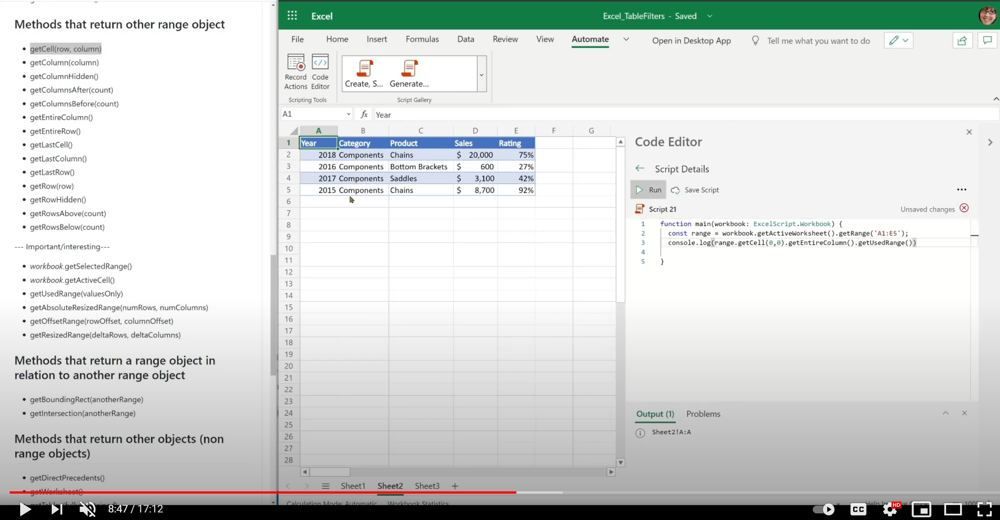
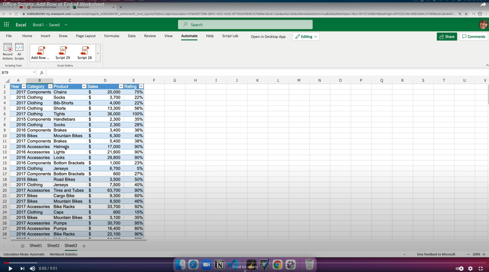

# Range basics

`Range` is the foundational object within the Office Scripts Excel object model. [Range APIs](/javascript/api/office-scripts/excelscript/excelscript.range) allow access to both data and format available on the grid and link other key objects within Excel such as worksheets, tables, charts, etc.

A range is identified using its address such as "A1:B4" or using a named-item, which is a named key for a given set of cells. In the Excel object model, both a cell and group of cells are referred as _range_. `Range` can contain cell-level attributes such as data within a cell and also cell and cells-level attributes such as format, borders, etc.

`Range` can also be obtained via user's selection that consists of at least one cell. As you interact with the range, it's important to keep these cell and range relationships clear.

Following are the core set of getters, setters, and other useful methods most often used in scripts. This is a great starting point for your API journey. The later sections group the methods and help to build a mental model as you begin to unlock the `Range` object's APIs.

## Example scripts

* [Basic read and write](#basic-read-and-write)
* [Add row at the end of worksheet](#add-row-at-the-end-of-worksheet)
* [Clear column filter](clear-table-filter-for-active-cell.md)
* [Color each cell with unique color](#color-each-cell-with-unique-color)
* [Update range with values using 2-dimensional (2D) array](#update-range-with-values-using-2d-array)

### Basic read and write

```TypeScript
/**
 * This script demonstrates basic read-write operations on the Range object.
 */
function main(workbook: ExcelScript.Workbook) {
  const cell = workbook.getActiveCell();
  const prevValue = cell.getValue();
  if (prevValue) {
      console.log(`Active cell's value is: ${prevValue}`);
  } else {
      console.log("Setting active cell's value..");
      cell.setValue("Sample");
  }

  // Get cell next to the right column and set its value and fill color.
  const nextCell = cell.getOffsetRange(0,1);
  nextCell.setValue("Next cell");
  console.log(`Next cell's address is: ${nextCell.getAddress()}`);
  console.log("Setting fill color and font color of next cell...");
  nextCell.getFormat().getFill().setColor("Magenta");
  nextCell.getFormat().getFill().setColor("Cyan");

  // Get the target range address to update with 2-dimensional value.
  const dataRange = nextCell.getOffsetRange(1, 0).getResizedRange(2, 1);
  const DATA = [
    [10, 7],
    [8, 15],
    [12, 1]
  ];
  console.log(`Updating range ${dataRange.getAddress()} with values: ${DATA}`);
  dataRange.setValues(DATA);

  // Formula range.
  const formulaRange = dataRange.getOffsetRange(3, 0).getRow(0);
  console.log(`Updating formula for range: ${formulaRange.getAddress()}`)
  // Since relative formula is being set, we can set the formula of the entire range to the same value.
  formulaRange.setFormulaR1C1("=SUM(R[-3]C:R[-1]C)");
  console.log(`Updating number format for range: ${formulaRange.getAddress()}`)
  // Since the number format is common to the entire range, we can set it to a common format.
  formulaRange.setNumberFormat("0.00");
  return;
}
```

### Add row at the end of worksheet

```TypeScript
function main(workbook: ExcelScript.Workbook) {
    const sheet = workbook.getWorksheet('Sheet5');
    const data = ['2016', 'Bikes', 'Seats', '1500', .05];
    addRow(sheet, data);
    return;
}

function addRow(sheet: ExcelScript.Worksheet, data: (string | number | boolean)[]): void {

    const usedRange = sheet.getUsedRange();
    let startCell: ExcelScript.Range;
    // If the sheet is empty, then use A1 as starting cell for the update.
    if (usedRange) {
      startCell = usedRange.getLastRow().getCell(0, 0).getOffsetRange(1, 0);
    } else {
      startCell = sheet.getRange('A1');
    }
    console.log(startCell.getAddress());
    const targetRange = startCell.getResizedRange(0, data.length - 1);
    targetRange.setValues([data]);
    return;
}
```

### Color each cell with unique color

```TypeScript
/**
 * This sample demonstrates how to iterate over a selected range and set cell property.
   It colors each cell within the selected range with a random color.
 */
function main(workbook: ExcelScript.Workbook) {

    const syncStart = new Date().getTime();
    // Get selected range
    const range = workbook.getSelectedRange();
    const rows = range.getRowCount();
    const cols = range.getColumnCount();
    console.log("Start");

    // Color each cell with random color.
    for (let row = 0; row < rows; row++) {
        for (let col = 0; col < cols; col++) {
            range
                .getCell(row, col)
                .getFormat()
                .getFill()
                .setColor(`#${Math.random().toString(16).substr(-6)}`);
        }
    }

    console.log("End");
    const syncEnd = new Date().getTime();
    console.log("Completed, took: " + (syncEnd - syncStart) / 1000 + " Sec");
}
```

### Update range with values using 2D array

Dynamically calculates the range dimension to update based on 2D array values.

> [!TIP]
> To understand more about working with range and 2D, see [tip](../../testing/tips.md#tip-5-range-values-texts-etc-2-dimensional-to-1-dimensional-conversion).

```TypeScript
function main(workbook: ExcelScript.Workbook) {
  const currentCell = workbook.getActiveCell();
  let inputRange = computeTargetRange(currentCell, DATA);
  // Set range values.
  console.log(inputRange.getAddress());
  inputRange.setValues(DATA);
  // Call a helper function to place border around the range.
  borderAround(inputRange);
}

/**
 * A helper function that computes the target range given the target range's starting cell and selected range. 
 */
function computeTargetRange(targetCell: ExcelScript.Range, data: string[][]): ExcelScript.Range {
  const targetRange = targetCell.getResizedRange(data.length - 1, data[0].length - 1);
  return targetRange;
}

/**
 * A helper function that places a border around the range.
 */
function borderAround(range: ExcelScript.Range): void {
  range.getFormat().getRangeBorder(ExcelScript.BorderIndex.edgeLeft).setStyle(ExcelScript.BorderLineStyle.dash);
  range.getFormat().getRangeBorder(ExcelScript.BorderIndex.edgeRight).setStyle(ExcelScript.BorderLineStyle.dash);
  range.getFormat().getRangeBorder(ExcelScript.BorderIndex.edgeTop).setStyle(ExcelScript.BorderLineStyle.dash);
  range.getFormat().getRangeBorder(ExcelScript.BorderIndex.edgeBottom).setStyle(ExcelScript.BorderLineStyle.dash);
  return;
}

// Values used for range setup.
const DATA = [
  ['Item', 'Bread', 'Donuts', 'Cookies', 'Cakes', 'Pies'],
  ['Amount', '2', '1.5', '4', '12', '26']
]
```

## Training videos: Range basics

_Range basics_

[](https://youtu.be/4emjkOFdLBA "Step-by-step video on Range basics")

_Add row at the end of worksheet_

[](https://youtu.be/RgtUar013D0 "Step-by-step video on how to add a row at the end of a worksheet")

## Methods that return some range metadata

* getAddress(), getAddressLocal()
* getCellCount()
* getRowCount(), getColumnCount()

## Methods that return data/constants associated with a given range

### Returned as single cell value

* getFormula(), getFormulaLocal()
* getFormulaR1C1()
* getNumberFormat(), getNumberFormatLocal()
* getText()
* getValue()
* getValueType()

### Returned as 2D arrays (whole range)

* getFormulas(), getFormulasLocal()
* getFormulasR1C1()
* getNumberFormatCategories()
* getNumberFormats(), getNumberFormatsLocal()
* getTexts()
* getValues()
* getValueTypes()
* getHidden()
* getIsEntireRow()
* getIsEntireColumn()

## Methods that return other range object

* getSurroundingRegion() -- similar to CurrentRegion in VBA
* getCell(row, column)
* getColumn(column)
* getColumnHidden()
* getColumnsAfter(count)
* getColumnsBefore(count)
* getEntireColumn()
* getEntireRow()
* getLastCell()
* getLastColumn()
* getLastRow()
* getRow(row)
* getRowHidden()
* getRowsAbove(count)
* getRowsBelow(count)

**Important/Interesting**

* _workbook_.getSelectedRange()
* _workbook_.getActiveCell()
* getUsedRange(valuesOnly)
* getAbsoluteResizedRange(numRows, numColumns)
* getOffsetRange(rowOffset, columnOffset)
* getResizedRange(deltaRows, deltaColumns)

## Methods that return a range object in relation to another range object

* getBoundingRect(anotherRange)
* getIntersection(anotherRange)

## Methods that return other objects (non-range objects)

* getDirectPrecedents()
* getWorksheet()
* getTables(fullyContained)
* getPivotTables(fullyContained)
* getDataValidation()
* getPredefinedCellStyle()

## Set methods

### Singular cell set methods

* setFormula(formula)
* setFormulaLocal(formulaLocal)
* setFormulaR1C1(formulaR1C1)
* setNumberFormatLocal(numberFormatLocal)
* setValue(value)

### 2D / entire range set methods

* setFormulas(formulas)
* setFormulasLocal(formulasLocal)
* setFormulasR1C1(formulasR1C1)
* setNumberFormat(numberFormat)
* setNumberFormats(numberFormats)
* setNumberFormatsLocal(numberFormatsLocal)
* setValues(values)

## Other methods

* merge(across)
* unmerge()

## Coming soon

* Range edge APIs
