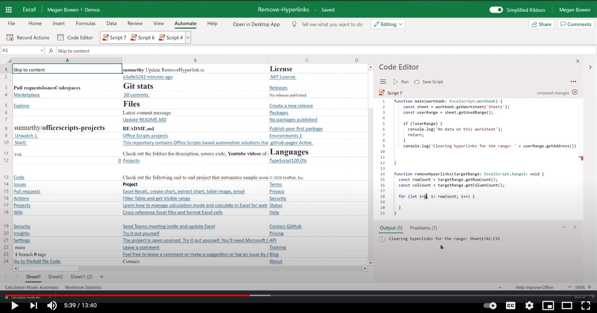

# Remove hyperlinks from each cell in an Excel worksheet

 This sample clears all of the hyperlinks from the current worksheet. It traverses the worksheet and if there is any hyperlink associated with the cell, it clears the hyperlink yet retains the cell value as is. Also logs the time it takes to complete traversal.

> [!NOTE]
> This only works if the cell count is < 10k.

## Office Scripts sample code: Remove hyperlinks

Download the file <a href="remove-hyperlinks.xlsx">remove-hyperlinks.xlsx</a> used in this sample and try it out yourself!

```TypeScript
function main(workbook: ExcelScript.Workbook, sheetName: string = 'Sheet1') {

  // Get the active worksheet. 
  let sheet = workbook.getWorksheet(sheetName);
  const targetRange = sheet.getUsedRange(true);
  if (!targetRange) {
    console.log(`There is no data in the worksheet. `)
    return;
  }
  console.log(`Target Range to clear hyperlinks from: ${targetRange.getAddress()}`);

  const rowCount = targetRange.getRowCount();
  const colCount = targetRange.getColumnCount();
  const totalCells = rowCount * colCount;
  if (totalCells > 10000) {
    console.log("Too many cells to operate with. Consider editing script to use selected range and then remove hyperlinks in batches. " + targetRange.getAddress());
    return;
  }
  // Call the helper function to remove the hyperlinks. 
  removeHyperLink(targetRange);
  return;
}

/**
 * Removes hyperlink for each cell in the target range. Logs the time it takes to complete traversal.
 * @param targetRange Target range to clear the hyperlinks from.
 */
function removeHyperLink(targetRange: ExcelScript.Range): void {
  const rowCount = targetRange.getRowCount();
  const colCount = targetRange.getColumnCount();
  console.log(`Searching for hyperlinks in ${targetRange.getAddress()} which contains ${(rowCount * colCount)} cells`);
  let clearedCount = 0;
  let cellsVisited = 0;

  let groupStart = new Date().getTime();
  for (let i = 0; i < rowCount; i++) {
    for (let j = 0; j < colCount; j++) {
      cellsVisited++;
      if (cellsVisited % 50 === 0) {
        let groupEnd = new Date().getTime();
        console.log(`Completed ${cellsVisited} cells out of ${rowCount * colCount}. This group took: ${(groupEnd - groupStart) / 1000} seconds to complete.`);
        groupStart = new Date().getTime();
      }
      const cell = targetRange.getCell(i, j);
      const hyperlink = cell.getHyperlink();
      if (hyperlink) {
        cell.clear(ExcelScript.ClearApplyTo.hyperlinks);
        cell.getFormat().getFont().setUnderline(ExcelScript.RangeUnderlineStyle.none);
        cell.getFormat().getFont().setColor('Black');
        clearedCount++;
      }
    }
  }
  console.log(`Done. Inspected ${cellsVisited} cells. Cleared hyperlinks in: ${clearedCount} cells`);
  return;
}
```

## Video

[](https://youtu.be/v20fdinxpHU "Step-by-step video")
