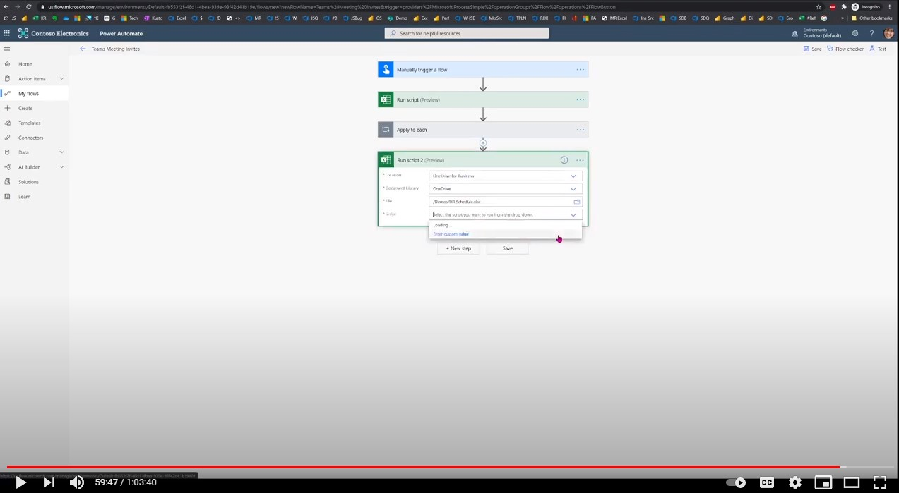

# Send Teams meeting from Excel data

This solution shows how to use Office Scripts and Power Automate actions to select rows from Excel file and use it to send a Teams meeting invite then update Excel.

## Example scenario

* An HR recruiter manages the interview schedule of candidates in an Excel file.
* The recruiter needs to send the Teams meeting invite to the candidate and interviewers. The business rules are to select:

    (a) Invites to only those for whom the invite isn't already sent as recorded in the file column.

    (b) Interview dates in the future (no past dates).

* The recruiter needs to update the Excel file with the confirmation that all Teams meetings have been sent for the eligible records.

## Solution

The solution has 3 parts:

1. Office Script to extract data from a table based on conditions and returns an array of objects as JSON data.
1. The data is then sent to the Teams **Create a Teams meeting** action to send invites. Send one Teams meeting per instance in the JSON array.
1. Send the same JSON data to another Office Script to update the status of the invitation.

## Sample Excel file

Download the file <a href="hr-schedule.xlsx">hr-schedule.xlsx</a> used in this sample and try it out yourself!

## Office Scripts

The solution uses two Office Scripts.

1. [Select filtered rows from table as JSON](#select-filtered-rows-from-table-as-json)
1. [Mark as invited](#mark-as-invited)

### Select filtered rows from table as JSON

```TypeScript
function main(workbook: ExcelScript.Workbook): InterviewInvite[] {
  console.log("Current date time: " + new Date().toUTCString())
  const MEETING_DURATION = workbook.getNamedItem('MeetingDuration').getRange().getValue() as number;
  const sheet = workbook.getWorksheet('Interviews');
  const table = sheet.getTables()[0];
  const dataRows: string[][] = table.getRange().getTexts();
  // OR use the following statement if there's no table:
  // let dataRows = sheet.getUsedRange().getValues();
  const selectedRows = dataRows.filter((row, i) => {
    // Select header row and any data row with the status column equal to approach value.
    return (row[1] === 'FALSE' || i === 0)
  })
  const recordDetails: RecordDetail[] = returnObjectFromValues(selectedRows as string[][]);
  const inviteRecords = generateInterviewRecords(recordDetails, MEETING_DURATION);
  console.log(JSON.stringify(inviteRecords));
  return inviteRecords;
}

/**
 * This helper function converts table values into an object array.
 */
function returnObjectFromValues(values: string[][]): RecordDetail[] {
  let objArray: BasicObj[] = [];
  let objKeys: string[] = [];
  for (let i = 0; i < values.length; i++) {
    if (i === 0) {
      objKeys = values[i]
      continue;
    }
    let obj = {}
    for (let j = 0; j < values[i].length; j++) {
      obj[objKeys[j]] = values[i][j]
    }
    objArray.push(obj);
  }
  return objArray as RecordDetail[];
}

/**
 * Generate interview records by selecting required columns.
 * @param records Input records
 * @param mins Number of minutes to add to the start date-time
 */
function generateInterviewRecords(records: RecordDetail[], mins: number): InterviewInvite[] {
  const interviewInvites: InterviewInvite[] = []

  records.forEach((record) => {
    // Interviewer 1
    // If the start date-time is greater than current date-time, add to output records.
    if ((new Date(record['Start time1'])) > new Date()) {
      console.log("selected " + new Date(record['Start time1']).toUTCString());
      let startTime = new Date(record['Start time1']).toISOString();
      // Compute the finish time of the meeting.
      let finishTime = addMins(new Date(record['Start time1']), mins).toISOString();
      interviewInvites.push({
        ID: record.ID,
        Candidate: record.Candidate,
        CandidateEmail: record['Candidate email'] as string,
        CandidateContact: record['Candidate contact'] as string,
        Interviewer: record.Interviewer1,
        InterviewerEmail: record['Interviewer1 email'],
        StartTime: startTime,
        FinishTime: finishTime
      })
    } else {
      console.log("Rejected " + (new Date(record['Start time1']).toUTCString()))
    }
    // Interviewer 2 
    // If the start date-time is greater than current date-time, add to output records.
    if ((new Date(record['Start time2'])) > new Date()) {
      console.log("selected " + new Date(record['Start time2']).toUTCString());


      let startTime = new Date(record['Start time2']).toISOString();
      // Compute the finish time of the meeting.
      let finishTime = addMins(new Date(record['Start time2']), mins).toISOString();
      interviewInvites.push({
        ID: record.ID,
        Candidate: record.Candidate,
        CandidateEmail: record['Candidate email'] as string,
        CandidateContact: record['Candidate contact'] as string,
        Interviewer: record.Interviewer2,
        InterviewerEmail: record['Interviewer2 email'],
        StartTime: startTime,
        FinishTime: finishTime
      })
    } else {
      console.log("Rejected " + (new Date(record['Start time2']).toUTCString()))

    }
  })
  return interviewInvites;
}

/**
 * Add minutes to start date-time.
 * @param startDateTime Start date-time
 * @param mins Minutes to add to the start date-time
 */
function addMins(startDateTime: Date, mins: number) {
  return new Date(startDateTime.getTime() + mins * 60 * 1000);
}

// Basic key-value pair object.
interface BasicObj {
  [key: string]: string | number | boolean
}

// Input record that matches the table data.
interface RecordDetail extends BasicObj {
  ID: string
  'Invite to interview': string
  Candidate: string
  'Candidate email': string
  'Candidate contact': string
  Interviewer1: string
  'Interviewer1 email': string
  Interviewer2: string
  'Interviewer2 email': string
  'Start time1': string
  'Start time2': string
}

// Output record.
interface InterviewInvite extends BasicObj {
  ID: string
  Candidate: string
  CandidateEmail: string
  CandidateContact: string
  Interviewer: string
  InterviewerEmail: string
  StartTime: string
  FinishTime: string
}
```

### Mark as invited

```TypeScript
function main(workbook: ExcelScript.Workbook, completedInvitesString: string) {
    completedInvitesString = `[
  {
    "ID": "10",
    "Candidate": "Adele ",
    "CandidateEmail": "AdeleV@M365x904181.OnMicrosoft.com",
    "CandidateContact": "1234567899",
    "Interviewer": "Megan",
    "InterviewerEmail": "MeganB@M365x904181.OnMicrosoft.com",
    "StartTime": "2020-11-03T18:30:00Z",
    "FinishTime": "2020-11-03T22:45:00Z"
  },
  {
    "ID": "30",
    "Candidate": "Allan ",
    "CandidateEmail": "AllanD@M365x904181.OnMicrosoft.com",
    "CandidateContact": "1234567978",
    "Interviewer": "Raul",
    "InterviewerEmail": "RaulR@M365x904181.OnMicrosoft.com",
    "StartTime": "2020-11-03T23:00:00Z",
    "FinishTime": "2020-11-03T23:45:00Z"
  }
]`;
    let completedInvites = JSON.parse(completedInvitesString) as InterviewInvite[];
    const sheet = workbook.getWorksheet('Interviews');
    const range = sheet.getTables()[0].getRange();
    const dataRows = range.getValues();
    for (let i=0; i < dataRows.length; i++) {
        for (let invite of completedInvites) {
            if (String(dataRows[i][0]) === invite.ID) {
                range.getCell(i,1).setValue(true);
            }
        }
    }
    return;
}


// Invite record.
interface InterviewInvite  {
    ID: string
    Candidate: string
    CandidateEmail: string
    CandidateContact: string
    Interviewer: string
    InterviewerEmail: string
    StartTime: string
    FinishTime: string
}
```

## Video

[](https://youtu.be/HyBdx52NOE8 "Step-by-step video")
