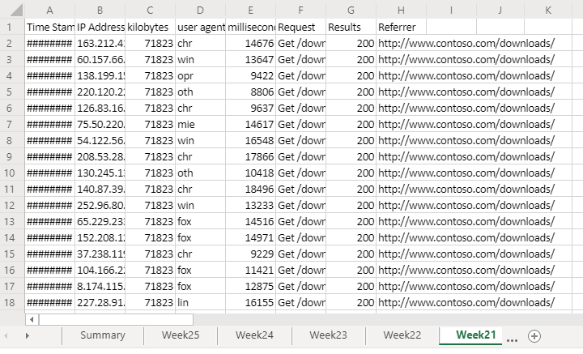

> [!IMPORTANT]
> This is a legacy sample that uses the Office Scripts Async APIs. These APIs are only recommended when script performance is critical. This sample is in the process of being converted to the new Office Scripts APIs.

# Office Scripts sample scenario: Analyze web downloads

In this scenario, you're tasked with analyzing download reports from your company's website. The goal of this analysis is to determine if the web traffic is coming from the United States or elsewhere in the world.

Your colleagues upload the raw data to your workbook. Each week's set of data has its own worksheet. There is also the **Summary** worksheet with a table and chart that shows week-over-week trends.

You'll develop a script that analyzes weekly downloads data in the active worksheet. It will parse the IP address associated with each download and determine whether or not it came from the US. The answer will be inserted in the worksheet as a boolean value ("TRUE" or "FALSE") and conditional formatting will be applied to those cells. The IP address location results will be totaled on the worksheet and copied to the summary table.

## Scripting skills covered

- Text parsing
- Subfunctions in scripts
- Conditional formatting
- Tables

## Demo video

This sample was demoed as part of the Office Add-ins developer community call for February 2020.

> [!VIDEO https://www.youtube.com/embed/vPEqbb7t6-Y?start=154]

## Setup instructions

1. Download <a href="analyze-web-downloads.xlsx">analyze-web-downloads.xlsx</a> to your OneDrive.

2. Open the workbook with Excel for the web.

3. Under the **Automate** tab, open the **Code Editor**.

4. In the **Code Editor** task pane, press **New Script** and paste the following script into the editor.

    ```TypeScript
      async function main(context: Excel.RequestContext) {
        let currentWorksheet = context.workbook.worksheets
          .getActiveWorksheet();
        // Get the values of the active range of the active worksheet.
        let logRange = currentWorksheet.getUsedRange().load("values");

        // Get the Summary worksheet and table.
        let summaryWorksheet = context.workbook.worksheets.getItem("Summary");
        let summaryTable = context.workbook.tables.getItem("Table1");

        // Get the range that will contain TRUE/FALSE if the IP address is from the United States (US).
        let isUSColumn = logRange
          .getLastColumn()
          .getOffsetRange(0, 1)
          .load("address");

        // Get the values of all the US IP addresses.
        let ipRange = context.workbook.worksheets
          .getItem("USIPAddresses")
          .getUsedRange()
          .load("values");
        await context.sync();

        // Remove the first row.
        let topRow = logRange.values.shift();

        // Create a new array to contain the boolean representing if this is a US IP address.
        let newCol = [[]];

        // Go through each row in worksheet and add Boolean.
        for (let i = 0; i < logRange.values.length; i++) {
          let curRowIP = logRange.values[i][1];
          if (findIP(ipRange.values, ipAddressToInteger(curRowIP)) > 0) {
            newCol.push([true]);
          } else {
            newCol.push([false]);
          }
        }

        // Remove the empty column header and add proper heading.
        newCol.shift();
        newCol.unshift(["Is US IP"]);

        // Write the result to the spreadsheet.
        isUSColumn.values = newCol;
        addSummaryData();
        applyConditionalFormatting();
        currentWorksheet.getUsedRange().format.autofitColumns();

        // Get the calculated summary data.
        let summaryRange = currentWorksheet.getRange("J2:M2").load("values");
        await context.sync();

        // Add the corresponding row to the summary table.
        summaryTable.rows.add(null, summaryRange.values);

        // Function to apply conditional formatting to the new column.
        function applyConditionalFormatting() {
          // Add conditional formatting to the new column.
          let conditionalFormatTrue = isUSColumn.conditionalFormats.add(
            Excel.ConditionalFormatType.cellValue
          );
          let conditionalFormatFalse = isUSColumn.conditionalFormats.add(
            Excel.ConditionalFormatType.cellValue
          );
          // Set TRUE to light blue and FALSE to light orange.
          conditionalFormatTrue.cellValue.format.fill.color = "#8FA8DB";
          conditionalFormatTrue.cellValue.rule = {
            formula1: "=TRUE",
            operator: "EqualTo"
          };
          conditionalFormatFalse.cellValue.format.fill.color = "#F8CCAD";
          conditionalFormatFalse.cellValue.rule = {
            formula1: "=FALSE",
            operator: "EqualTo"
          };
        }

        // Adds the summary data to the current sheet and to the summary table.
        function addSummaryData() {
          // Add a summary row and table.
          let summaryHeader = [["Year", "Week", "US", "Other"]];
          let countTrueFormula =
            "=COUNTIF(" + isUSColumn.address + ', "=TRUE")/' + (newCol.length - 1);
          let countFalseFormula =
            "=COUNTIF(" + isUSColumn.address + ', "=FALSE")/' + (newCol.length - 1);

          let summaryContent = [
            [
              '=TEXT(A2,"YYYY")',
              '=TEXTJOIN(" ", FALSE, "Wk", WEEKNUM(A2))',
              countTrueFormula,
              countFalseFormula
            ]
          ];
          let summaryHeaderRow = context.workbook.worksheets
            .getActiveWorksheet()
            .getRange("J1:M1");
          let summaryContentRow = context.workbook.worksheets
            .getActiveWorksheet()
            .getRange("J2:M2");
          summaryHeaderRow.values = summaryHeader;
          summaryContentRow.values = summaryContent;
          let formats = [[".000", ".000"]];
          summaryContentRow
            .getOffsetRange(0, 2)
            .getResizedRange(0, -2).numberFormat = formats;
        }
      }

      // Translate an IP address into an integer.
      function ipAddressToInteger(ipAddress: string) {
        // Split the IP address into octets.
        let octets = ipAddress.split(".");

        // Create a number for each octet and do the math to create the integer value of the IP address.
        let fullNum =
          // Define an arbitrary number for the last octet.
          111 +
          parseInt(octets[2]) * 256 +
          parseInt(octets[1]) * 65536 +
          parseInt(octets[0]) * 16777216;
        return fullNum;
      }

      // Return the row number where the ip address is found.
      function findIP(ipLookupTable: number[][], n: number) {
        for (let i = 0; i < ipLookupTable.length; i++) {
          if (ipLookupTable[i][0] <= n && ipLookupTable[i][1] >= n) {
            return i;
          }
        }
        return -1;
      }
    ```

5. Rename the script to **Analyze Web Downloads** and save it.

## Running the script

Navigate to any of the **Week\*\*** worksheets and run the **Analyze Web Downloads** script. The script will apply the conditional formatting and location labelling on the current sheet. It will also update the **Summary** worksheet.

### Before running the script



### After running the script


