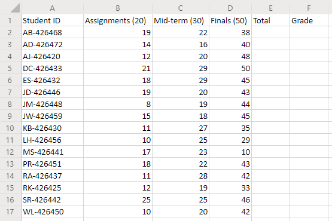
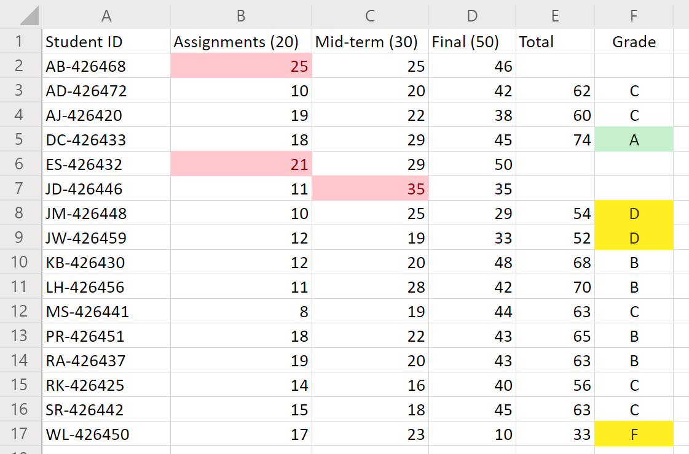

# Office Scripts sample scenario: Grade calculator

In this scenario, you're an instructor tallying every student's end-of-term grades. You've been entering the scores for their assignments and tests as you go. Now, it is time to determine the students' fates.

You'll develop a script that totals the grades for each point category and assign a letter grade to each student based on the total. To help ensure accuracy, you'll add a couple checks to see if any individual scores are too low or high. If a student's score is less than zero or more than the possible point value, the script will flag the cell with a red fill and not total that student's points. This will be a clear indication of which records to double-check. You also want some basic formatting for the grades to quickly view the top and bottom of the class.

## Scripting skills covered

- Cell formatting
- Error checking
- Regular expressions

## Setup instructions

1. Download <a href="grade-calculator.xlsx">grade-calculator.xlsx</a> to your OneDrive.

2. Open the workbook with Excel for the web.

3. Under the **Automate** tab, open the **Code Editor**.

4. In the **Code Editor** task pane, press **New Script** and paste the following script into the editor.

    ```TypeScript
    async function main(context: Excel.RequestContext) {
      // Get the number of student record rows.
      let sheet = context.workbook.worksheets.getActiveWorksheet();
      let studentsRange = sheet.getUsedRange().load("values, rowCount");
      await context.sync();
      console.log("Total students: " + (studentsRange.rowCount - 1));

      // Clean up any formatting from previous runs of the script.
      studentsRange.clear(Excel.ClearApplyTo.formats);
      studentsRange.getColumn(4).getCell(0, 0).getRowsBelow(studentsRange.rowCount - 1).clear(Excel.ClearApplyTo.all);
      studentsRange.getColumn(5).getCell(0, 0).getRowsBelow(studentsRange.rowCount - 1).clear(Excel.ClearApplyTo.all);
      await context.sync();

      // Parse the headers for the maximum possible scores for each category.
      // The format is `category (score)`.
      let assignmentsMax = studentsRange.values[0][1].match(/\d+/)[0];
      let midTermMax = studentsRange.values[0][2].match(/\d+/)[0];
      let finalsMax = studentsRange.values[0][3].match(/\d+/)[0];
      console.log("Assignments max score:" + assignmentsMax);
      console.log("Mid-term max score: " + midTermMax);
      console.log("Final max score: " + finalsMax);

      // Look at every student row.
      for (let i = 1; i < studentsRange.values.length; i++) {
        let row = studentsRange.values[i];
        let total = row[1] + row[2] + row[3];
        let valid = true;

        // Look for any records that are too low or too high.
        if (row[1] < 0 || row[1] > assignmentsMax) {
          studentsRange.getCell(i, 1).format.fill.color = "Red";
          valid = false;
        }
        if (row[2] < 0 || row[2] > midTermMax) {
          studentsRange.getCell(i, 2).format.fill.color = "Red";
          valid = false;
        }
        if (row[3] < 0 || row[3] > finalsMax) {
          studentsRange.getCell(i, 3).format.fill.color = "Red";
          valid = false;
        }

        // If the scores are valid, total that student's points and assign them a letter grade.
        if (valid) {
          let grade: string;
          switch (true) {
            case total < 60:
              grade = "E";
              break;
            case total < 70:
              grade = "D";
              break;
            case total < 80:
              grade = "C";
              break;
            case total < 90:
              grade = "B";
              break;
            default:
              grade = "A";
              break;
          }

          studentsRange.getCell(i, 4).values = [[total]];
          studentsRange.getCell(i, 5).values = [[grade]];

          // Highlight excellent students and those in need of attention.
          if (grade === "A") {
            studentsRange.getCell(i, 5).format.fill.color = "Green";
          } else if (grade === "E" || grade === "D") {
            studentsRange.getCell(i, 5).format.fill.color = "Orange";
          }
        }
      }

      studentsRange.getColumn(5).format.horizontalAlignment = "Center";
    }
    ```

5. Rename the script to **Grade Calculator** and save it.

## Running the script

Run the **Grade Calculator** script on the only worksheet. The script will total the grades and assign each student a letter grade. If any individual grades have more points than the assignment or test is worth, then the offending grade is marked red and the total is not calculated.

### Before running the script



### After running the script


