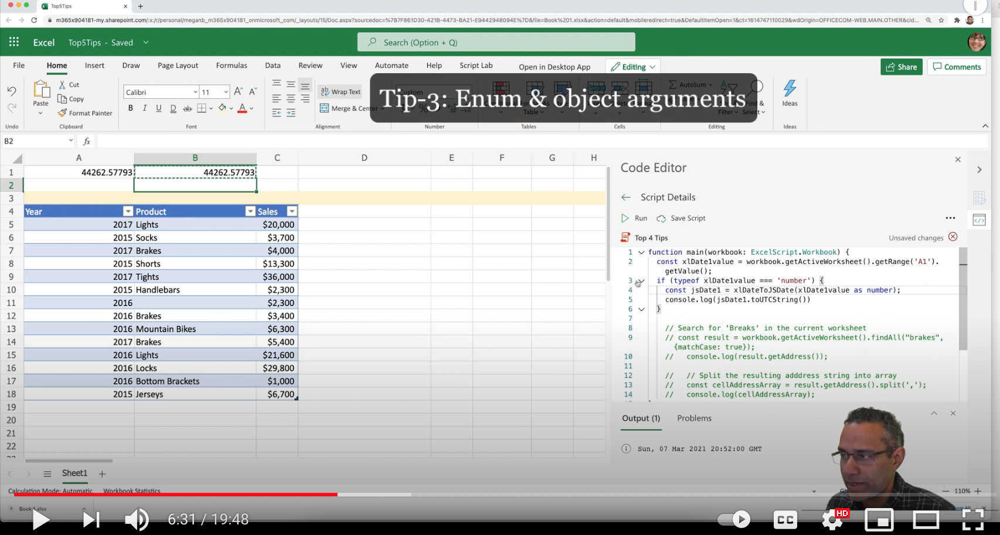
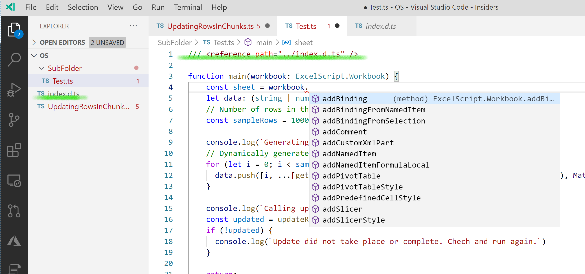

# Top tips to accelerate your learning

Use the following tips to reduce your development time and improve the quality of your scripts.

## Training video

[](https://youtu.be/xm2z_D8eP_o "Watch step-by-step video about top 5 tips")

## Excel file used in the video

Download the file <a href="../resources/top-5-tips.xlsx">top-5-tips.xlsx</a> used in the video and try the tips yourself!

## Tip 1: Use code-completion/IntelliSense in the editor

Per [Visual Studio Code document](https://code.visualstudio.com/docs/editor/intellisense), IntelliSense is a general term for various code editing features including code completion, parameter info, quick info, and member lists. IntelliSense features are sometimes called by other names such as "code completion", "content assist", and "code hinting."

IntelliSense features in Office Scripts are powered by TypeScript language. TypeScript knows how to read and interpret the script you write and the APIs that Excel offers. When it's possible to provide code completion hints, the IntelliSense suggestions will pop up as you type. If you continue typing characters, the list of members (variables, methods, etc.) is filtered to only include members containing your typed characters. Pressing **Tab** or **Enter** will insert the selected member.

You can trigger IntelliSense by pressing the CTRL+SPACE keys or by typing the dot character (.) next to a variable or type. IntelliSense is most useful when completing a method. Among other things, the method signature will contain a list of arguments it needs (if any), each argument's data type (may accept many types), whether a given argument is required or optional, and the return type of the method.

Use this code completion feature to explore the object model, discover API you need, and learn how to use it.

To learn more about setting up IntelliSense in Visual Studio Code, see [tip on full screen editing](#full-screen-editing).

## Tip 2: Type assertion of range values

The `Range` object is the foundational object within Office Script's Excel object model. [Range APIs](/javascript/api/office-scripts/excelscript/excelscript.range) allow access to both the data and format that are available on the grid and link other key objects within Excel such as worksheets, tables, charts, etc.

Among other things, each cell consists of `value` field. It contains the underlying value of the cell, which may be different from the `text` you see in the cell. Date or time are good examples where the value may be different from the `text` you see in the cell. A cell can contain one of the following types: `string`, `number`, `boolean`. Even error codes are stored as strings.

When you are using the cell value it is important to tell TypeScript what value you are expecting to get from a cell. For example, let's say you would like to use this function that subtracts two dates present in cells and get the number of days separating them. The function that helps you do this `xlDateToJSDate` expects a number type as its argument (`serialDate`). However, when you call this function, you have to tell TypeScript that the value being read from the cell using `getValue()` is a number using the `as number` **Type Assertion**. Otherwise, the TypeScript compiler points out the potential mismatch using a warning message (red underline). Let's see how to do that.

```TypeScript
function main(workbook: ExcelScript.Workbook) {

  const xlDate1value = workbook.getActiveWorksheet().getRange('A2').getValue();

  // Tell TypeScript compiler that the value will be a number.
  const jsDate1 = xlDateToJSDate(xlDate1value as number);
  console.log(jsDate1.toUTCString())
}

/**
 * Function to return the JS date from Excel date.
 */
function xlDateToJSDate(serialDate: number): Date {
  var days = Math.floor(serialDate);
  var hours = Math.floor((serialDate % 1) * 24);
  var minutes = Math.floor((((serialDate % 1) * 24) - hours) * 60)
  const returnDate = new Date(Date.UTC(0, 0, serialDate, hours - 17, minutes));
  return returnDate;
}
```

We are conveying the information that `xlDate1value` is a number using the assertion `xlDate1value as number` while invoking the function.

Similarly, you can use `as string`, `as boolean` **Type Assertions**.

Note that such compile-time warnings will not affect the actual running of the script as at runtime you are really passing the numerical argument. However, the TypeScript compiler doesn't know the values at runtime and hence it shows the warning in the editor.

If indeed the cell had a non-numeric value at run-time, the helper function will fail to execute and throw an error. So, if you are unsure about the type of data present then you must do a run-time check before calling this function that expects a numeric argument. Let's see how to do that.

```TypeScript
function main(workbook: ExcelScript.Workbook) {

  const xlDate1value = workbook.getActiveWorksheet().getRange('A2').getValue();
  
  if (typeof xlDate1value === 'number') {
    const jsDate1 = xlDateToJSDate(xlDate1value as number);
    console.log(jsDate1.toUTCString())
  }
}


/**
 * Function to return the JS date from Excel date.
 */
function xlDateToJSDate(serialDate: number): Date {
  var days = Math.floor(serialDate);
  var hours = Math.floor((serialDate % 1) * 24);
  var minutes = Math.floor((((serialDate % 1) * 24) - hours) * 60)
  const returnDate = new Date(Date.UTC(0, 0, serialDate, hours - 17, minutes));
  return returnDate;
}
```

## Tip 3: Understand method's argument types

The Office Scripts methods accept zero or many arguments depending on the type of the method. `workbook.getActiveWorksheet()` or `workbook.getActiveCell()` doesn't require any argument for them to work; however `workbook.getWorksheet()` method requires the name or ID of the worksheet such as `workbook.getWorksheet('Sheet1')`. The arguments passed to methods can be of many data types such as:

* String
* Number
* Boolean
* Excel objects as Range, Table, etc.
* Object  

For object argument, simply add open close curly parenthesis `{}`, take your cursor to the middle of the open close parenthesis and type `ctrl space` together. It'll open up the code completion to help you pick the key & value pair you need to complete the argument.

Then there is a special parameter known as enumerator - which basically allows standardized argument that Excel accepts for a given method. Example of enumerator (ENUM) argument passed to the method:

* `workbook.getActiveCell().clear(ExcelScript.ClearApplyTo.contents)`
* `workbook.getActiveCell().clear(ExcelScript.ClearApplyTo.formats)`
* `workbook.getActiveCell().clear(ExcelScript.ClearApplyTo.all)`

In the above lines, different standardized enumerator arguments are passed to the range's clear method. The name of the enumerator is `ExcelScript.ClearApplyTo` and it offers options such as `contents1`, `formats`, and `all` in the last segment of the enumerator.

## Tip 4: `null` or `undefined` check and optional chaining

The `null` or `undefined` types crop up as part of API return values and can cause quite a bit of headache if not handled properly. Fortunately, TypeScript/JavaScript language offers an easy way to check if a variable is of type undefined or null easily.

For example, the `findAll` API can either return the range areas where the string "breaks" is found or it can return `undefined` (if there is no such string in the worksheet).

```TypeScript
function main(workbook: ExcelScript.Workbook) {
  // Search for Breaks in the current worksheet.
  const result = workbook.getActiveWorksheet().findAll("breaks", {matchCase: false});
  console.log(result.getAddress());
  
  // Split the resulting address string into array.
  const cellAddressArray = result.getAddress().split(',');
  console.log(cellAddressArray);
}
```

The `getAddress()` method called on the `result` variable can either work or throw an error such as the one below:

`Line 7: Cannot read property 'getAddress' of undefined`

So, it is important to check if the `getAddress()` method returned an string or `undefined` type. You can easily do that using the following syntax.

```TypeScript
function main(workbook: ExcelScript.Workbook) {
  // Search for Breaks in the current worksheet.
  const result = workbook.getActiveWorksheet().findAll("breaks", {matchCase: true});
  if (result) {
    console.log(result.getAddress());
    
    // Split the resulting address string into array.
    const cellAddressArray = result.getAddress().split(',');
    console.log(cellAddressArray);
  }
}
```

Another technique you can use to avoid such runtime errors is to use optional chaining. Per [docs](https://developer.mozilla.org/docs/Web/JavaScript/Reference/Operators/Optional_chaining), the optional chaining operator (`?.`) permits reading the value of a property located deep within a chain of connected objects without having to expressly validate that each reference in the chain is valid. The ?. operator functions similarly to the. chaining operator, except that instead of causing an error if a reference is nullish (null or undefined), the expression short-circuits with a return value of undefined. When used with function calls, it returns undefined if the given function does not exist.

```TypeScript
function main(workbook: ExcelScript.Workbook) {
  // Search for Breaks in the current worksheet.
  const result = workbook.getActiveWorksheet().findAll("breaks", {matchCase: true});
  console.log(result?.getAddress());

  // Split the resulting address string into array.
  const cellAddressArray = result?.getAddress()?.split(',');
  console.log(cellAddressArray);
}
```

## Tip 5: Range values, texts, etc. 2-dimensional to 1-dimensional conversion  

The range object is the foundational object within Office Script's Excel object model. [Range APIs](/javascript/api/office-scripts/excelscript/excelscript.range) allows access to both data and format that available on the grid and links other key objects within Excel such as worksheets, tables, charts, etc.

In Excel API object model, both a cell (single cell) and a range (1 or more cells) are represented by the same [range](/javascript/api/office-scripts/excelscript/excelscript.range) object.

The range object offers getter APIs to get a singular value (top-left cell if there are more than 1 cells) or multiple cell values.

* Range object's range.getText(), `getValue()`, `getNumberFormat()`, and `getFormula()` methods return a single result (of type string or number or boolean - depending on the API). This is true even if the range contains more than 1 cell. It always gets the result from the 1st cell.
* Range object's `range.getTexts()`, `getValues()`, `getNumberFormats()`, and `getFormulas()` methods return a 2-dimensional result (of type string or number or boolean - depending on the API). This is true even if the range contains just single cell or a single row or single column. It always gets the result in the form of a 2-D array.

For single-cell range, use the singular versions of the API. For multi-cell range or for a range that you don't know in advance how many cells it may contain, use the plural versions of the API.

You may wish to convert the 2-dimensional result into a 1-dimensional array for further processing. Let's see how to achieve that for a single row and single column.

```TypeScript
function main(workbook: ExcelScript.Workbook)
{
  const table = workbook.getActiveWorksheet().getTables()[0];
  const header = table.getHeaderRowRange().getTexts();
  // Display header as 1D array - extract 1st row.
  console.log(header[0]);


  const sales = table.getColumnByName('Sales').getRange().getValues();
  console.log(sales);
  
  // Get column-0.
  const salesAs1DArray = extractColumn(sales, 0);
  console.log(salesAs1DArray);

  // Add 100 to each value.
  const revisedSales = salesAs1DArray.map(data => data as number + 100);
  // Add a column.
  table.addColumn(-1, revisedSales);

  const salesBackTo2D = convertColumnTo2D(salesAs1DArray);
  console.log(salesBackTo2D);

}

/**
 * Extract a column from 2D array and return result.
 */
function extractColumn(data: (string | number | boolean)[][], index: number): (string | number | boolean)[] {

  const column = data.map((row) => {
    return row[index];
  })
  return column;
}

/**
 * Convert a flat array into 2D array that can be used as range column.
 */
function convertColumnTo2D(data: (string | number | boolean)[]): (string | number | boolean)[][] {

  const columnAs2D = data.map((row) => {
    return [row];
  })
  return columnAs2D;
}
```

For setter APIs, the model is similar. There are singular `setValue()`, `setFormula()`, etc. APIs that accept an argument of a single type (string or number or boolean depending on the API). If you use these methods on a range with multiple cells, all cells will be set to the same value/formula, etc.

* `range.setValue('Hello')` --> this will set all cells in the range to value `Hello`.
* `range.setValues([['Hello', 'World!]])` --> this will set two adjacent cells of the range. If you are using a plural version of the API, the dimension of the range should match the dimension of the argument.

## Other miscellaneous tips

## Full screen editing

A full-screen detachable editor is not yet offered in Office Scripts. In the meantime, you can use the following steps to get code completion in Visual Studio Code. It's only for editing; you can't execute a script using this. To run the script, you still have to copy/paste code into the Office Scripts in-built code editor.

1. In case you already don't have it, download and install the [Visual Studio Code editor](https://code.visualstudio.com/).
1. Download the intelliSense (code completion assistance) [file](index.d.ts) to your local machine into a base folder from where you'll edit your script files.
1. You can see in the image later that this file is saved in a folder called **OS**.
1. Edit or copy your script to a new file in the same folder. The key is to name the script file locally with the .ts extension. Otherwise, the code completion doesn't work. This only works with the Visual Studio Code editor.
1. Next, add triple-slash directive to the script on line 1. `/// <reference path="{path to index.d.ts}" />`. For example: `/// <reference path="index.d.ts" />`.
1. Then, you can start authoring the script and get code completion. Change the `path to index.d.ts` depending on where your script is. In the later image see where the `index.d.ts` is one level above and the `path` directs to it.
1. Of course, you can't test or run the code from here. For that, you still have to copy/paste the code back to the Code editor within Excel in the your browser.
1. Make sure you remove the `/// <reference path="{path to index.d.ts}" />` line before copying code back to Office Scripts code editor in Excel.
1. This provides a larger surface area when editing a script. It is especially useful when you're editing a large script.


