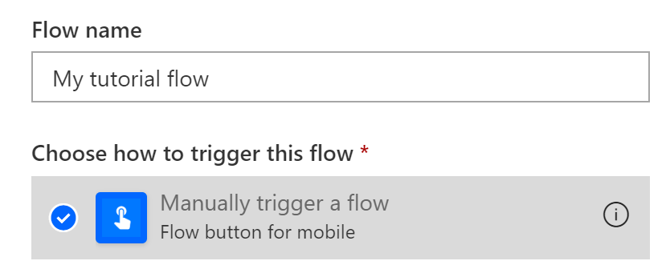
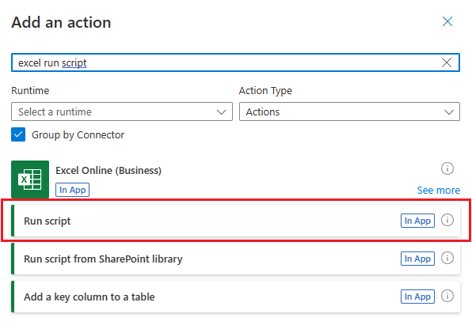
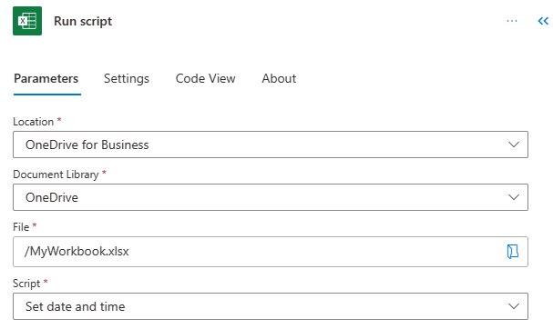
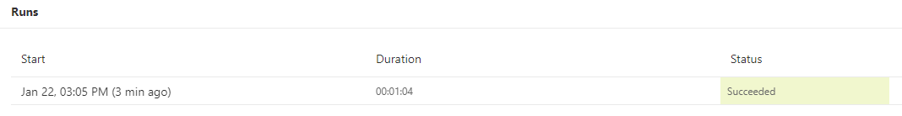

# Call scripts from a manual Power Automate flow (preview)

This tutorial teaches you how to run an Office Script for Excel on the web through [Power Automate](https://flow.microsoft.com). You'll make a script that updates the values of two cells with the current time. You'll then connect that script to a manually triggered Power Automate flow, so that the script is run whenever a button in Power Automate is pressed. Once you understand the basic pattern, you can expand the flow to include other applications and automate more of your daily workflow.

> [!TIP]
> If you are new to Office Scripts, we recommend starting with the [Record, edit, and create Office Scripts in Excel on the web](excel-tutorial.md) tutorial. [Office Scripts use TypeScript](../overview/code-editor-environment.md) and this tutorial is intended for people with beginner to intermediate-level knowledge of JavaScript or TypeScript. If you're new to JavaScript, we recommend starting with the [Mozilla JavaScript tutorial](https://developer.mozilla.org/docs/Web/JavaScript/Guide/Introduction).

## Prerequisites

[!INCLUDE [Tutorial prerequisites](../includes/power-automate-tutorial-prerequisites.md)]

## Prepare the workbook

Power Automate shouldn't use [relative references](../testing/power-automate-troubleshooting.md#avoid-using-relative-references) like `Workbook.getActiveWorksheet` to access workbook components. So, we need a workbook and worksheet with consistent names that Power Automate can reference.

1. Create a new workbook named **MyWorkbook**.

2. In the **MyWorkbook** workbook, create a worksheet called **TutorialWorksheet**.

## Create an Office Script

1. Go to the **Automate** tab and select **All Scripts**.

2. Select **New Script**.

3. Replace the default script with the following script. This script adds the current date and time to the first two cells of the **TutorialWorksheet** worksheet.

    ```TypeScript
    function main(workbook: ExcelScript.Workbook) {
      // Get the "TutorialWorksheet" worksheet from the workbook.
      let worksheet = workbook.getWorksheet("TutorialWorksheet");

      // Get the cells at A1 and B1.
      let dateRange = worksheet.getRange("A1");
      let timeRange = worksheet.getRange("B1");

      // Get the current date and time using the JavaScript Date object.
      let date = new Date(Date.now());

      // Add the date string to A1.
      dateRange.setValue(date.toLocaleDateString());

      // Add the time string to B1.
      timeRange.setValue(date.toLocaleTimeString());
    }
    ```

4. Rename the script to **Set date and time**. Press the script name to change it.

5. Save the script by pressing **Save Script**.

## Create an automated workflow with Power Automate

1. Sign in to the [Power Automate site](https://flow.microsoft.com).

2. In the menu that's displayed on the left side of the screen, press **Create**. This brings you to list of ways to create new workflows.

    

3. In the **Start from blank** section, select **Instant flow**. This creates a manually activated workflow.

    

4. In the dialog window that appears, enter a name for your flow in the **Flow name** text box, select **Manually trigger a flow** from the list of options under **Choose how to trigger the flow**, and press **Create**.

    

    Note that a manually triggered flow is just one of many types of flows. In the next tutorial, you'll make a flow that automatically runs when you receive an email.

5. Press **New step**.

6. Select the **Standard** tab, then select **Excel Online (Business)**.

    

7. Under **Actions**, select **Run script (preview)**.

    

8. Next, you'll select the workbook and script to use in the flow step. For the tutorial, you'll use the workbook you created in your OneDrive, but you could use any workbook in a OneDrive or SharePoint site. Specify the following settings for the **Run script** connector:

    - **Location**: OneDrive for Business
    - **Document Library**: OneDrive
    - **File**: MyWorkbook.xlsx *(Chosen through the file browser)*
    - **Script**: Set date and time

    

9. Press **Save**.

Your flow is now ready to be run through Power Automate. You can test it using the **Test** button in the flow editor or follow the remaining tutorial steps to run the flow from your flow collection.

## Run the script through Power Automate

1. From the main Power Automate page, select **My flows**.

    

2. Select **My tutorial flow** from the list of flows displayed in the **My flows** tab. This shows the details of the flow we previously created.

3. Press **Run**.

    

4. A task pane will appear for running the flow. If you are asked to **Sign in** to Excel Online, do so by pressing **Continue**.

5. Press **Run flow**. This runs the flow, which runs the related Office Script.

6. Press **Done**. You should see the **Runs** section update accordingly.

7. Refresh the page to see the results of the Power Automate. If it succeeded, go to the workbook to see the updated cells. If it failed, verify the flow's settings and run it a second time.

    

## Next steps

Complete the [Pass data to scripts in an automatically-run Power Automate flow](excel-power-automate-trigger.md) tutorial. It teaches you how to pass data from a workflow service to your Office Script and run the Power Automate flow when certain events occur.
