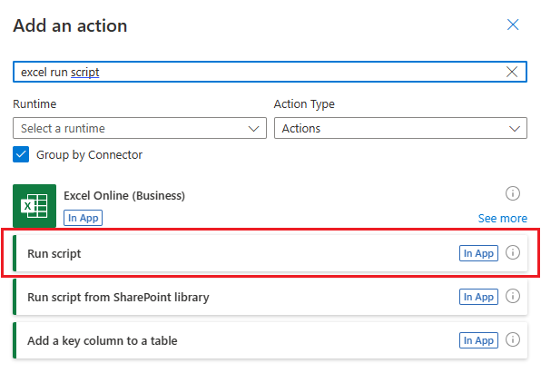

# Return data from a script to an automatically-run Power Automate flow (preview)

This tutorial teaches you how to return information from an Office Script for Excel on the web as part of an automated [Power Automate](https://flow.microsoft.com) workflow. You'll make a script that looks through a schedule and works with a flow to send reminder emails. This flow will run on a regular schedule, providing these reminders on your behalf.

> [!TIP]
> If you are new to Office Scripts, we recommend starting with the [Record, edit, and create Office Scripts in Excel on the web](excel-tutorial.md) tutorial. If you are new to Power Automate, we recommend starting with the [Call scripts from a manual Power Automate flow](excel-power-automate-manual.md) and [Pass data to scripts in an automatically-run Power Automate flow](excel-power-automate-trigger.md) tutorials. [Office Scripts use TypeScript](../overview/code-editor-environment.md) and this tutorial is intended for people with beginner to intermediate-level knowledge of JavaScript or TypeScript. If you're new to JavaScript, we recommend starting with the [Mozilla JavaScript tutorial](https://developer.mozilla.org/docs/Web/JavaScript/Guide/Introduction).

## Prerequisites

[!INCLUDE [Tutorial prerequisites](../includes/power-automate-tutorial-prerequisites.md)]

## Prepare the workbook

1. Download the workbook <a href="on-call-rotation.xlsx">on-call-rotation.xlsx</a> to your OneDrive.

1. Open **on-call-rotation.xlsx** in Excel on the web.

1. Add a row to the table with your name, email address, and start and end dates that overlap with the current date.

    > [!IMPORTANT]
    > The script you'll write uses the first matching entry in the table, so make sure your name is above any row with the current week.

    

## Create an Office Script

1. Go to the **Automate** tab and select **All Scripts**.

1. Select **New Script**.

1. Name the script **Get On-Call Person**.

1. You should now have an empty script. We want to use the script to get an email address from the spreadsheet. Change `main` to return a string, like this:

    ```typescript
    function main(workbook: ExcelScript.Workbook) : string {
    }
    ```

1. Next, we need to get all the data from the table. That lets us look through each row with the script. Add the following code inside the `main` function.

    ```typescript
    // Get the H1 worksheet.
    let worksheet = workbook.getWorksheet("H1");

    // Get the first (and only) table in the worksheet.
    let table = worksheet.getTables()[0];

    // Get the data from the table.
    let tableValues = table.getRangeBetweenHeaderAndTotal().getValues();
    ```

1. The dates in the table are stored using [Excel's date serial number](https://support.microsoft.com/office/date-systems-in-excel-e7fe7167-48a9-4b96-bb53-5612a800b487). We need to convert those dates to JavaScript dates in order to compare them. We'll add a helper function to our script. Add the following code outside of the `main` function:

    ```typescript
    // Convert the Excel date to a JavaScript Date object.
    function convertDate(excelDateValue: number) {
        let javaScriptDate = new Date(Math.round((excelDateValue - 25569) * 86400 * 1000));
        return javaScriptDate;
    }
    ```

1. Now, we need to figure out which person is on call right now. Their row will have a start and end date surrounding the current date. We'll write the script to assume only one person is on call at a time. Scripts can return arrays to handle multiple values, but for now we'll return the first matching email address. Add the following code to the end of `main` function:

    ```typescript
    // Look for the first row where today's date is between the row's start and end dates.
    let currentDate = new Date();
    for (let row = 0; row < tableValues.length; row++) {
        let startDate = convertDate(tableValues[row][2] as number);
        let endDate = convertDate(tableValues[row][3] as number);
        if (startDate <= currentDate && endDate >= currentDate) {
            // Return the first matching email address.
            return tableValues[row][1].toString();
        }
    }
    ```

1. The final script should look like this:

    ```typescript
    function main(workbook: ExcelScript.Workbook) : string {
        // Get the H1 worksheet.
        let worksheet = workbook.getWorksheet("H1");

        // Get the first (and only) table in the worksheet.
        let table = worksheet.getTables()[0];
    
        // Get the data from the table.
        let tableValues = table.getRangeBetweenHeaderAndTotal().getValues();
    
        // Look for the first row where today's date is between the row's start and end dates.
        let currentDate = new Date();
        for (let row = 0; row < tableValues.length; row++) {
            let startDate = convertDate(tableValues[row][2] as number);
            let endDate = convertDate(tableValues[row][3] as number);
            if (startDate <= currentDate && endDate >= currentDate) {
                // Return the first matching email address.
                return tableValues[row][1].toString();
            }
        }
    }

    // Convert the Excel date to a JavaScript Date object.
    function convertDate(excelDateValue: number) {
        let javaScriptDate = new Date(Math.round((excelDateValue - 25569) * 86400 * 1000));
        return javaScriptDate;
    }
    ```

## Create an automated workflow with Power Automate

1. Sign in to the [Power Automate site](https://flow.microsoft.com).

1. In the menu that's displayed on the left side of the screen, press **Create**. This brings you to list of ways to create new workflows.

    

1. Under the **Start from blank** section, select **Scheduled cloud flow**.

    

1. Now we need to set the schedule for this flow. Our spreadsheet has a new on-call assignment starting every Monday in the first half of 2021. Let's set the flow to run first thing Monday mornings. Use the following options to configure the flow to run on Monday each week:

    - **Flow name**: Notify On-Call Person
    - **Starting**: 1/4/21 at 1:00am
    - **Repeat every**: 1 Week
    - **On these days**: M

    

1. Press **Create**.

1. Press **New step**.

1. Select the **Standard** tab, then select **Excel Online (Business)**.

    

1. Under **Actions**, select **Run script (preview)**.

    

1. Next, you'll select the workbook and script to use in the flow step. Use the **on-call-rotation.xlsx** workbook you created in your OneDrive. Specify the following settings for the **Run script** connector:

    - **Location**: OneDrive for Business
    - **Document Library**: OneDrive
    - **File**: on-call-rotation.xlsx *(Chosen through the file browser)*
    - **Script**: Get On-Call Person

    

1. Press **New step**.

1. We'll end the flow by sending the reminder email. Select the **Send an email (V2)** by using the connector's search bar. Use the **Add dynamic content** control to add the email address returned by the script. This will be labelled **result** with the Excel icon next to it. You can provide whatever subject and body text you'd like.

    

    > [!NOTE]
    > This tutorial uses Outlook. Feel free to use your preferred email service instead, though some options may be different.

1. Press **Save**.

## Test the script in Power Automate

Your flow will run every Monday morning. You can test the script now by pressing the **Test** button in the upper-right corner of the screen. Select **Manually** and press **Run Test** to run the flow now and test the behavior. You may need to grant permissions to Excel and Outlook to continue.


> [!TIP]
> If your flow fails to send an email, double-check in the spreadsheet that a valid email is listed for the current date range at the top of the table.

## Next steps

Visit [Run Office Scripts with Power Automate](../develop/power-automate-integration.md) to learn more about connecting Office Scripts with Power Automate.

You can also check out the [Automated task reminders sample scenario](../resources/scenarios/task-reminders.md) to learn how to combine Office Scripts and Power Automate with Teams Adaptive Cards.
