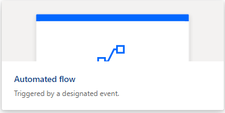
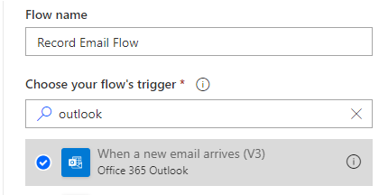
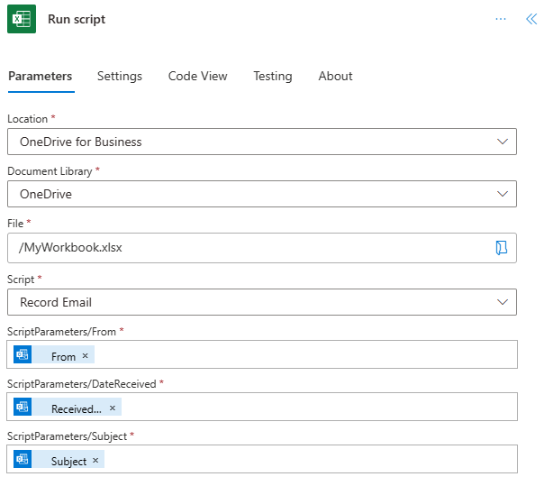
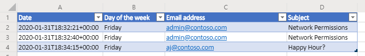

# Pass data to scripts in an automatically-run Power Automate flow (preview)

This tutorial teaches you how to use an Office Script for Excel on the web with an automated [Power Automate](https://flow.microsoft.com) workflow. Your script will automatically run each time you receive an email, recording information from the email in an Excel workbook.

## Prerequisites

[!INCLUDE [Tutorial prerequisites](../includes/power-automate-tutorial-prerequisites.md)]

> [!IMPORTANT]
> This tutorial assumes you have completed the [Run Office Scripts in Excel on the web with Power Automate](excel-power-automate-manual.md) tutorial.

## Prepare the workbook

Power Automate can't use [relative references](../develop/power-automate-integration.md#avoid-using-relative-references) like `Workbook.getActiveWorksheet` to access workbook components. So, we need a workbook and worksheet with consistent names for Power Automate to reference.

1. Create a new workbook named **MyWorkbook**.

2. Go to the **Automate** tab and select **Code Editor**.

3. Select **New Script**.

4. Replace the existing code with the following script and press **Run**. This will setup the workbook with consistent worksheet, table, and PivotTable names.

    ```TypeScript
    function main(workbook: ExcelScript.Workbook) {
      // Add a new worksheet to store our email table
      let emailsSheet = workbook.addWorksheet("Emails");

      // Add data and create a table
      emailsSheet.getRange("A1:D1").setValues([
        ["Date", "Day of the week", "Email address", "Subject"]
      ]);
      let newTable = workbook.addTable(emailsSheet.getRange("A1:D2"), true);
      newTable.setName("EmailTable");

      // Add a new PivotTable to a new worksheet
      let pivotWorksheet = workbook.addWorksheet("SubjectPivot");
      let newPivotTable = workbook.addPivotTable("Pivot", "EmailTable", pivotWorksheet.getRange("A3:C20"));

      // Setup the pivot hierarchies
      newPivotTable.addRowHierarchy(newPivotTable.getHierarchy("Day of the week"));
      newPivotTable.addRowHierarchy(newPivotTable.getHierarchy("Email address"));
      newPivotTable.addDataHierarchy(newPivotTable.getHierarchy("Subject"));
    }
    ```

## Create an Office Script for your automated workflow

Let's create a script that logs information from an email. We want to know how which days of the week we receive the most mail and how many unique senders are sending that mail. Our workbook has a table with **Date**, **Day of the week**, **Email address**, and **Subject** columns. Our worksheet also has a PivotTable that is pivoting on the **Day of the week** and **Email address** (those are the row hierarchies). The count of unique **Subjects** is the aggregated information being displayed (the data hierarchy). We'll have our script refresh that PivotTable after updating the email table.

1. From within the **Code Editor**, select **New Script**.

2. The flow that we'll create later in the tutorial will send our script information about each email that's received. The script needs to accept that input through parameters in the `main` function. Replace the default script with the following script:

    ```TypeScript
    function main(
      workbook: ExcelScript.Workbook,
      from: string,
      dateReceived: string,
      subject: string) {

    }
    ```

3. The script needs access to the workbook's table and PivotTable. Add the following code to the body of the script, after the opening `{`:

    ```TypeScript
    // Get the email table.
    let emailWorksheet = workbook.getWorksheet("Emails");
    let table = emailWorksheet.getTable("EmailTable");
  
    // Get the PivotTable.
    let pivotTableWorksheet = workbook.getWorksheet("SubjectPivot");
    let pivotTable = pivotTableWorksheet.getPivotTable("Pivot");
    ```

4. The `dateReceived` parameter is of type `string`. Let's convert that to a [`Date` object](../develop/javascript-objects.md#date) so we can easily get the day of the week. After doing that, we'll need to map the day's number value to a more readable version. Add the following code to the end of your script, before the closing `}`:

    ```TypeScript
    // Parse the received date string.
    let date = new Date(dateReceived);

    // Convert number representing the day of the week into the name of the day.
    let dayText : string;
    switch (date.getDay()) {
      case 0:
        dayText = "Sunday";
        break;
      case 1:
        dayText = "Monday";
        break;
      case 2:
        dayText = "Tuesday";
        break;
      case 3:
        dayText = "Wednesday";
        break;
      case 4:
        dayText = "Thursday";
        break;
      case 5:
        dayText = "Friday";
        break;
      default:
        dayText = "Saturday";
        break;
    }
    ```

5. The `subject` string may include the "RE:" reply tag. Let's remove that from the string so that emails in the same thread have the same subject for the table. Add the following code to the end of your script, before the closing `}`:

    ```TypeScript
    // Remove the reply tag from the email subject to group emails on the same thread.
    let subjectText = subject.replace("Re: ", "");
    subjectText = subjectText.replace("RE: ", "");
    ```

6. Now that the email data has been formatted to our liking, let's add a row to the email table. Add the following code to the end of your script, before the closing `}`:

    ```TypeScript
    // Add the parsed text to the table.
    table.addRow(-1, [dateReceived, dayText, from, subjectText]);
    ```

7. Finally, let's make sure the PivotTable is refreshed. Add the following code to the end of your script, before the closing `}`:

    ```TypeScript
    // Refresh the PivotTable to include the new row.
    pivotTable.refresh();
    ```

8. Rename your script **Record Email** and press **Save script**.

Your script is now ready for a Power Automate workflow. It should look like the following script:

```TypeScript
function main(
  workbook: ExcelScript.Workbook,
  from: string,
  dateReceived: string,
  subject: string) {
  // Get the email table.
  let emailWorksheet = workbook.getWorksheet("Emails");
  let table = emailWorksheet.getTable("EmailTable");

  // Get the PivotTable.
  let pivotTableWorksheet = workbook.getWorksheet("Pivot");
  let pivotTable = pivotTableWorksheet.getPivotTable("SubjectPivot");

  // Parse the received date string.
  let date = new Date(dateReceived);

  // Convert number representing the day of the week into the name of the day.
  let dayText: string;
  switch (date.getDay()) {
    case 0:
      dayText = "Sunday";
      break;
    case 1:
      dayText = "Monday";
      break;
    case 2:
      dayText = "Tuesday";
      break;
    case 3:
      dayText = "Wednesday";
      break;
    case 4:
      dayText = "Thursday";
      break;
    case 5:
      dayText = "Friday";
      break;
    default:
      dayText = "Saturday";
      break;
  }

  // Remove the reply tag from the email subject to group emails on the same thread.
  let subjectText = subject.replace("Re: ", "");
  subjectText = subjectText.replace("RE: ", "");

  // Add the parsed text to the table.
  table.addRow(-1, [dateReceived, dayText, from, subjectText]);

  // Refresh the PivotTable to include the new row.
  pivotTable.refresh();
}
```

## Create an automated workflow with Power Automate

1. Sign in to the [Power Automate site](https://flow.microsoft.com).

2. In the menu that's displayed on the left side of the screen, press **Create**. This brings you to list of ways to create new workflows.

    

3. In the **Start from blank** section, select **Automated flow**. This creates a workflow triggered by an event, such as receiving an email.

    

4. In the dialog window that appears, enter a name for your flow in the **Flow name** text box. Then select **When a new email arrives** from the list of options under **Choose your flow's trigger**. You may need to search for the option using the search box. Finally, press **Create**.

    

    > [!NOTE]
    > This tutorial uses Outlook. Feel free to use your preferred email service instead, though some options may be different.

5. Press **New step**.

6. Select the **Standard** tab, then select **Excel Online (Business)**.

    

7. Under **Actions**, select **Run script (preview)**.

    

8. Specify the following settings for the **Run script** connector:

    - **Location**: OneDrive for Business
    - **Document Library**: OneDrive
    - **File**: MyWorkbook.xlsx
    - **Script**: Record Email
    - **from**: From *(dynamic content from Outlook)*
    - **dateReceived**: Received Time *(dynamic content from Outlook)*
    - **subject**: Subject *(dynamic content from Outlook)*

    *Note that the parameters for the script will only appear once the script is selected.*

    

9. Press **Save**.

Your flow is now enabled. It will automatically run your script each time you receive an email through Outlook.

## Manage the script in Power Automate

1. From the main Power Automate page, select **My flows**.

    

2. Select your flow. Here you can see the run history. You can refresh the page or press the refresh **All runs** button to update the history. The flow will trigger shortly after an email is received. Test the flow by sending yourself mail.

When the flow is triggered and successfully runs your script, you should see the workbook's table and PivotTable update.




## Next steps

Visit [Run Office Scripts with Power Automate](../develop/power-automate-integration.md) to learn more about connecting Office Scripts with Power Automate.

You can also check out the [Automated task reminders sample scenario](../resources/scenarios/task-reminders.md) to learn how to combine Office Scripts and Power Automate with Teams Adaptive Cards.
