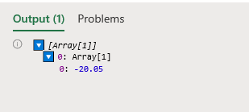
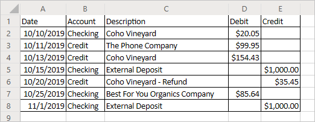

# Read workbook data with Office Scripts in Excel on the web

This tutorial will teach you how to read data from a workbook with an Office Script for Excel on the web. You'll then edit the data you read and put it back in the workbook.

> [!TIP]
> If you are new to Office Scripts, we recommend starting with the [Record, edit, and create Office Scripts in Excel on the web](excel-tutorial.md) tutorial.

## Prerequisites

[!INCLUDE [Preview note](../includes/preview-note.md)]

Before starting this tutorial, you'll need access to Office Scripts, which requires the following:

- [Excel on the web](https://www.office.com/launch/excel).
- Ask your administrator to [enable Office Scripts for your organization](https://support.office.com/article/office-scripts-settings-in-m365-19d3c51a-6ca2-40ab-978d-60fa49554dcf), which adds the **Automate** tab to the ribbon.

> [!IMPORTANT]
> This tutorial is intended for people with beginner to intermediate-level knowledge of JavaScript or TypeScript. If you're new to JavaScript, we recommend reviewing the [Mozilla JavaScript tutorial](https://developer.mozilla.org/docs/Web/JavaScript/Guide/Introduction). Visit [Office Scripts in Excel on the web](../overview/excel.md) to learn more about the script environment.

## Read a cell

Scripts made with the Action Recorder can only write information to the workbook. With the Code Editor, you can edit and make scripts that also read data from a workbook.

Let's make a script that reads data and acts based on what was read. We're going to work with a sample banking statement. This statement is a combined checking and credit statement. Unfortunately, they report balance changes differently. The checking statement gives income as positive credit and costs as negative debit. The credit statement does the opposite.

Over the rest of the tutorial, we will normalize this data using a script. First, let's learn how to read data from the workbook.

1. Create a new worksheet in the workbook you've used for the rest of the tutorial.
2. Copy the following data and paste it into the new worksheet, starting at cell **A1**.

    |Date |Account |Description |Debit |Credit |
    |:--|:--|:--|:--|:--|
    |10/10/2019 |Checking |Coho Vineyard |-20.05 | |
    |10/11/2019 |Credit |The Phone Company |99.95 | |
    |10/13/2019 |Credit |Coho Vineyard |154.43 | |
    |10/15/2019 |Checking |External Deposit | |1000 |
    |10/20/2019 |Credit |Coho Vineyard - Refund | |-35.45 |
    |10/25/2019 |Checking |Best For You Organics Company | -85.64 | |
    |11/01/2019 |Checking |External Deposit | |1000 |

3. Open the **Code Editor** and select **New Script**.
4. Let's clean up the formatting. This is a financial document, so let's change the number formatting in the **Debit** and **Credit** columns to show values as dollar amounts. Let's also fit the column width to the data.

    Replace the script contents with the following code:

    ```TypeScript
    async function main(context: Excel.RequestContext) {
      // Get the current worksheet.
      let workbook = context.workbook;
      let worksheets = workbook.worksheets;
      let selectedSheet = worksheets.getActiveWorksheet();

      // Format the range to display numerical dollar amounts.
      selectedSheet.getRange("D2:E8").numberFormat = [["$#,##0.00"]];

      // Fit the width of all the used columns to the data.
      selectedSheet.getUsedRange().format.autofitColumns();
    }
    ```

5. Now let's read a value from one of the number columns. Add the following code to the end of the script:

    ```TypeScript
    // Get the value of cell D2.
    let range = selectedSheet.getRange("D2");
    range.load("values");
    await context.sync();
  
    // Print the value of D2.
    console.log(range.values);
    ```

    Note the calls to `load` and `sync`. You can learn the details of those methods in [Scripting Fundamentals for Office Scripts in Excel on the web](../develop/scripting-fundamentals.md#sync-and-load). For now, know that you must request data to be read and then sync your script with the workbook to read that data.

6. Run the script.
7. Open the console. Go to the **Ellipses** menu and press **Logs...**.
8. You should see `[Array[1]]` in the console. This is not a number because ranges are two-dimensional arrays of data. That two-dimensional range is being logged to the console directly. Luckily, the Code Editor does let you see the contents of the array.
9. When a two-dimensional array is logged to the console, it groups column values under each row. Expand the array log by pressing the blue triangle.
10. Expand the second level of the array by pressing the newly revealed blue triangle. You should now see this:

    

## Modify the value of a cell

Now that we can read data, let's use that data to modify the workbook. We'll make the value of the cell **D2** positive with the `Math.abs` function. The [Math](https://developer.mozilla.org/docs/web/javascript/reference/global_objects/math) object contains many functions to which your scripts have access. More information about `Math` and other built-in objects can be found at [Using built-in JavaScript objects in Office Scripts](../develop/javascript-objects.md).

1. Add the following code to the end of the script:

    ```TypeScript
    // Run the `Math.abs` function with the value at D2 and apply that value back to D2.
    let positiveValue = Math.abs(range.values[0][0]);
    range.values = [[positiveValue]];
    ```

2. The value of cell **D2** should now be positive.

## Modify the values of a column

Now that we know how to read and write to a single cell, let's generalize the script to work on the entire **Debit** and **Credit** columns.

1. Remove the code that affects only a single cell (the previous absolute value code), such that your script now looks like this:

    ```TypeScript
    async function main(context: Excel.RequestContext) {
      // Get the current worksheet.
      let workbook = context.workbook;
      let worksheets = workbook.worksheets;
      let selectedSheet = worksheets.getActiveWorksheet();

      // Format the range to display numerical dollar amounts.
      selectedSheet.getRange("D2:E8").numberFormat = [["$#,##0.00"]];

      // Fit the width of all the used columns to the data.
      selectedSheet.getUsedRange().format.autofitColumns();
    }
    ```

2. Add a loop that iterates through the rows in the last two columns. For each cell, the script sets the value to the current value's absolute value.

    Note that the array defining cell locations is zero-based. That means cell **A1** is `range[0][0]`.

    ```TypeScript
    // Get the values of the used range.
    let range = selectedSheet.getUsedRange();
    range.load("rowCount,values");
    await context.sync();

    // Iterate over the fourth and fifth columns and set their values to their absolute value.
    for (let i = 1; i < range.rowCount; i++) {
      // The column at index 3 is column "4" in the worksheet.
      if (range.values[i][3] != 0) {
        let positiveValue = Math.abs(range.values[i][3]);
        selectedSheet.getCell(i, 3).values = [[positiveValue]];
      }

      // The column at index 4 is column "5" in the worksheet.
      if (range.values[i][4] != 0) {
        let positiveValue = Math.abs(range.values[i][4]);
        selectedSheet.getCell(i, 4).values = [[positiveValue]];
      }
    }
    ```

    This portion of the script does several important tasks. First, it loads the values and row count of the used range. This lets us look at values and know when to stop. Second, it iterates through the used range, checking each cell in the **Debit** or **Credit** columns. Finally, if the value in the cell is not 0, it is replaced by its absolute value. We're avoiding zeroes so we can leave the blank cells as they were.

3. Run the script.

    Your banking statement should now look like this:

    

## Next steps

Open the Code Editor and try out some of our [Sample scripts for Office Scripts in Excel on the web](../resources/excel-samples.md). You can also visit [Scripting Fundamentals for Office Scripts in Excel on the web](../develop/scripting-fundamentals.md) to learn more about creating Office Scripts.
