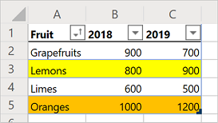

# Record, edit, and create Office Scripts in Excel on the web

This tutorial will teach you the basics of recording, editing, and writing an Office Script for Excel on the web.

## Prerequisites

[!INCLUDE [Preview note](../includes/preview-note.md)]

Before starting this tutorial, you'll need access to Office Scripts, which requires the following:

- Excel on the web.
- Have your [admin enable Office Scripts on your account](https://support.office.com/article/office-scripting-settings-in-m365-19d3c51a-6ca2-40ab-978d-60fa49554dcf). This adds the **Automate** tab to the ribbon.

> [!IMPORTANT]
> This tutorial is intended for people with beginner to intermediate-level knowledge of JavaScript or TypeScript. If you're new to JavaScript, we recommend reviewing the [Mozilla JavaScript tutorial](https://developer.mozilla.org/docs/Web/JavaScript/Guide/Introduction). Visit [Office Scripts in Excel on the web](../overview/excel.md) to learn more about the script environment.

## Add data and record a basic script

First, we'll need some data and a small starting script.

1. Create a new workbook in Excel for the Web.
2. Copy the following fruit sales data and paste it into the worksheet, starting at cell **A1**.

    |Fruit |2018 |2019 |
    |:---|:---|:---|
    |Oranges |1000 |1200 |
    |Lemons |800 |900 |
    |Limes |600 |500 |
    |Grapefruits |900 |700 |

3. Open the **Automate** tab. If you do not see the **Automate** tab, check the ribbon overflow by pressing the drop-down arrow.
4. Press the **Record Actions** button.
5. Select cells **A2:C2** (the "Oranges" row) and set the fill color to orange.
6. Stop the recording by pressing the **Stop** button.
7. Fill in the **Script Name** field with a memorable name.
8. *Optional:* Fill in the **Description** field with a meaningful description. This is used to provide context as to what the script does. For the tutorial, you can use "Color-codes rows of a table".

   > [!TIP]
   > You can edit a script's description later from the **Script Details** pane, which is located under the Code Editor's **...** menu.

9. Save the script by pressing the **Save** button.

    Your worksheet should look like this (don't worry if the color is different):

    

## Edit an existing script

The previous script colored the "Oranges" row to be orange. Let's add a yellow row for the "Lemons".

1. Open the **Automate** tab.
2. Press the **Code Editor** button.
3. Open the script you recorded in the previous section. You should see something similar to this code:

    ```TypeScript
    async function main(context: Excel.RequestContext) {
      // Set fill color to FFC000 for range Sheet1!A2:C2
      let workbook = context.workbook;
      let worksheets = workbook.worksheets;
      let selectedSheet = worksheets.getActiveWorksheet();
      selectedSheet.getRange("A2:C2").format.fill.color = "FFC000";
    }
    ```

    This code gets the current worksheet by first accessing the workbook's worksheet collection. Then, it sets the fill color of the range **A2:C2**.

    Ranges are a fundamental part of Office Scripts in Excel on the web. A range is a contiguous, rectangular block of cells that contains values, formula, and formatting. They are the basic structure of cells through which you'll perform most of your scripting tasks.

4. Add the following line to the end of the script (between where the `color` is set and the closing `}`):

    ```TypeScript
    selectedSheet.getRange("A3:C3").format.fill.color = "yellow";
    ```

5. Test the script by pressing **Run**. Your workbook should now look like this:

    

## Create a table

Let's convert this fruit sales data into a table. We'll use our script for the entire process.

1. Add the following line to the end of the script (before the closing `}`):

    ```TypeScript
    let table = selectedSheet.tables.add("A1:C5", true);
    ```

2. That call returns a `Table` object. Let's use that table to sort the data. We'll sort the data in ascending order based on the values in the "Fruit" column. Add the following line after the table creation:

    ```TypeScript
    table.sort.apply([{ key: 0, ascending: true }]);
    ```

    Your script should look like this:

    ```TypeScript
    async function main(context: Excel.RequestContext) {
      // Set fill color to FFC000 for range Sheet1!A2:C2
      let workbook = context.workbook;
      let worksheets = workbook.worksheets;
      let selectedSheet = worksheets.getActiveWorksheet();
      selectedSheet.getRange("A2:C2").format.fill.color = "FFC000";
      selectedSheet.getRange("A3:C3").format.fill.color = "yellow";
      let table = selectedSheet.tables.add("A1:C5", true);
      table.sort.apply([{ key: 0, ascending: true }]);
    }
    ```

    Tables have a `TableSort` object, accessed through the `Table.sort` property. You can apply sorting criteria to that object. The `apply` method takes in an array of `SortField` objects. In this case, we only have one sorting criteria, so we only use one `SortField`. `key: 0` sets the column with the sort-defining values to "0" (which is the first column on the table, **A** in this case). `ascending: true` sorts the data in ascending order (instead of descending order).

3. Run the script. You should see a table like this:

    

    > [!NOTE]
    > If you re-run the script, you'll get an error. This is because you cannot create a table on top of another table. However, you can run the script on a different worksheet or workbook.

### Re-run the script

1. Create a new worksheet in the current workbook.
2. Copy the fruit data from the beginning of the tutorial and paste it into the new worksheet, starting at cell **A1**.
3. Run the script.

## Read a cell

Scripts made with the Action Recorder can only write information to the workbook. With the Code Editor, you can edit and make scripts that also read data from a workbook.

Let's make a script that reads data and acts based on what was read. We're going to work with a sample banking statement. This statement is a combined checking and credit statement. Unfortunately, they report balance changes differently. The checking statement gives income as positive credit and costs as negative debit. The credit statement does the opposite.

Over the rest of the tutorial, we will normalize this data using a script. First, let's learn how to read data from the workbook.

1. Create a new worksheet in the workbook you've used for the rest of the tutorial.
2. Copy the following data and paste it into the new worksheet, starting at cell **A1**.

    |Date |Account |Description |Debit |Credit |
    |:--|:--|:--|:--|:--|
    |10/10/2019 |Checking |Coho Vineyard |-20.05 | |
    |10/11/2019 |Credit |The Phone Company |99.95 | |
    |10/13/2019 |Credit |Coho Vineyard |154.43 | |
    |10/15/2019 |Checking |External Deposit | |1000 |
    |10/20/2019 |Credit |Coho Vineyard - Refund | |-35.45 |
    |10/25/2019 |Checking |Best For You Organics Company | -85.64 | |
    |11/01/2019 |Checking |External Deposit | |1000 |

3. Open the **Code Editor** and select **New Script**.
4. Let's clean up the formatting. This is a financial document, so let's change the number formatting in the **Debit** and **Credit** columns to show values as dollar amounts. Let's also fit the column width to the data.

    Replace the script contents with the following code:

    ```TypeScript
    async function main(context: Excel.RequestContext) {
      // Get the current worksheet.
      let workbook = context.workbook;
      let worksheets = workbook.worksheets;
      let selectedSheet = worksheets.getActiveWorksheet();

      // Format the range to display numerical dollar amounts.
      selectedSheet.getRange("D2:E8").numberFormat = [["$##.##"]]

      // Fit the width of all the used columns to the data.
      selectedSheet.getUsedRange().format.autofitColumns();
    }
    ```

5. Now let's read a value from one of the number columns. Add the following code to the end of the script:

    ```TypeScript
    // Get the value of cell D2.
    let range = selectedSheet.getRange("D2");
    range.load("values");
    await context.sync();
  
    // Print the value of D2.
    console.log(range.values);
    ```

    Note the calls to `load` and `sync`. You can learn the details of those methods in [Scripting Fundamentals for Office Scripts in Excel on the web](../develop/scripting-fundamentals.md#sync-and-load). For now, know that you must request data to be read and then sync your script with the workbook to read that data.

6. Run the script.
7. Open the console. Go to the **Ellipses** menu and press **Logs...**.
8. You should see `[Array[1]]` in the console. This is not a number because ranges are two-dimensional arrays of data. That two-dimensional range is being logged to the console directly. Luckily, the Code Editor does let you see the contents of the array.
9. When a two-dimensional array is logged to the console, it groups column values under each row. Expand the array log by pressing the blue triangle.
10. Expand the second level of the array by pressing the newly revealed blue triangle. You should now see this:

    

## Modify the value of a cell

Now that we can read data, let's use that data to modify the workbook. We'll make the value of the cell **D2** positive with the `Math.abs` function. The [Math](https://developer.mozilla.org/docs/web/javascript/reference/global_objects/math) object contains many functions to which your scripts have access.

1. Add the following code to the end of the script:

    ```TypeScript
    // Run the `Math.abs` function with the value at D2 and apply that value back to D2.
    range.values = [[Math.abs(range.values[0][0])]];
    ```

2. The value of cell **D2** should now be positive.

## Modify the values of a column

Now that we know how to read and write to a single cell, let's generalize the script to work on the entire **Debit** and **Credit** columns.

1. Remove the code that affects only a single cell (the previous absolute value code), such that your script now looks like this:

    ```TypeScript
    async function main(context: Excel.RequestContext) {
      // Get the current worksheet.
      let workbook = context.workbook;
      let worksheets = workbook.worksheets;
      let selectedSheet = worksheets.getActiveWorksheet();

      // Format the range to display numerical dollar amounts.
      selectedSheet.getRange("D2:E8").numberFormat = [["$#,##0.00"]]

      // Fit the width of all the used columns to the data.
      selectedSheet.getUsedRange().format.autofitColumns();
    }
    ```

2. Add a loop that iterates through the rows in the last two columns. For each cell, the script sets the value to the current value's absolute value.

    Note that the array defining cell locations is zero-based. That means cell **A1** is `range[0][0]`.

    ```TypeScript
    // Get the values of the used range.
    let range = selectedSheet.getUsedRange();
    range.load("rowCount,values");
    await context.sync();

    // Iterate over the fourth and fifth columns and set their values to their absolute value.
    for (let i = 1; i < range.rowCount; i++) {
      // The column at index 3 is column "4" in the worksheet.
      if (range.values[i][3] != 0) {
        selectedSheet.getCell(i,3).values = [[Math.abs(range.values[i][3])]];
      }

      // The column at index 4 is column "5" in the worksheet.
      if (range.values[i][4] != 0) {
        selectedSheet.getCell(i,4).values = [[Math.abs(range.values[i][4])]];
      }
    }
    ```

    This portion of the script does several important tasks. First, it loads the values and row count of the used range. This lets us look at values and know when to stop. Second, it iterates through the used range, checking each cell in the **Debit** or **Credit** columns. Finally, if the value in the cell is not 0, it is replaced by its absolute value. We're avoiding zeroes so we can leave the blank cells as they were.

3. Run the script.

    Your banking statement should now look like this:

    

## Next steps

The [Code Editor](https://aka.ms/office-scripting-overview) has more samples for you to explore as you learn Office Scripts. Visit [Scripting Fundamentals for Office Scripts in Excel on the web](../develop/scripting-fundamentals.md) to learn more about the platform.
