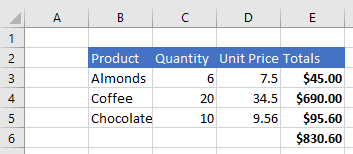
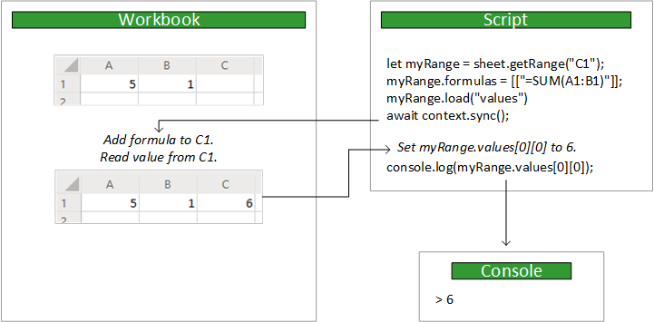

# Scripting Fundamentals for Office Scripts in Excel on the web

This section presents the areas of Office Scripts in Excel on the web where you’ll need a better understanding of how the script code works with Excel. For a more in-depth description on this topic, visit [Fundamental programming concepts with the Excel JavaScript API](https://docs.microsoft.com/office/dev/add-ins/excel/excel-add-ins-core-concepts).

## Object Model

To understand the Excel APIs, you must understand how the components of a workbook are related to one another.

- A **Workbook** contains one or more **Worksheets**.
- A **Worksheet** gives access to cells through **Range** objects.
- A **Range** represents a group of contiguous cells.
- **Ranges** are used to create and place **Tables**, **Charts**, **Shapes**, and other data visualization or organization objects.
- A **Worksheet** contains collections of those data objects that are present in the individual sheet.
- **Workbooks** contain collections of some of those data objects (such as **Tables**) for the entire **Workbook**.

### Ranges

A range is a group of contiguous cells in the workbook. Scripts typically use A1-style notation (e.g. “B3” for the single cell in row **B** and column **3** or “C2:F4” for the cells from rows **C** through **F** and columns **2** through **4**) to define ranges.

Ranges have three core properties: `values`, `formulas`, and `format`. These get or set the cell values, and formulas to be evaluated, and the visual formatting of the cells.

#### Range sample

The following sample shows how to create sales records. This uses Range objects to set the values, formulas, and formats.

```TypeScript
async function main(context: Excel.RequestContext) {
  // Get the active worksheet.
  const sheet = context.workbook.worksheets.getActiveWorksheet();

  // Create the headers and format them to stand out.
  const headers = [
    ["Product", "Quantity", "Unit Price", "Totals"]
  ];
  const headerRange = sheet.getRange("B2:E2");
  headerRange.values = headers;
  headerRange.format.fill.color = "#4472C4";
  headerRange.format.font.color = "white";

  // Create the product data rows.
  const productData = [
    ["Almonds", 6, 7.5],
    ["Coffee", 20, 34.5],
    ["Chocolate", 10, 9.56],
  ];
  const dataRange = sheet.getRange("B3:D5");
  dataRange.values = productData;

  // Create the formulas to total the amounts sold.
  const totalFormulas = [
    ["=C3 * D3"],
    ["=C4 * D4"],
    ["=C5 * D5"],
    ["=SUM(E3:E5)"]
  ];
  const totalRange = sheet.getRange("E3:E6");
  totalRange.formulas = totalFormulas;
  totalRange.format.font.bold = true;

  // Display the totals as US dollar amounts.
  totalRange.numberFormat = [["$0.00"]];
}
```



### Charts, tables, and other data objects

Scripts can create and manipulate the data tools within Excel. Tables and charts are two of the more commonly used objects, but the APIs support PivotTables, Shapes, Images, and more.

#### Creating a table

Create tables by using data-filled ranges. The table controls (such as filters) and formatting are automatically layered on top on the range.

The following script creates a table using the ranges from the previous sample.

```TypeScript
async function main(context: Excel.RequestContext) {
   const sheet = context.workbook.worksheets.getActiveWorksheet();
   sheet.tables.add("B2:E5", true);
}
```


#### Creating a chart

Create charts to visualize the data in a range. Scripts allow for dozens of chart varieties, each of which can be customized to suit your needs.

The following script creates a simple column chart for three items and places it 100 pixels below the top of the worksheet.

```TypeScript
async function main(context: Excel.RequestContext) {
  const sheet = context.workbook.worksheets.getActiveWorksheet();
  const chart = sheet.charts.add(Excel.ChartType.columnStacked, sheet.getRange("B3:C5"));
  chart.top = 100;
}
```


## `main` function

Every Excel Script is contained within a `main` function.

```TypeScript
async function main(context: Excel.RequestContext) {
    // Your Excel Script
}
```

The code inside that `main` function is executed when the script is run. Any code outside of that function is ignored.

## Context

The `main` function is given an `Excel.RequestContext` parameter, named `context`. Think of it as the bridge between your script and the workbook. Your script accesses the workbook from the context object and uses that context to send data back and forth.

The context object is necessary because the script and Excel are running in different processes and locations. The script running on your local machine will need to make changes to or query data from the workbook in the cloud. The context manages those transactions.

## Sync and Load

Your script and workbook run in different locations. This means any data transfer takes time. To help increase performance of the script, commands are queued up until the script explicitly calls the workbook to synchronize the two entities. Your script can work independently until it needs to change or access the workbook. This can happen for the following reasons:

- Data needs to be read from the workbook (following a `load` operation).
- Data needs to be written to the workbook (usually because the script has finished).



### Sync

This synchronization is done through the `RequestContext.sync` method. Whenever your script needs to do this, make the following call on the `context` object:

```TypeScript
await context.sync();
```

> [!NOTE]
> `context.sync()` is implicitly called when a script ends.

After `sync` completes, the workbook updates with any write operations the script has called. A write operation is setting any property on a Excel object (e.g. `range.format.fill.color = “red”`) or calling a method that results in a property changing (e.g. `range.format.autoFitColumns()`). `sync` also reads any values requested from a `load` operation (as discussed in the next section).

Synchronizing your script with the workbook can take time, depending on your network. You should minimize the number of `sync` calls to help your script run fast.  

### Load

A script must load data from the workbook before reading it. However, loading the entire workbook every time would greatly reduce the script’s speed. Instead, the `load` method lets your script selectively return data.

Every Excel object has this `load` method. You must load an object’s properties before you can read them. Not doing so will result in an error.

There are three ways to load data. The following examples use a `Range` object to demonstrate them.

- Load one property: `myRange.load(“values”);` - This loads a single property, in this case the two-dimensional array of values in this range.
- Load multiple properties: `myRange.load("values, rowCount, columnCount");` - This loads are the properties from a comma-delimited list.
- Load everything: `myRange.load();` - This loads all the properties on the range. It is not a recommended solution, since it will slow down your script by getting unnecessary data. You should only use this while testing your script or if you need every property from the object.

> [!TIP]
> Scripts can also load properties along hierarchies. For example, `range.load(“format/fill/color”)` and `range.format.fill.load(“color”)` have the same behavior.

You must call `context.sync()` before reading any loaded values.

```TypeScript
let range = selectedSheet.getRange("A1:B3");
range.load ("rowCount"); // Load the property.
await context.sync(); // Synchronize with the workbook to get the property.
console.log(range.rowCount); // Will display “3”.
```

## See also

- [Overview: Office Scripts in Excel on the web](../overview/overview.md)
