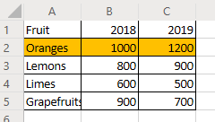
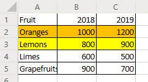
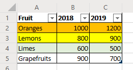
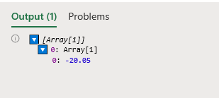
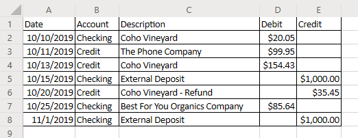

# Tutorial: Office Scripts in Excel on the web

This tutorial will teach you the basics of editing and writing an Office Script for Excel on the web.

## Prerequisites

Before starting this tutorial, you will need access to Office Scripts. That requires the following:

- Excel for the web.
- [Opt-in to the Excel Scripting preview](https://aka.ms/makersdogfood).

> [!IMPORTANT]
> This tutorial is intended for people beginner to intermediate-level JavaScript or TypeScript experience. For those brand new to JavaScript, we recommend the [Mozilla JavaScript tutorial](https://developer.mozilla.org/docs/Web/JavaScript/Guide/Introduction). Visit [Overview: Office Scripts in Excel on the web](../overview/overview.md) to learn more about the script environment.

## Add data and record a basic script

First, we’ll need some data and a small starting script.

1. Create a new workbook in Excel for the Web.
2. Copy the following fruit sales data into the worksheet, starting at **A1**.

  |Fruit |2018 |2019 |
  |:---|:---|:---|
  |Oranges |1000 |1200 |
  |Lemons |800 |900 |
  |Limes |600 |500 |
  |Grapefruits |900 |700 |

3. Open the **Automate** tab and press **Record Actions**.
4. Select cells **A2:C2** (the "Oranges" row) and set the fill color to orange.
5. Stop the recording by pressing the **Stop** button.
6. Fill out the **Script Name** field with a memorable name. The **Description** field can be used to provide context as to what the script does. You can leave the **Description** blank for the tutorial.
7. Save the script by pressing the **Save** button.

You should have a worksheet that looks like this (don’t worry if the color is different):



## Edit an existing script

The previous script colored the “Oranges” row to be orange. Let’s add a yellow row for the “Lemons”.

1. Open the **Code Editor**.
2. Open the script you recorded in the previous section. You should see something similar to this code:

```TypeScript
async function main(context: Excel.RequestContext) {
  // Set fill color to FFC000 for range Sheet1!A2:C2
  let workbook = context.workbook;
  let worksheets = workbook.worksheets;
  let selectedSheet = worksheets.getActiveWorksheet();
  selectedSheet.getRange("A2:C2").format.fill.color = "FFC000";
}
```

This code gets the current worksheet by first accessing the workbook’s worksheet collection. Then, the range **A2:C2** has its fill color changed.

Ranges are a fundamental part of Office Script in Excel on the web. A range is a contiguous, rectangular block of cells that contains values, formula, and formatting. They are the basic structure of cells through which you’ll perform most of your scripting tasks.

3. Add the following line to the end of the script (between where the `color` is set and the closing `}`):

```TypeScript
selectedSheet.getRange("A3:C3").format.fill.color = "yellow";
```

4. Test the script by pressing **Run**. Your workbook should now look like this:



## Create a table

Let’s convert this fruit sales data into a table. We’ll use our script for the entire process.

1. Add the following line to the end of the script (before the closing `}`):

```TypeScript
let table = selectedSheet.tables.add("A1:C5", true);
```

2. That call returns a `Table` object. Let’s use that table to change the style. Add the following line after the table creation:

```TypeScript
table.style = "TableStyleLight21";
```

Your script should look like this:

```TypeScript
async function main(context: Excel.RequestContext) {
  // Set fill color to FFC000 for range Sheet1!A2:C2
  let workbook = context.workbook;
  let worksheets = workbook.worksheets;
  let selectedSheet = worksheets.getActiveWorksheet();
  selectedSheet.getRange("A2:C2").format.fill.color = "FFC000";
  selectedSheet.getRange("A3:C3").format.fill.color = "yellow";
  let table = selectedSheet.tables.add("A1:C5", true);
  table.style = "TableStyleLight21";
}
```

3. Run the script. You should see a table like this:



> [!NOTE]
> If you re-run the script, you’ll get an error. This is because you cannot create a table on top of another table. However, you can run the script on a different worksheet or workbook.

### Rerunning the script

1. Open a new worksheet in the current workbook.
2. Copy the fruit data from the beginning of the tutorial into **A1**.
3. Run the script.

## Read a cell

The Script Recorder records your changes to the workbook. Any workbook change is recorded as one or more write operations in the script. Scripts can also read data from a workbook.

Let’s make a script that reads data and acts based on what was read. We’re going to work with a sample banking statement. This statement is a combined checking and credit statement. Unfortunately, they report balance changes differently. The checking statement gives income as positive credit and costs as negative debit. The credit statement does the opposite.

Over the rest of the tutorial, we will normalize this data using a script. First, let’s learn how to read data from the workbook.

1. Create a new worksheet in the workbook you’ve used for the rest of the tutorial.
2. Copy the following data into the worksheet, starting at **A1**.

|Date |Account |Description |Debit |Credit |
|:--|:--|:--|:--|:--|
|10/10/2019 |Checking |Coho Vineyard |-20.05 | |
|10/11/2019 |Credit |The Phone Company |99.95 | |
|10/13/2019 |Credit |Coho Vineyard |154.43 | |
|10/15/2019 |Checking |External Deposit | |1000 |
|10/20/2019 |Credit |Coho Vineyard - Refund | |-35.45 |
|10/25/2019 |Checking |Best For You Organics Company | -85.64 | |
|11/01/2019 |Checking |External Deposit | |1000 |

3. Open the **Script Editor** and select **New Script**.
4. Let’s clean up the formatting. This is a financial document, so let’s change the number formatting in the **Debit** and **Credit** columns to show values as dollar amounts. Let’s also fit the column width to the data.

Replace the script contents with the following code:

```TypeScript
async function main(context: Excel.RequestContext) {
  // Get the current worksheet.
  let workbook = context.workbook;
  let worksheets = workbook.worksheets;
  let selectedSheet = worksheets.getActiveWorksheet();
  
  // Format the range to display numerical dollar amounts.
  selectedSheet.getRange("D2:E8").numberFormat = [["$##.##"]]
  
  // Fit the width of all the used columns to the data.
  selectedSheet.getUsedRange().format.autofitColumns();
}
```

5. Now let’s read a value from one of the number columns. Add the following code to the end of the script:

```TypeScript
  // Get the value of cell D2.
  let range = selectedSheet.getRange("D2");
  range.load("values");
  await context.sync();

  // Print the value of D2.
  console.log(range.values);
```

Note the calls to `load` and `sync`. You can learn the details of those methods in [Scripting Fundamentals for Office Scripts in Excel on the web](../develop/scripting-fundamentals.md#sync-and-load). For now, know that you must request data to be read and then sync your script with the workbook to read that data.

6. Run the script.
7. Open the console. Go to the **Ellipses** menu and press **Logs...**.
8. You should see "[Array[1]]" in the console. This is not a number because ranges are two-dimensional arrays of data. That two-dimensional range is being logged to the console directly. Luckily, the Script Editor does let you see the contents of the array.
9. When a two-dimensional array is logged to the console, it groups column values under each row. Expand the array log by pressing the blue triangle.
10. Expand the second level of the array by pressing the newly revealed blue triangle. You should now see this:



## Apply the absolute value function to a cell

Now that we can read data, let’s use it to modify the workbook. We’ll make the value of D2 positive using Excel’s built-in absolute value function.

1. Add the following code to the end of the script:

```TypeScript
  // Apply the ABS function to the value at D2 and get the result from the worksheet.
  let newValue = workbook.functions.abs(range.values[0][0]);
  newValue.load("value");
  await context.sync();

  // Set the value of D2 to its absolute value.
  range.values = [[newValue.value]];
```

2. The value of **D2** should now be positive.

You may have noticed we’re now calling `context.sync()` twice. We need to read the values in the cell first. Then, we need to read the result of the absolute value function. We could skip that second `load` and `sync` if we calculated the absolute value locally.

## Apply the absolute value function to a column

Now that we know how to read and write to a single cell, let’s generalize the script to work on the entire **Debit** and **Credit** columns.

1. Remove the code affecting only a single cell. You should now have a script that looks like this:

```TypeScript
async function main(context: Excel.RequestContext) {
  // Get the current worksheet.
  let workbook = context.workbook;
  let worksheets = workbook.worksheets;
  let selectedSheet = worksheets.getActiveWorksheet();
  
  // Format the range to display numerical dollar amounts.
  selectedSheet.getRange("D2:E8").numberFormat = [["$##.##"]]
  
  // Fit the width of all the used columns to the data.
  selectedSheet.getUsedRange().format.autofitColumns();
}
```

2. Add a loop that goes over all the rows in the last two columns. For each cell, the script sets the value to that cell value’s absolute value. We’ll use the `Math.abs` function instead of Excel’s functions (which will save us a `load` and `sync`). [Math](https://developer.mozilla.org/docs/web/javascript/reference/global_objects/math) contains many functions to which your scripts have access.

Note that the array defining cell locations is zero-based. That means cell A1 is range[0][0].

```TypeScript
  // Get the values of the used range.
  let range = selectedSheet.getUsedRange();
  range.load("rowCount,values");
  await context.sync();

  // Iterate over the fourth and fifth columns and set their values to their absolute value.
  for (let i = 1; i < range.rowCount; i++) {
    // The column at index 3 is column “4” in the worksheet.
    if (range.values[i][3] != 0) {
      selectedSheet.getCell(i,3).values = [[Math.abs(range.values[i][3])]];
    }

    // The column at index 4 is column “5” in the worksheet.
    if (range.values[i][4] != 0) {
      selectedSheet.getCell(i,4).values = [[Math.abs(range.values[i][4])]];
    }
  }
```

That code block does several important tasks. First, it loads the used range’s values and row count. This lets us look at values and know when to stop. Second, it iterates over the used range, checking each cell in the **Debit** or **Credit** columns. Finally, if the value in the cell is not 0, it is replaced by its absolute value. We are avoiding zeroes so we can leave the blank cells as they were.

3. Run the script.

Your banking statement should now look like this:



## Next steps

The [Script Editor](https://aka.ms/office-scripting-overview) has more samples for you to explore as you learn Office Scripts. Visit [Scripting Fundamentals for Office Scripts in Excel on the web](../develop/scripting-fundamentals.md) to learn more about the platform.
